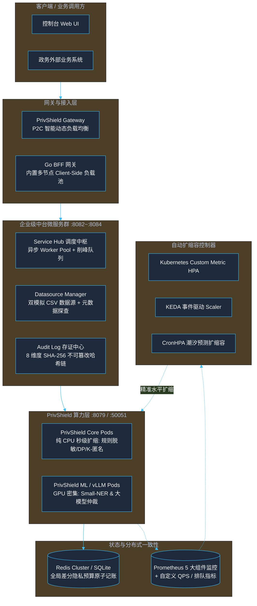

# PrivShield 生产级架构优化与高可用演进设计方案

> **版本**：v1.0.0  
> **适用范围**：`PrivShield` 核心算力引擎、中台微服务群（`service-hub` / `datasource-mgr` / `audit-log`）、控制台 BFF 及 Kubernetes 云原生部署套件。  
> **核心目标**：针对高并发政务与医疗数据流通场景，全面升级负载均衡、分布式预算一致性、细粒度事件驱动自动扩缩容（KEDA/CronHPA）、异步任务队列与极限压测套件。

---

## 1. 架构演进全景图



---

## 2. 核心优化模块详细设计

### 2.1 分布式全局隐私预算一致性中心 (Distributed Consistency Budget)

#### 现状痛点
单机 SQLite 模式在多副本 Deployment（如 5~20 个 Pod）水平扩展时，无法实现跨 Pod 强一致性的原子记账，可能导致隐私预算 $\epsilon$ 发生超支穿透。

#### 优化设计
在 `PrivShield/privacy/budget.py` 中引入统一后端抽象：
1. **`InMemoryBudgetAccountant`**：单机开发调试（零依赖）；
2. **`SQLiteBudgetAccountant`**：单机本地持久化；
3. **`RedisBudgetAccountant`**：生产多节点强一致原子记账，使用 Redis 原子指令与事务扣减，支持自动滑动时间窗口（`window_seconds`）重置。

```python
# 环境变量配置
PRIVACY_BUDGET_BACKEND=redis       # memory | sqlite | redis
PRIVACY_BUDGET_REDIS_URL=redis://:password@redis:6379/0
PRIVACY_BUDGET_TOTAL_EPSILON=10.0
PRIVACY_BUDGET_TOTAL_DELTA=0.01
PRIVACY_BUDGET_WINDOW_SECONDS=86400
```

---

### 2.2 智能动态负载均衡 (Smart Load Balancing)

#### 1. Go 微服务共享客户端多节点池化 (`pkg/agent/client.go`)
- **多端点配置**：支持环境变量 `PRIVACY_AGENT_URLS=http://agent-1:8079,http://agent-2:8079`；
- **客户端轮询与故障转移 (Client-Side Round-Robin & Failover)**：
  - 维护健康的节点列表，自动轮询分发；
  - 当某个节点连续失败达到阈值时自动熔断并剔除，在后台异步进行心跳探活；
  - 探活恢复后自动重新纳入可用节点池。

#### 2. Python 网关 P2C 动态负载调度 (`PrivShield/gateway/balancer.py`)
- **Power of Two Choices (P2C) 算法**：
  - 每次调度从健康节点列表中随机选取两个候选节点；
  - 计算候选节点的综合负载得分：
    $$\text{Score} = \text{ActiveConnections} \times 1.0 + \text{RecentLatencyMs} \times 0.05$$
  - 将请求派发给负载得分最低的节点，有效消除羊群效应（Herd Effect）。

---

### 2.3 细粒度事件驱动自动扩缩容 (Advanced Auto-Scaling)

#### 1. 基于自定义业务指标的 HPA 扩展
在 Helm Chart 中支持直接绑定 Prometheus 业务指标：
- **QPS 触发**：`rate(privacy_requests_total[1m]) > 200`
- **LLM 排队深度触发**：`privacy_llm_queue_depth > 2`
- **P95 延迟恶化触发**：`histogram_quantile(0.95, rate(privacy_request_duration_seconds_bucket[2m])) > 0.5`

#### 2. 算力分层 Deployment（Tiered Scaling）
- **`privshield-core`**：纯 CPU 算力（脱敏、K-匿名、差分隐私），极速秒级扩缩（副本数 3~30）；
- **`privshield-ml`**：GPU 显存算力（Small-NER 与本地 LLM），平稳扩缩（副本数 2~6）。

#### 3. CronHPA 潮汐预测调度
针对政务就医业务规律，预置工作日早高峰（08:15）提前扩容与夜间（20:00）自动缩容。

---

### 2.4 Service Hub 异步工作池与削峰填谷 (Async Task Worker Pool)

#### 优化设计
在 `services/service-hub` 中构建有界任务队列与工作池（Worker Pool）：
- 采用固定大小的 Goroutine Worker Pool 消费后台流水线任务；
- 提供任务排队、状态机追踪（`pending` ➔ `running` ➔ `completed` / `failed`）与超时保护；
- 避免突发数千任务并发时瞬间打爆系统资源。

---

### 2.5 极限压测与基准性能评估套件 (Stress & Benchmark Suite)

新增 `scripts/test/stress_test_suite.py` 自动化压测套件：
- 支持并发模拟 50~500 用户持续压测；
- 统计并输出 QPS、总吞吐、P50、P90、P95、P99 延迟及错误率；
- 验证在极限压力下熔断器与多节点负载均衡的稳定性。
