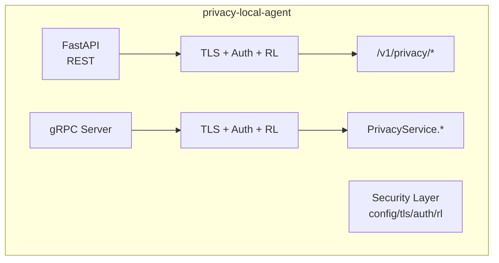
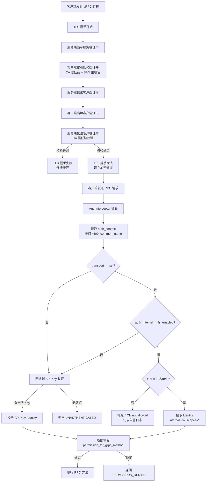
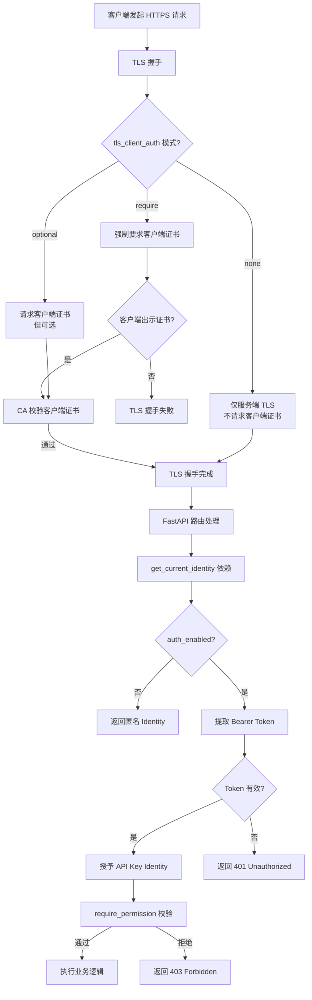
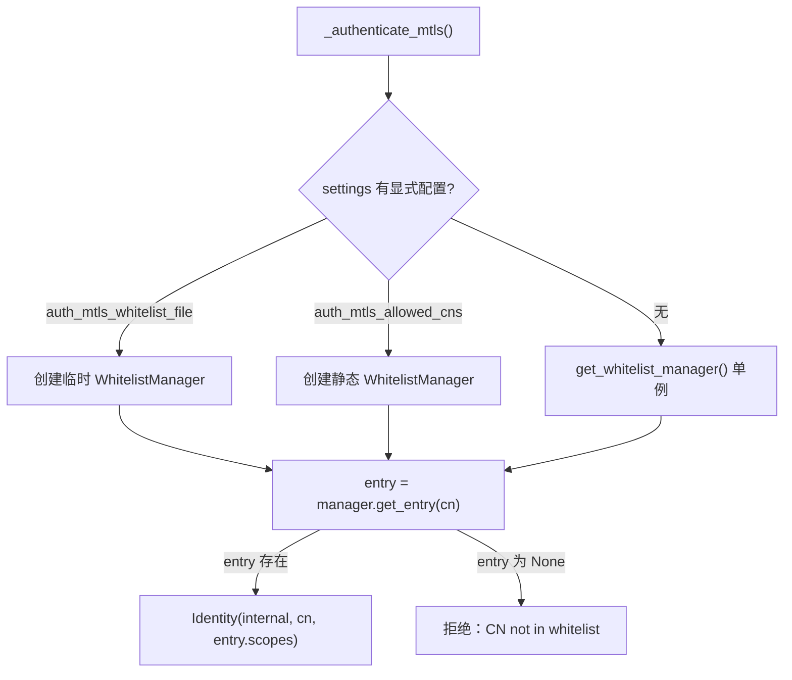

# 生产安全加固设计文档

> Scope: P0 — TLS/mTLS、认证鉴权、速率限制。


## 目录 (Table of Contents)

- [1. 概述](#1-概述)
- [2. 设计目标](#2-设计目标)
- [3. 威胁模型与缓解措施](#3-威胁模型与缓解措施)
- [4. 总体架构](#4-总体架构)
- [5. 模块设计](#5-模块设计)
  - [5.1 `security/config.py`](#51-securityconfigpy)
  - [5.2 `security/tls.py`](#52-securitytlspy)
  - [5.3 `security/identity.py`](#53-securityidentitypy)
  - [5.4 `security/auth.py`](#54-securityauthpy)
  - [5.5 `security/ratelimit.py`](#55-securityratelimitpy)
- [6. mTLS 白名单认证鉴权](#6-mtls-白名单认证鉴权)
  - [6.1 原理概述](#61-原理概述)
  - [6.2 认证流程](#62-认证流程)
  - [6.3 gRPC mTLS 白名单认证详解](#63-grpc-mtls-白名单认证详解)
  - [6.4 REST mTLS 客户端证书认证详解](#64-rest-mtls-客户端证书认证详解)
  - [6.5 证书生成与部署](#65-证书生成与部署)
  - [6.6 环境变量配置](#66-环境变量配置)
  - [6.7 Fail-Closed 安全设计](#67-fail-closed-安全设计)
  - [6.8 白名单管理器（WhitelistManager）](#68-白名单管理器whitelistmanager)
- [7. REST 与 gRPC 集成](#7-rest-与-grpc-集成)
  - [REST (`main.py`)](#rest-mainpy)
  - [gRPC (`grpc_server.py`)](#grpc-grpc_serverpy)
  - [统一启动器 (`server.py`)](#统一启动器-serverpy)
- [8. 部署约定](#8-部署约定)
  - [8.1 证书管理](#81-证书管理)
  - [8.2 K8s 探针](#82-k8s-探针)
  - [8.3 多副本限速](#83-多副本限速)
- [9. 错误码](#9-错误码)
- [10. 测试策略](#10-测试策略)
- [11. 工业化评分 / Industrialization Scorecard](#11-工业化评分-industrialization-scorecard)
  - [11.1 加权评分表](#111-加权评分表)
  - [11.2 结论](#112-结论)
  - [11.3 亮点](#113-亮点)
  - [11.4 改进建议](#114-改进建议)

---

## 1. 概述

本文档定义 `PrivShield` 生产安全模块的技术架构、设计原理与实现细节。该模块为 REST 与 gRPC 双协议提供可选的传输安全、身份认证、权限鉴权与速率限制能力。

## 2. 设计目标

- 为 REST/gRPC 提供可选的服务器端 TLS，gRPC 额外支持可选的 mTLS。
- 区分内部服务与外部服务两类身份，按最小权限原则控制接口访问。
- 基于调用者身份与接口路径/方法进行速率限制。
- 所有安全能力默认关闭，通过环境变量显式开启。

## 3. 威胁模型与缓解措施

| 威胁 | 缓解措施 |
|---|---|
| 链路上窃听隐私请求/响应 | REST/gRPC 服务端 TLS 加密 |
| 中间人篡改请求 | TLS + 客户端校验服务器证书；mTLS 同时校验客户端证书 |
| 未授权调用消耗隐私预算 | API Key / mTLS 认证 + 接口级 scope 鉴权 |
| 凭证泄露后横向越权 | 外部服务使用最小 scope；内部服务使用独立内部 Key |
| 暴力调用导致资源/预算耗尽 | 基于身份的速率限制 |
| K8s 探针因认证失败被误判 | `/health` 与 `Health` 默认匿名、不限速 |

## 4. 总体架构



安全层对 REST 与 gRPC 共享同一套配置与身份模型：

- `SecuritySettings`：统一从环境变量加载。
- `Identity`：调用者身份（internal/external + name + scopes）。
- `tls.py`：为 Uvicorn 与 gRPC server 构造 TLS 参数。
- `auth.py`：FastAPI dependency + gRPC interceptor。
- `ratelimit.py`：FastAPI dependency + gRPC interceptor。

## 5. 模块设计

### 5.1 `security/config.py`

使用 Pydantic v2 `BaseModel` 解析环境变量。

核心字段：

```python
class SecuritySettings(BaseModel):
    tls_enabled: bool = False
    tls_cert_file: Path | None = None
    tls_key_file: Path | None = None
    tls_ca_file: Path | None = None
    tls_client_auth: Literal["none", "optional", "require"] = "none"
    tls_key_password: str | None = None

    auth_enabled: bool = False
    auth_internal_mtls_enabled: bool = False
    auth_mtls_allowed_cns: list[str] = Field(default_factory=list)
    auth_mtls_whitelist_file: Path | None = None  # YAML 配置文件路径（可选）
    internal_keys: dict[str, KeyConfig] = Field(default_factory=dict)
    external_keys: dict[str, KeyConfig] = Field(default_factory=dict)

    rate_limit_enabled: bool = False
    rate_limit_default_rps: float = 10.0
    rate_limit_default_burst: float = 20.0
    rate_limit_per_endpoint: dict[str, RateLimitConfig] = Field(default_factory=dict)
    rate_limit_redis_url: str | None = None

    health_no_auth: bool = True
    health_no_rate_limit: bool = True
```

API Key 通过 JSON 环境变量注入：

```bash
PRIVACY_AUTH_INTERNAL_KEYS_JSON='{"sk-internal-1":{"name":"secretpad","scopes":["*"]}}'
PRIVACY_AUTH_EXTERNAL_KEYS_JSON='{"sk-external-1":{"name":"portal","scopes":["privacy:mask","classification:read"]}}'
```

### 5.2 `security/tls.py`

#### REST

为 `uvicorn.run()` 生成 SSL 参数字典：

```python
def uvicorn_ssl_kwargs(settings: SecuritySettings) -> dict:
    return {
        "ssl_keyfile": str(settings.tls_key_file),
        "ssl_certfile": str(settings.tls_cert_file),
        "ssl_keyfile_password": settings.tls_key_password,
        "ssl_cert_reqs": _map_client_auth(settings.tls_client_auth),
        "ssl_ca_certs": str(settings.tls_ca_file) if settings.tls_ca_file else None,
    }
```

`ssl_cert_reqs` 映射：

| `tls_client_auth` | `ssl.CERT_*` |
|---|---|
| none | `ssl.CERT_NONE` |
| optional | `ssl.CERT_OPTIONAL` |
| require | `ssl.CERT_REQUIRED` |

#### gRPC

```python
def grpc_server_credentials(settings: SecuritySettings) -> grpc.ServerCredentials:
    private_key = settings.tls_key_file.read_bytes()
    certificate_chain = settings.tls_cert_file.read_bytes()
    if settings.tls_client_auth == "require":
        root_certificates = settings.tls_ca_file.read_bytes()
        return grpc.ssl_server_credentials(
            ((private_key, certificate_chain),),
            root_certificates=root_certificates,
            require_client_auth=True,
        )
    return grpc.ssl_server_credentials(((private_key, certificate_chain),))
```

### 5.3 `security/identity.py`

```python
@dataclass(frozen=True)
class Identity:
    service_type: Literal["internal", "external"]
    name: str
    scopes: list[str]

    def has_permission(self, permission: str) -> bool:
        return "*" in self.scopes or permission in self.scopes
```

接口权限映射：

| REST 路径 | 权限 |
|---|---|
| `/v1/privacy/mask` | `privacy:mask` |
| `/v1/privacy/mask_record` | `privacy:mask` |
| `/v1/privacy/hash` | `privacy:hash` |
| `/v1/privacy/dp/count` | `privacy:dp` |
| `/v1/privacy/dp/sum` | `privacy:dp` |
| `/v1/privacy/dp/mean` | `privacy:dp` |
| `/v1/privacy/k_anonymize/record` | `privacy:kano` |
| `/v1/privacy/qol/obfuscate` | `privacy:qol` |
| `/v1/privacy/budget` | `privacy:budget` |
| `/v1/privacy/classify/*` | `classification:read` |

| gRPC 方法 | 权限 |
|---|---|
| `Mask` / `MaskRecord` | `privacy:mask` |
| `Hash` | `privacy:hash` |
| `DPCount` / `DPSum` / `DPMean` | `privacy:dp` |
| `KAnonymizeRecord` | `privacy:kano` |
| `ObfuscateQuery` | `privacy:qol` |
| `ClassifyField` / `ClassifyRecord` / `ClassifyTable` | `classification:read` |

### 5.4 `security/auth.py`

#### API Key 认证

从 `Authorization: Bearer <token>` 或 gRPC metadata `authorization` 中提取 token，在 `internal_keys` 与 `external_keys` 中查找。

#### mTLS 认证（gRPC）

```python
auth_context = context.auth_context()
cn = auth_context.get("x509_common_name", [b""])[0].decode()
```

若 CN 匹配配置的 `internal_cn_allowlist`，返回 internal identity。

#### FastAPI Dependency

```python
async def get_current_identity(request: Request) -> Identity:
    if not settings.auth_enabled:
        return Identity("internal", "anonymous", ["*"])
    if is_health_path(request.url.path) and settings.health_no_auth:
        return Identity("internal", "health-probe", ["*"])
    token = extract_bearer_token(request.headers.get("authorization"))
    identity = api_key_auth.authenticate(token)
    if identity is None:
        raise HTTPException(status_code=401, detail="Unauthorized")
    return identity
```

#### 权限依赖

```python
def require_permission(permission: str):
    async def checker(identity: Identity = Depends(get_current_identity)):
        if not identity.has_permission(permission):
            raise HTTPException(status_code=403, detail="Forbidden")
    return Depends(checker)
```

#### gRPC Auth Interceptor

Unary interceptor：在 `intercept_service` 中读取 metadata/auth_context，构造 identity 并校验权限；未通过则提前返回错误。

### 5.5 `security/ratelimit.py`

依赖 `limits` 库：

```python
from limits import storage, strategies

storage = storage.MemoryStorage() if not redis_url else storage.RedisStorage(redis_url)
limiter = strategies.MovingWindowRateLimiter(storage)
```

- 限流键：`f"{identity.name}:{method_or_path}"`
- 默认规则：`default_rps` requests/second，burst = `default_burst`
- 每接口覆盖：`PRIVACY_RATE_LIMIT_PER_ENDPOINT_JSON`

REST 超速：`HTTP 429 Too Many Requests`
gRPC 超速：`grpc.StatusCode.RESOURCE_EXHAUSTED`

## 6. mTLS 白名单认证鉴权

### 6.1 原理概述

mTLS（Mutual TLS，双向 TLS）在传统服务端 TLS 的基础上，要求**客户端同样向服务端出示 X.509 证书**，从而实现"服务端验证客户端身份 + 客户端验证服务端身份"的双向信任。

本项目的 mTLS 认证鉴权采用**两层校验**模型：

| 层级 | 校验内容 | 作用 |
|------|---------|------|
| **传输层**（TLS 握手） | 客户端证书是否由受信任 CA 签发 | 证明客户端持有合法证书（CA 信任链校验） |
| **应用层**（CN 白名单） | 证书 Common Name（CN）是否在 `PRIVACY_AUTH_MTLS_ALLOWED_CNS` 白名单中 | 证明客户端被**明确授权**访问本服务 |

> **核心设计原则**：通过 CA 校验仅代表"持有合法证书"，不代表"被授权访问本服务"。只有通过 CN 白名单匹配的客户端才会被授予内部身份（`Identity("internal", cn, ["*"])`），获得全接口访问权限。

这一设计解决了以下问题：

1. **证书泄露不影响安全**：即使某客户端证书被第三方获取，只要其 CN 不在白名单中，服务端依然拒绝访问。
2. **细粒度访问控制**：可以为不同 CN 的客户端证书分配不同的权限范围，结合 API Key scope 机制实现灵活的权限管理。
3. **零信任网络兼容**：即使在内网环境中，也需要显式授权才能调用隐私服务，防止横向越权。

### 6.2 认证流程

#### gRPC mTLS 完整认证流程



#### REST mTLS 认证流程



> **注意**：当前 REST 侧的 mTLS 客户端证书信息（CN）尚未接入 `get_current_identity` 依赖链。REST 的 mTLS 主要用于传输安全（强制客户端证书以保证连接可信），应用层认证仍依赖 API Key。gRPC 侧已完整实现 mTLS CN 白名单认证。

### 6.3 gRPC mTLS 白名单认证详解

#### 第一步：TLS 握手 — 传输层信任建立

gRPC 服务端启动时，根据 `SecuritySettings` 构造 `grpc.ServerCredentials`：

```python
# security/tls.py — grpc_server_credentials()
if settings.tls_client_auth in ("optional", "require"):
    root_certificates = settings.tls_ca_file.read_bytes()
    return grpc.ssl_server_credentials(
        ((private_key, certificate_chain),),
        root_certificates=root_certificates,
        require_client_auth=(settings.tls_client_auth == "require"),
    )
```

- `tls_client_auth = "require"`：强制要求客户端出示证书，TLS 握手阶段即拒绝无证书的客户端。
- `tls_client_auth = "optional"`：请求但不强制客户端证书，无证书的客户端仍可建立连接（后续回退到 API Key 认证）。
- `root_certificates`：服务端信任的 CA 证书，用于校验客户端证书是否由受信任的 CA 签发。

#### 第二步：提取客户端身份 — 从 auth_context 读取 CN

TLS 握手完成后，gRPC 框架将客户端证书信息写入 `auth_context`。`AuthInterceptor` 在每次 RPC 调用时提取：

```python
# security/auth.py — _authenticate_mtls()
def _authenticate_mtls(settings, auth_context):
    # 1. 检查 mTLS 认证是否显式启用（默认关闭，fail-closed）
    if not settings.auth_internal_mtls_enabled:
        return None
    # 2. 确认传输层为 SSL/TLS
    transport = auth_context.get("transport_security_type", [b""])[0]
    if transport != b"ssl":
        return None
    # 3. 提取客户端证书 Common Name
    cn_bytes = auth_context.get("x509_common_name", [b""])[0]
    if not cn_bytes:
        return None
    cn = cn_bytes.decode("utf-8", errors="replace")
    # 4. 白名单校验：通过 WhitelistManager 查找 CN
    #    - 若配置了 auth_mtls_whitelist_file，使用 YAML 文件（支持 per-CN scope + 热重载）
    #    - 若配置了 auth_mtls_allowed_cns，使用静态列表（向后兼容，scope=["*"]）
    #    - 否则使用全局单例（从环境变量初始化）
    manager = get_whitelist_manager()
    entry = manager.get_entry(cn)
    if entry is None:
        logger.warning("mTLS client certificate rejected: CN not in whitelist",
                       extra={"cn": cn, "reason": "cn_not_allowed"})
        return None
    # 5. 通过白名单校验 → 授予内部身份，使用条目定义的 scopes
    return Identity("internal", cn, entry.scopes)
```

#### 第三步：凭证优先级 — mTLS 优先于 API Key

```python
# security/auth.py — _extract_identity_from_grpc_context()
def _extract_identity_from_grpc_context(settings, context, method):
    # 优先尝试 mTLS（证书认证的信任强度高于 Bearer Token）
    auth_context = context.auth_context()
    if auth_context:
        identity = _authenticate_mtls(settings, auth_context)
        if identity:
            return identity  # mTLS 认证成功，直接返回

    # 健康检查端点豁免
    if is_health_path_or_method(method) and settings.health_no_auth:
        return Identity("internal", "health-probe", ["*"])

    # 回退到 API Key 认证
    metadata = dict(context.invocation_metadata() or [])
    token = _extract_bearer_token(metadata.get("authorization", ""))
    if token:
        return _authenticate_api_key(settings, token)
    return None
```

**优先级设计理由**：

- mTLS 证书在传输层由操作系统/硬件保护，私钥不离开客户端内存，信任强度高于可被截获/泄露的 Bearer Token。
- 因此先尝试 mTLS，成功后直接返回，不再检查 API Key。
- mTLS 失败（CN 不在白名单）时回退到 API Key，允许同时配置多种认证方式。

#### 第四步：权限校验 — scope 匹配

通过 mTLS 白名单的客户端获得 `Identity("internal", cn, entry.scopes)`，其中 `entry.scopes` 是在白名单配置中为该 CN 定义的权限列表。`AuthInterceptor._check()` 随后校验该身份是否有权调用目标 RPC 方法：

```python
permission = permission_for_grpc_method(method)  # e.g. "privacy:mask"
if not identity.has_permission(permission):
    context.abort(grpc.StatusCode.PERMISSION_DENIED, "Insufficient scope")
```

**Per-CN Scope 控制**：白名单管理器支持为每个 CN 定义独立的 scope 列表，实现最小权限原则：

| CN | Scopes | 说明 |
|---|---|---|
| `privacy-gateway` | `["*"]` | API 网关，全权限 |
| `prometheus-monitor` | `["health:read"]` | 监控服务，仅健康检查 |
| `data-analytics` | `["privacy:dp", "classification:read"]` | 数据分析，仅 DP + 分类 |

> 向后兼容：使用 `PRIVACY_AUTH_MTLS_ALLOWED_CNS` 环境变量时，所有 CN 默认获得 `["*"]` 全权限。

### 6.4 REST mTLS 客户端证书认证详解

REST 侧通过 Uvicorn 的 SSL 参数实现 mTLS 传输层安全：

```python
# security/tls.py — uvicorn_ssl_kwargs()
kwargs = {
    "ssl_keyfile": str(settings.tls_key_file),
    "ssl_certfile": str(settings.tls_cert_file),
    "ssl_cert_reqs": _map_client_auth(settings.tls_client_auth),
    "ssl_version": ssl.PROTOCOL_TLS_SERVER,
}
if settings.tls_ca_file is not None:
    kwargs["ssl_ca_certs"] = str(settings.tls_ca_file)
```

| `tls_client_auth` | `ssl_cert_reqs` | 行为 |
|---|---|---|
| `none` | `CERT_NONE` | 不请求客户端证书（仅服务端 TLS） |
| `optional` | `CERT_OPTIONAL` | 请求但不强制客户端证书 |
| `require` | `CERT_REQUIRED` | 强制要求客户端出示受信 CA 签发的证书 |

当 `tls_client_auth = "require"` 时，Uvicorn 底层 SSL 模块会在 TLS 握手阶段强制校验客户端证书：

- 客户端未出示证书 → TLS 握手失败，连接直接断开。
- 客户端出示的证书不是由 `ssl_ca_certs` 中 CA 签发 → 握手失败。
- 客户端证书通过 CA 校验 → 连接建立，请求到达 FastAPI 路由层。

REST 应用层目前仍通过 `Authorization: Bearer <token>` 进行 API Key 认证（见 `get_current_identity`）。mTLS 在 REST 侧的主要价值在于**传输层加固**——确保只有持有受信 CA 签发证书的客户端才能建立 TCP 连接。

### 6.5 证书生成与部署

#### 证书链结构

```
Root CA (privacy-local-agent-test-ca)
├── Server Certificate (CN=localhost, SAN: localhost/127.0.0.1, EKU: serverAuth)
│   → 部署在 Python agent 服务端
└── Client Certificate (CN=privacy-console-go-client, EKU: clientAuth)
    → 部署在 Go 代理客户端
```

#### 使用项目脚本生成测试证书

```bash
# 生成完整证书链（CA + 服务端 + 客户端）
bash console/backend-go/scripts/gen-certs.sh console/backend-go/certs
```

生成的文件：

| 文件 | 用途 | 部署位置 |
|------|------|----------|
| `ca.crt` | 受信任根 CA 证书 | 服务端 + 客户端 |
| `server.crt` | 服务端证书（含 SAN） | Python agent |
| `server.key` | 服务端私钥 | Python agent |
| `client.crt` | 客户端证书（EKU: clientAuth） | Go 代理 |
| `client.key` | 客户端私钥 | Go 代理 |

#### 生产环境证书要求

- 使用企业 PKI 或 Let's Encrypt 签发，禁止使用自签名证书。
- 服务端证书必须包含正确的 SAN（Subject Alternative Name），至少覆盖服务主机名。
- 客户端证书 EKU 应设置为 `clientAuth`（OID 1.3.6.1.5.5.7.3.2）。
- 私钥文件权限 `chmod 600`，生产通过 K8s Secret 或 KMS 注入。
- 证书有效期建议不超过 1 年，配合自动轮换机制。

### 6.6 环境变量配置

#### 服务端（Python agent）

```bash
# 启用 TLS + mTLS
export PRIVACY_TLS_ENABLED=true
export PRIVACY_TLS_CERT_FILE=/certs/server.crt
export PRIVACY_TLS_KEY_FILE=/certs/server.key
export PRIVACY_TLS_CA_FILE=/certs/ca.crt
export PRIVACY_TLS_CLIENT_AUTH=require          # 强制客户端出示证书

# 启用认证 + mTLS CN 白名单
export PRIVACY_AUTH_ENABLED=true
export PRIVACY_AUTH_INTERNAL_MTLS_ENABLED=true   # 显式启用 mTLS 认证（默认关闭）

# 方式一：YAML 配置文件（推荐，支持 per-CN scope + 热重载）
export PRIVACY_AUTH_MTLS_WHITELIST_FILE=/config/mtls-whitelist.yaml

# 方式二：静态 CN 列表（向后兼容，所有 CN 获得 ["*"] 全权限）
# export PRIVACY_AUTH_MTLS_ALLOWED_CNS='["privacy-console-go-client","secretpad"]'
# 也支持逗号分隔格式：
# export PRIVACY_AUTH_MTLS_ALLOWED_CNS=privacy-console-go-client,secretpad
```

#### YAML 白名单配置文件示例

```yaml
# config/mtls-whitelist.yaml
version: "1.0"
default_scopes: []  # 空列表 = fail-closed

entries:
  - cn: "privacy-console-go-client"
    scopes: ["*"]
    description: "Go console backend - full access"
    enabled: true

  - cn: "prometheus-monitor"
    scopes: ["health:read"]
    description: "Prometheus scraper - health check only"
    enabled: true

  - cn: "data-analytics"
    scopes: ["privacy:dp", "classification:read"]
    description: "Analytics pipeline - DP and classification"
    enabled: true
```

**热重载**：修改 YAML 文件后无需重启服务，下次请求到达时自动检测并重新加载（基于文件 mtime）。

#### 客户端（Go 代理）

```bash
export PRIVACY_AGENT_TLS_ENABLED=true
export PRIVACY_AGENT_TLS_CERT_FILE=/certs/client.crt
export PRIVACY_AGENT_TLS_KEY_FILE=/certs/client.key
export PRIVACY_AGENT_TLS_CA_FILE=/certs/ca.crt
export PRIVACY_AGENT_TLS_SERVER_NAME=localhost
```

### 6.7 Fail-Closed 安全设计

所有 mTLS 相关配置默认均为"关闭"或"空"，确保未显式配置时行为最为严格：

| 配置项 | 默认值 | Fail-Closed 行为 |
|--------|--------|------------------|
| `auth_internal_mtls_enabled` | `false` | 即使客户端证书通过 CA 校验，也不授予任何身份 |
| `auth_mtls_allowed_cns` | `[]`（空列表） | 即使启用了 mTLS 认证，也拒绝所有证书 |
| `tls_client_auth` | `"none"` | 不请求客户端证书，不启用 mTLS |

配置一致性校验由 Pydantic v2 `model_validator` 保证：

- `tls_client_auth` 为 `"optional"` 或 `"require"` 时必须提供 `tls_ca_file`，否则抛出 `ValueError`。
- `tls_enabled` 为 `true` 时必须提供 `tls_cert_file` 和 `tls_key_file`。

认证拒绝均记录到结构化日志（`logger.warning`）并计入 `privacy_auth_denials_total` Prometheus Counter 与 `privacy_auth_duration_seconds` Histogram，供运维监控与告警。

### 6.8 白名单管理器（WhitelistManager）

为解决静态 CN 列表的局限性（所有 CN 获得相同的全权限 `"*"`，修改需重启服务），项目引入了 `WhitelistManager` 模块，提供：

- **Per-CN Scope 控制**：每个 CN 可配置独立的权限 scope 列表，实现最小权限原则
- **YAML 配置文件**：支持结构化配置（CN、scopes、description、enabled）
- **热重载**：基于文件 mtime 的请求驱动重载，无需重启服务
- **向后兼容**：未配置 YAML 文件时回退到环境变量静态列表

#### 架构设计



#### 核心类

```python
# security/whitelist.py

class CNEntry(BaseModel):
    """单个 CN 白名单条目。"""
    cn: str
    scopes: list[str] = Field(default_factory=lambda: ["*"])
    description: str = ""
    enabled: bool = True

class WhitelistConfig(BaseModel):
    """YAML 配置文件根模型。"""
    version: str = "1.0"
    entries: list[CNEntry] = Field(default_factory=list)
    default_scopes: list[str] = Field(default_factory=list)

class WhitelistManager:
    """线程安全的白名单管理器，支持热重载。"""
    def __init__(self, config_path: Path | None, static_cns: list[str] | None):
        ...
    def get_entry(self, cn: str) -> CNEntry | None:
        """查找 CN 条目，触发重载检查。"""
    def is_allowed(self, cn: str) -> bool:
        """检查 CN 是否在白名单中。"""
    def reload(self) -> None:
        """强制重新加载配置。"""
```

#### 热重载机制

热重载采用**请求驱动 + 被动检查**模式（与分类规则引擎一致）：

1. 每次 `get_entry()` 调用时检查配置文件 mtime
2. 若 mtime 大于上次加载时间，触发重载
3. 使用 `threading.RLock` 保证线程安全
4. **两阶段提交**：先解析到临时缓存，成功后原子替换
5. 加载失败时保留旧配置，确保服务可用性

```python
def _check_reload(self):
    if self._config_path is None:
        return
    current_mtime = self._config_path.stat().st_mtime
    if current_mtime > self._last_mtime:
        self._load()  # 两阶段提交
```

#### 环境变量

| 环境变量 | 默认值 | 说明 |
|---|---|---|
| `PRIVACY_AUTH_MTLS_WHITELIST_FILE` | 空 | YAML 白名单配置文件路径。设置后启用 per-CN scope 控制与热重载 |
| `PRIVACY_AUTH_MTLS_ALLOWED_CNS` | 空 | 静态 CN 列表（逗号分隔或 JSON 数组）。当 WHITELIST_FILE 未设置时使用 |

> **优先级**：`PRIVACY_AUTH_MTLS_WHITELIST_FILE` > `PRIVACY_AUTH_MTLS_ALLOWED_CNS`。两者都未设置时白名单为空，拒绝所有 mTLS 证书（fail-closed）。

## 7. REST 与 gRPC 集成

### REST (`main.py`)

```python
from fastapi import Depends
from .security.auth import get_current_identity, require_permission
from .security.ratelimit import rate_limit_dependency

@app.get("/health")
def health(): ...

app.include_router(
    classification_router,
    dependencies=[Depends(get_current_identity), Depends(rate_limit_dependency)],
)

@app.post("/v1/privacy/mask", dependencies=[require_permission("privacy:mask")])
def mask(req: MaskRequest): ...
```

### gRPC (`grpc_server.py`)

```python
from .security.auth import AuthInterceptor
from .security.ratelimit import RateLimitInterceptor
from .security.tls import grpc_server_credentials

interceptors = []
if settings.auth_enabled:
    interceptors.append(AuthInterceptor(settings))
if settings.rate_limit_enabled:
    interceptors.append(RateLimitInterceptor(settings))

server = grpc.server(
    futures.ThreadPoolExecutor(max_workers=max_workers),
    interceptors=tuple(interceptors),
)

if settings.tls_enabled:
    server.add_secure_port(f"[::]:{port}", grpc_server_credentials(settings))
else:
    server.add_insecure_port(f"[::]:{port}")
```

### 统一启动器 (`server.py`)

```python
from .security.config import settings
from .security.tls import uvicorn_ssl_kwargs

ssl_kwargs = uvicorn_ssl_kwargs(settings) if settings.tls_enabled else {}
uvicorn.run(app, host=REST_HOST, port=REST_PORT, log_level="info", **ssl_kwargs)
```

## 8. 部署约定

### 8.1 证书管理

- 服务器证书与私钥挂载到 `/certs/server.crt`、`/certs/server.key`。
- CA 证书挂载到 `/certs/ca.crt`（mTLS 模式必需）。
- 私钥口令通过环境变量注入，生产建议通过 K8s Secret 管理。

### 8.2 K8s 探针

```yaml
livenessProbe:
  httpGet:
    path: /health
    port: 8079
    scheme: HTTP
readinessProbe:
  httpGet:
    path: /health
    port: 8079
```

保持 `PRIVACY_HEALTH_NO_AUTH=true` 与 `PRIVACY_HEALTH_NO_RATE_LIMIT=true`。

### 8.3 多副本限速

单副本使用内存计数器；多副本时配置 `PRIVACY_RATE_LIMIT_REDIS_URL`。

## 9. 错误码

| 场景 | REST | gRPC |
|---|---|---|
| 未认证 | 401 Unauthorized | `UNAUTHENTICATED` |
| 越权 | 403 Forbidden | `PERMISSION_DENIED` |
| 超速 | 429 Too Many Requests | `RESOURCE_EXHAUSTED` |
| TLS 握手失败 | SSL/TLS 连接断开 | `UNAVAILABLE` |

## 10. 测试策略

- 使用 `cryptography` 动态生成 CA/服务器/客户端证书链。
- REST TLS 测试：使用 `httpx` 访问 HTTPS 端口，验证信任/不信任 CA。
- gRPC TLS/mTLS 测试：使用 `grpc.ssl_channel_credentials` + metadata。
- 认证测试：FastAPI `TestClient` 设置 headers；gRPC metadata。
- 限速测试：短时间连续调用直到触发限流。

## 11. 工业化评分 / Industrialization Scorecard

> **工业化软件 = 功能正确 + 性能稳定 + 安全可靠 + 可维护 + 可观测 + 可快速迭代**
>
> 评估框架参考 ISO/IEC 25010 与 Google SRE 实践，采用 6 维度加权评分（1–10 分）。

### 11.1 加权评分表

| 维度 | 权重 | 得分 | 说明 |
|------|------|------|------|
| 功能完整性 | 20% | 9/10 | TLS/mTLS、API Key + mTLS 认证、scope 鉴权、移动窗口限速；REST/gRPC 双协议；Redis 可选 |
| 性能 | 15% | 8/10 | 内存存储零网络开销；MovingWindow 策略；Redis 可选扩展多副本 |
| 可靠性 | 20% | 8/10 | 所有安全能力默认关闭，显式开启；健康探针豁免；优雅降级 |
| 安全性 | 15% | 9/10 | 威胁模型完整；最小权限原则；凭证不硬编码；K8s Secret 注入 |
| 可维护性 | 15% | 8/10 | `from __future__` 全覆盖；Pydantic v2 配置；模块拆分清晰（5 个文件） |
| 工程化 | 15% | 6/10 | `privacy_auth_denials_total` Counter 存在；但 auth/ratelimit 缺少结构化日志与延迟指标 |
| **总分** | **100%** | **8.10** | |

### 11.2 结论

**通过（Pass）**——满足工业化要求，可进入主线。

### 11.3 亮点

- 威胁模型与缓解措施表完整，覆盖 6 类威胁。
- 安全能力全默认关闭，不影响开发与测试。
- 接口级 scope 权限映射清晰（REST 路径 + gRPC 方法）。
- 健康探针豁免设计避免 K8s 误判。

### 11.4 改进建议

| 优先级 | 建议 | 影响维度 |
|--------|------|----------|
| P1 | 为 auth.py/ratelimit.py 添加 `get_logger(__name__)` + `extra={}` 结构化日志 | 工程化 +1.5 |
| P1 | 添加 `privacy_auth_latency_seconds` Histogram | 工程化 +0.5 |
| P2 | 添加 API Key 轮换机制文档 | 安全性 +0.5 |
| P3 | 补充审计日志（谁在什么时间访问了什么接口） | 安全性 +0.5 |