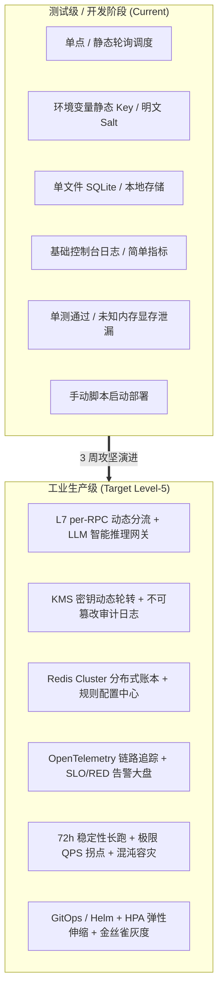
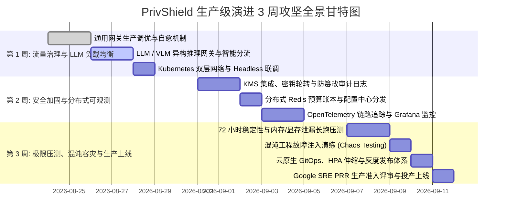
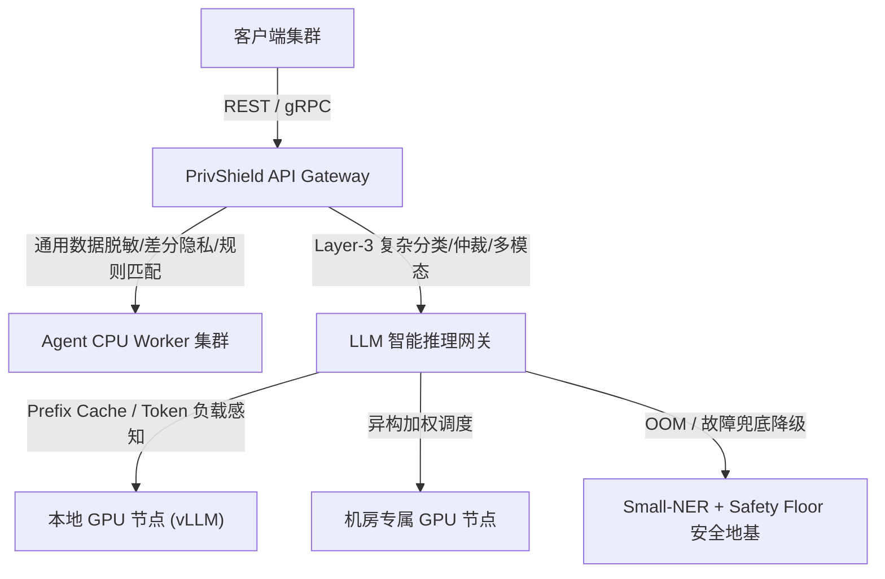
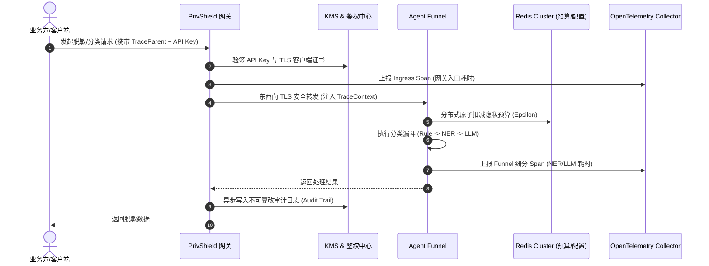
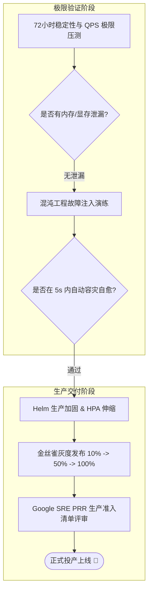
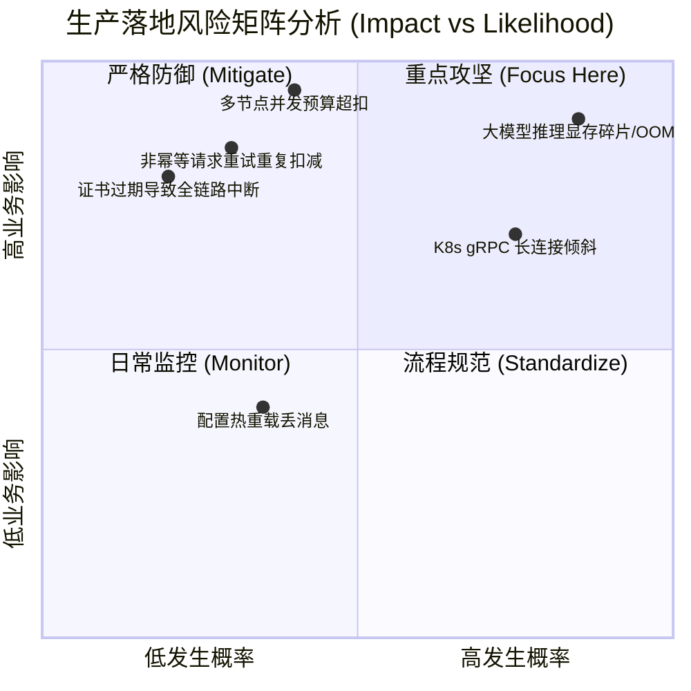

# PrivShield 从测试级走向生产级 (Production-Ready) 三周攻坚演进计划

> 本规划文档系统化定义 `PrivShield`（数盾 · 隐私计算与数据安全治理系统）从 **测试/开发原型阶段（Test/Dev Prototype）** 全面演进并达标 **工业生产级（Level-5 Production-Ready / Enterprise Grade）** 的端到端攻坚路线图。
>
> 目标：构建具备金融/医疗级高可用、零信任安全合规、状态解耦、自愈容灾、全链路可观测与弹性伸缩能力的企业级隐私计算 Sidecar 与网关基础设施。

---

## 目录 (Table of Contents)

- [1. 演进背景与生产级核心差距 (The Production Gap)](#1-演进背景与生产级核心差距-the-production-gap)
- [2. 三周攻坚全景甘特图 (Roadmap Overview)](#2-三周攻坚全景甘特图-roadmap-overview)
- [3. 详细排期与分日实施计划](#3-详细排期与分日实施计划)
  - [3.1 Week 1: 流量接入、网关治理与 LLM 智能负载均衡](#31-week-1-流量接入网关治理与-llm-智能负载均衡)
  - [3.2 Week 2: 零信任安全加固、分布式状态与全链路可观测性](#32-week-2-零信任安全加固分布式状态与全链路可观测性)
  - [3.3 Week 3: 极限并发压测、混沌容灾、云原生 GitOps 与生产准入](#33-week-3-极限并发压测混沌容灾云原生-gitops-与生产准入)
- [4. 每周里程碑与关键交付物清单 (Deliverables)](#4-每周里程碑与关键交付物清单-deliverables)
- [5. 生产就绪评审硬性检查清单 (PRR Checklist)](#5-生产就绪评审硬性检查清单-prr-checklist)
- [6. 生产风险矩阵与应急预案 (Risk & Mitigation)](#6-生产风险矩阵与应急预案-risk--mitigation)

---

## 1. 演进背景与生产级核心差距 (The Production Gap)

测试级（Dev/Test）项目通常仅关注“功能跑通与单机演示”，而企业生产级（Production-Ready）系统则要求在面对**网络抖动、突发海量并发、硬件掉卡、多租户恶意渗透与断电瞬断**等极端工况时，依然具备 99.99% 的可用性、数据零超扣与可合规追溯性。



### 生产级 7 大核心差距对比

| 核心领域 | 测试级现状 (Current Dev) | 生产级硬性标准 (Production Ready) | 业务与安全影响 |
|---|---|---|---|
| **1. 流量与调度** | 简单静态轮询，gRPC 长连接在 K8s 下单一 Pod 钉死 | **L7 per-RPC 调度、LLM Token/槽位感知智能分流、K8s 双层协同** | 防止大模型/高耗时计算打爆单台机器，消除雪崩风险 |
| **2. 安全与凭证** | 静态环境变量配置 Key，明文 Salt，缺乏细粒度审计 | **KMS 密钥动态轮转、不可篡改审计日志 (Audit Trail)、分布式限流** | 满足《数据安全法》等保三级要求，防内网提权与篡改 |
| **3. 存储与状态** | 单节点 / NFS 共享 SQLite 文件锁 | **Redis Cluster / 分布式事务账本、多机房冷热备、规则动态广播** | 消除共享文件锁 IO 性能瓶颈，杜绝多节点并发超扣预算 |
| **4. 高可用与自愈** | 进程挂死需手动重启，故障感知延迟数秒 | **双协议主动探针 + 0ms 被动下线 + 节点独立三态熔断 + 优雅停机** | 确保单节点崩溃时业务零感知、流量秒级自动切换 |
| **5. 全链路可观测** | 控制台简单日志，无链路拓扑 | **OpenTelemetry 分布式链路追踪、SLO 告警、RED 看板、Error Budget** | 秒级定位超时是由于网络抖动、模型推理还是存储锁竞争 |
| **6. 性能与极限** | 单元测试通过，未测并发与长跑 | **72小时内存驻留与 GPU 显存泄漏压测、QPS 极限拐点、混沌注入** | 暴露 PyTorch/ONNX 多线程显存泄漏与突发故障自愈缺陷 |
| **7. 运维与交付** | 本地手工运行脚本，缺乏灰度与弹性 | **Helm/GitOps、HPA 基于 GPU/QPS 自动弹性扩缩、金丝雀灰度、SOP** | 达成 0 停机发布、秒级弹性扩缩与标准 On-Call 运维 |

---

## 2. 三周攻坚全景甘特图 (Roadmap Overview)



---

## 3. 详细排期与分日实施计划

### 3.1 Week 1: 流量接入、网关治理与 LLM 智能负载均衡

> **核心目标**：彻底打通通用业务流量与大模型/GPU 计算流量的统一接入与精细调度，解决长连接倾斜与异构算力分流。



#### 分日实施任务：
- **Day 1–Day 2: 通用 API 网关与 Agent 调度池加固**
  - [x] 验证平滑加权轮询 (SWRR)、最小连接数 (Least Connections) 及 5 种算法；
  - [x] 调优 64 MiB 消息缓冲区与单例连接池复用（Keep-Alive 100 / Max 500）；
  - [x] 落地非幂等重试中断安全边界（仅 ConnectError 允许重试，防二次扣减）。
- **Day 3–Day 4: LLM / VLM 专用推理负载均衡器 (LLM Gateway)**
  - [ ] **算力池化管理**：将本地 GPU 实例 (vLLM)、跨机房物理 GPU 节点与远程模型 API 进行统一接入池化；
  - [ ] **智能感知分流算法**：
    - 基于当前正在处理的 Token 长度与空闲槽位（Available Slots）动态选路；
    - 基于 Prompt Prefix Cache 命中率感知调度（将相同前缀任务派发至同一实例）；
  - [ ] **GPU OOM 与过载降级自愈**：
    - 当 LLM 实例显存耗尽（OOM）或排队超时时，自动触发 Layer-3 降级回退机制；
    - 由 Layer-2 Small-NER + Layer-1 规则地基（Safety Floor）兜底仲裁，严禁返回 500 崩溃。
- **Day 5: 云原生 Kubernetes 双层协同联调**
  - [x] 部署 Ingress + Gateway + Headless Service 编排；
  - [ ] 在真实 K8s 集群执行动态弹性伸缩（`kubectl scale`）验证，确认无长连接钉住现象。

---

### 3.2 Week 2: 零信任安全加固、分布式状态与全链路可观测性

> **核心目标**：构建金融级零信任安全合规闭环，解除单机存储瓶颈，实现全链路透明追踪。



#### 分日实施任务：
- **Day 1–Day 2: 零信任安全加固与密钥合规治理**
  - [ ] **KMS 密钥管理系统对接**：集成 HashiCorp Vault / 阿里云 KMS / AWS KMS，实现 HMAC Salt、API Key 与 TLS 私钥的统一纳管；
  - [ ] **密钥无感动态轮转 (Zero-Downtime Key Rotation)**：支持每 30 天自动轮换 Salt 与 Token，旧 Key 在双活过渡期保持只读验签；
  - [ ] **不可篡改合规审计日志 (Audit Trail)**：对每一次敏感数据分类分级、脱敏及预算操作，生成包含 SHA256 签名的审计条目，支持等保三级审计追溯；
  - [ ] **分布式集群限流 (Distributed Rate Limiting)**：基于 Redis 滑动窗口实现针对 IP / API Key / 租户的全局并发与速率限制。
- **Day 3: 分布式状态解耦与隐私预算存储演进**
  - [ ] **隐私预算存储升级**：提供 Redis Cluster 与 PostgreSQL 分布式事务账本驱动，解除对单文件 SQLite NFS 的依赖；
  - [ ] **配置动态分发中心**：通过 Redis PubSub / Etcd 监听机制，实现 YAML 分类规则与 Taxonomy 标准的跨节点秒级热重载广播。
- **Day 4–Day 5: 全链路分布式追踪与 Prometheus 生产看板**
  - [ ] **OpenTelemetry (OTel) 链路打通**：
    - 网关生成或提取 W3C `traceparent`；
    - 透传至 Agent 内部的 Funnel（Step 1 规则 $\rightarrow$ Step 2 NER $\rightarrow$ Step 3 LLM）与隐私原语；
    - 导出至 Jaeger / Tempo，形成调用链火焰图；
  - [ ] **Grafana 生产监控大盘**：依据 RED 方法论（Rate 请求率, Errors 错误率, Duration 耗时分布）构建统一看板，配置 SLO 99.9% 告警与 Error Budget 消耗告警。

---

### 3.3 Week 3: 极限并发压测、混沌容灾、云原生 GitOps 与生产准入

> **核心目标**：极限施压检验系统瓶颈，注入破坏性故障验证自愈能力，完成生产就绪评审与投产上线。



#### 分日实施任务：
- **Day 1–Day 2: 极限并发性能压测与长跑稳定性测试**
  - [ ] **QPS 吞吐拐点与极限容量压测**：使用 Locust / wrk 对脱敏、差分隐私、分类漏斗进行梯度加压（500 $\rightarrow$ 2000 $\rightarrow$ 5000 QPS），绘制 P95/P99 延迟拐点曲线；
  - [ ] **72 小时稳定性长跑压测**：在 70% 额定水位下持续压测 72 小时，监控 Python 进程常驻内存（RSS）、PyTorch 显存碎片、AsyncIO 连接数，确保无泄漏；
  - [ ] **多模态大文件吞吐测试**：压测 50MB~100MB 批次大表与医学图像脱敏场景。
- **Day 3: 混沌工程故障注入演练 (Chaos Engineering)**
  - [ ] **节点突发宕机测试**：随机 `kill -9` 后端 Agent Worker 或 GPU 节点，验证网关 0ms 被动故障剔除与熔断器自愈；
  - [ ] **弱网与存储抖动测试**：注入 20% 网络丢包、500ms 网络延迟与磁盘 IO 满载，验证降级保护与重试安全边界。
- **Day 4: 云原生 GitOps、HPA 自动弹性伸缩与灰度发布**
  - [ ] **HPA 弹性扩缩容**：基于 CPU / GPU 显存利用率及自定义 Prometheus QPS 指标配置 Horizontal Pod Autoscaler；
  - [ ] **金丝雀灰度发布 (Canary Deployment)**：编写金丝雀切流策略（10% $\rightarrow$ 50% $\rightarrow$ 100%）与秒级一键无损回滚 SOP。
- **Day 5: 生产就绪评审 (PRR Sign-Off) 与正式上线**
  - [ ] 依照 Google SRE 生产就绪评审清单逐项核验；
  - [ ] 产出《生产应急预案手册 (Runbook)》与 On-Call 轮值运维交接；
  - [ ] 正式投产上线。

---

## 4. 每周里程碑与关键交付物清单 (Deliverables)

```
PrivShield 生产级演进可交付物全景
│
├── 📦 Week 1 交付物 (流量与调度)
│   ├── [代码] engine.gateway 代理转发与负载均衡核心模块
│   ├── [代码] engine.gateway.llm_balancer LLM 专用推理负载均衡器
│   ├── [配置] deploy/k8s/privshield-k8s-two-tier.yaml 双层网络协同编排清单
│   └── [测试] tests/gateway/ 55 项单元与集成测试套件 (100% Passed)
│
├── 📦 Week 2 交付物 (安全与可观测)
│   ├── [代码] PrivShield.security.kms 密钥管理与自动轮换驱动
│   ├── [代码] PrivShield.security.audit 不可篡改审计日志模块
│   ├── [代码] PrivShield.privacy.budget_redis 分布式 Redis 预算账本驱动
│   ├── [观测] deploy/observability/opentelemetry.yaml 链路追踪配置
│   └── [看板] deploy/grafana/dashboards/privshield-production.json 生产监控大盘
│
└── 📦 Week 3 交付物 (压测、容灾与发布)
    ├── [报告] docs/benchmarks/72h_stress_test_report.md 性能容量与压测报告
    ├── [报告] docs/chaos/chaos_engineering_report.md 混沌容灾演练报告
    ├── [编排] deploy/helm/PrivShield-production/ 生产加固版 Helm Chart
    ├── [手册] docs/runbook/production_troubleshooting.md 生产排障应急 Runbook
    └── [评审] docs/audit_reports/prr_production_signoff.md 生产就绪评审签署单
```

---

## 5. 生产就绪评审硬性检查清单 (PRR Checklist)

在 Week 3 最终上线前，必须 100% 满足以下 12 条准入标准：

| 序号 | 检查领域 | 准入硬性指标 | 验证方式 | 状态 |
|:---:|---|---|---|:---:|
| 1 | **流量调度** | gRPC 长连接在 K8s 内部无单 Pod 钉住，per-RPC 均匀分发 | 压测时观察各 Pod CPU/QPS 差值 < 10% | [ ] |
| 2 | **LLM 调度** | GPU 满载或 OOM 时 100% 自动降级为 Small-NER + 规则地基 | 模拟显存占满，验证无 500 报错 | [ ] |
| 3 | **密钥安全** | 严禁明文硬编码任何 Secret/Salt，必须通过 KMS/Secret 注入 | 静态代码扫描 (TruffleHog / Bandit) | [ ] |
| 4 | **审计合规** | 敏感分类与脱敏操作具备 SHA256 签名审计追踪日志 | 检查审计日志字段完整度与校验防篡改 | [ ] |
| 5 | **预算一致** | 多实例高并发扣减差分隐私预算，绝无超扣与 Race Condition | 并发压测超量请求，验证最终拦截正确率 | [ ] |
| 6 | **被动容灾** | 节点突发宕机，网关 0ms 被动感知并在 5s 冷却内完成故障转移 | 随机 Kill 实例，观察请求成功率 $\ge 99.99\%$ | [ ] |
| 7 | **熔断保护** | 连续失败 5 次触发熔断 Open，30s 冷却后半开自愈 | 单元与集成测试验证 | [ ] |
| 8 | **内存稳定性** | 70% 负荷连续运行 72 小时无内存/显存单调递增泄漏 | 连续监控 RSS 曲线与 GPU 内存碎片率 | [ ] |
| 9 | **监控覆盖** | QPS、P95/P99 延迟、健康节点数、熔断状态已接入 Prometheus | 验证 Grafana 仪表盘与 Alertmanager 告警通路 | [ ] |
| 10 | **链路追踪** | OpenTelemetry TraceContext 完整贯穿网关、漏斗与模型层 | 在 Jaeger 中查看全链路火焰图调用栈 | [ ] |
| 11 | **弹性扩缩** | HPA 在高负载下 60 秒内自动拉起新副本并平滑承接流量 | 压测注入流量，观察 Pod 自动伸缩过程 | [ ] |
| 12 | **回滚能力** | 新版本发布异常时可在 30 秒内一键秒级回滚到上一稳定版 | 执行 `helm rollback` 演练 | [ ] |

---

## 6. 生产风险矩阵与应急预案 (Risk & Mitigation)



### 关键风险应对策略

1. **风险 1：大模型推理多线程显存碎片与 GPU OOM**
   - **应对预案**：
     - 网关配置基于 Context Length 与 Available Slots 的前置限流；
     - 部署独立的 vLLM 推理服务，与 Agent 主服务进行物理进程隔离；
     - 漏斗内置 Safety Floor 安全地基兜底，OOM 触发时秒级退避至 Small-NER 与正则层。
2. **风险 2：分布式高并发场景下的隐私预算超扣**
   - **应对预案**：
     - Redis 采用 Lua 脚本保证预算“检查+扣减”的原子性；
     - 分布式数据库采用 `BEGIN IMMEDIATE` / `SELECT ... FOR UPDATE` 排他写锁；
     - 设立全局硬性限额与预算耗尽前置预警（达到 80% 触发告警）。
3. **风险 3：生产发布与灰度切流异常**
   - **应对预案**：
     - 严格实施金丝雀灰度发布（10% 观测 30 分钟无 5xx 错误再推进）；
     - 预置 `helm rollback` 一键回滚脚本，保障 RTO $< 30$ 秒。
