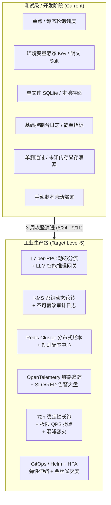
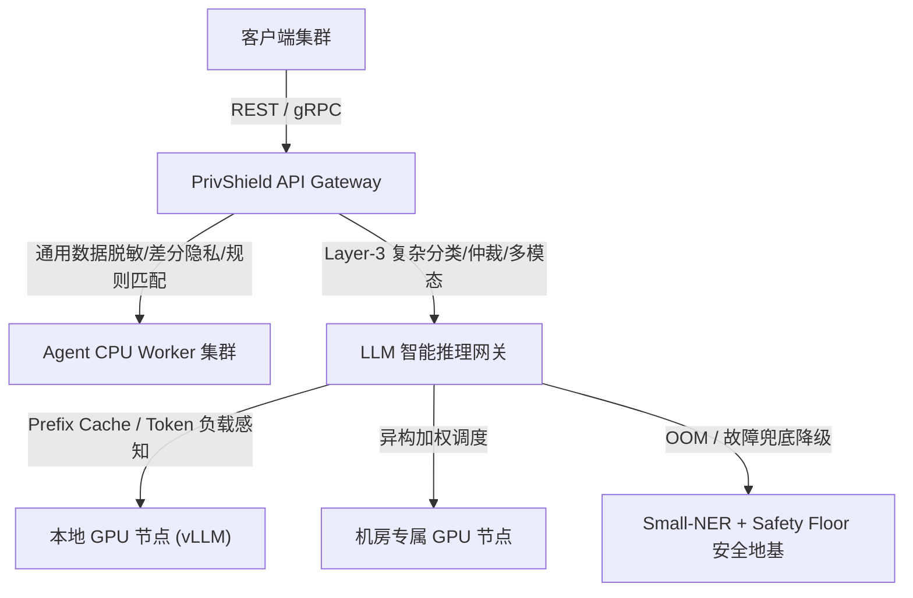
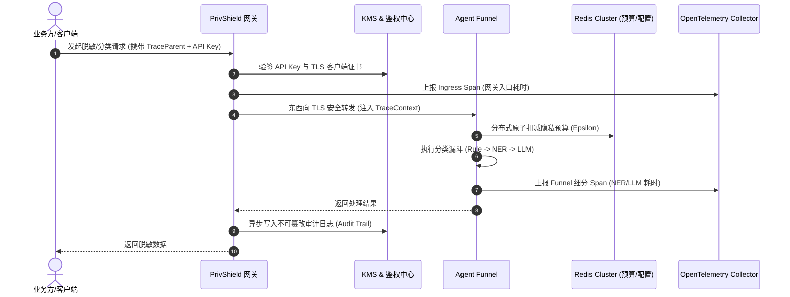
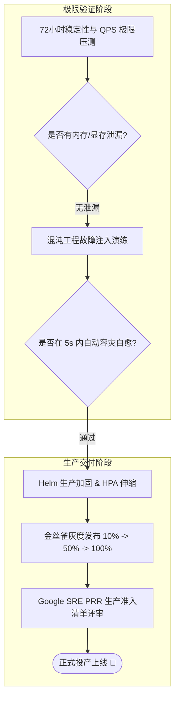
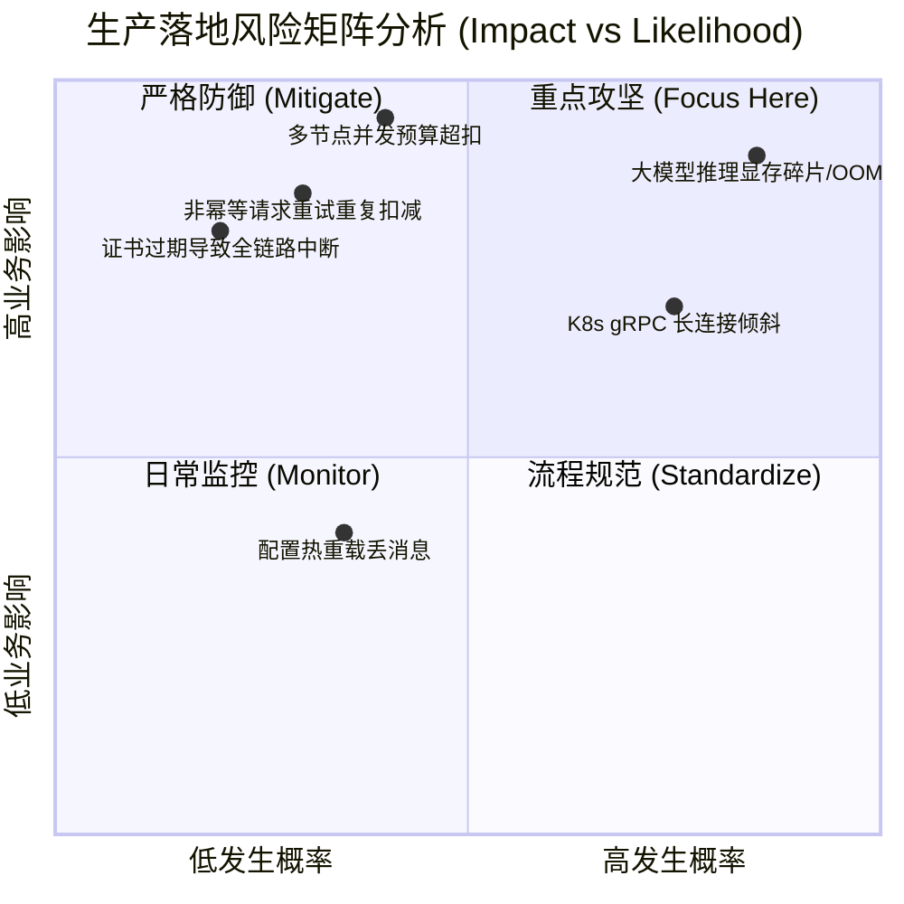

# 隐私计算平台 —— 团队汇报与落地

> 面向对象：研发团队、产品、安全合规、项目管理  
> 文档定位：比立项报告更复杂，用于团队内部对齐、技术汇报与后续开发落地  
> 涵盖范围：数据分类分级（Data Classification）+ 本地隐私处理（DP / K-匿名 / 脱敏 / 查询混淆）+ 联邦学习 / 安全多方计算（FL / MPC）  
> 计划时间 2026.7.20
---

## 摘要（Executive Summary）

本项目要解决的核心问题是：**如何让 SecretFlow / SecretPad 平台既能识别数据的敏感程度，又能根据敏感程度自动、安全地处理数据。**

为此，我们构建**三层隐私计算能力体系**：

1. **数据分类分级（Data Classification）**：像给数据贴“安全标签”一样，自动判断字段、记录、整表的敏感等级（L1 ~ L5），并输出可被下游系统消费的策略标签。
2. **本地隐私处理（Local Privacy Processing）**：在数据被使用或出域前，自动或手动地执行脱敏、K-匿名、差分隐私、查询混淆四种保护手段。
3. **联邦学习 / 安全多方计算（FL / MPC）**：在跨机构、跨域的协同计算中，让原始数据始终不出域、不可见，仅交换模型参数或加密后的计算结果。

这三层能力按“**识别 → 处理 → 协同**”的流水线串联，共同构成完整的隐私计算平台体系：

```
数据接入 → 分类分级（L1~L5） → 本地隐私处理 → 联邦学习 / MPC → 审计与预算台账
```

其中，第 1、2 层支持“**双模执行**”：

- **批量模式**：作为 SecretFlow 组件，跑在 DataMesh / Kuscia 上处理整表；
- **本地模式**：作为 Java / Go / Python SDK 或 REST / gRPC 服务，嵌入业务系统处理单条 / 小批量数据。

本文档将围绕“为什么、是什么、怎么做”三个维度，结合医疗场景实例，系统阐述算法目标、架构设计、代码交付形态、参数治理、多语言多格式支持以及产品需求。

------

## 一、为什么做这件事

### 1.1 现实痛点

在当前隐私计算平台的实际落地中，普遍存在以下问题：

| 痛点               | 具体表现                                                 | 后果                                            |
| ------------------ | -------------------------------------------------------- | ----------------------------------------------- |
| 数据“黑箱”         | 平台不知道接入的数据里有没有身份证号、基因序列、HIV 诊断 | 高敏感数据可能以明文形式参与计算或导出          |
| 策略与计算脱节     | 安全策略写在文档里，实际执行靠人工判断                   | 误用、漏用保护算法，合规风险高                  |
| 保护能力使用门槛高 | DP 的 ε、K-匿名的 K、脱敏规则对业务开发不透明            | 业务系统不敢用、不会用、乱用                    |
| 接入方式单一       | 只有批量 DAG 组件，没有本地实时能力                      | 无法覆盖 API 脱敏、医生工作站、大模型网关等场景 |
| 参数无法治理       | 参数散落在代码、配置文件、UI 面板中                      | 无法审计、无法版本化、无法自动推荐              |

### 1.2 不做分类分级的直接后果

假设一个医院把 `patient_records` 表接入平台，表内字段如下：

| id_card            | mobile      | diagnosis | brca1_status | cost  |
| ------------------ | ----------- | --------- | ------------ | ----- |
| 11010119900101123X | 13800138000 | B21.1     | positive     | 85000 |

如果不做分类分级：

- `id_card`、`mobile` 是 L3 PII，可能被明文导出；
- `diagnosis=B21.1` 是 L4 HIV 相关敏感病种，可能进入普通联邦学习；
- `brca1_status=positive` 是 L5 基因信息，可能以明文形式出现在科研共享结果中。

一次数据泄露或不合规出域，可能导致平台无法通过等保、数据安全法、个人信息保护法的合规审查。

### 1.3 我们的价值定位

我们要让平台具备“**看见敏感数据 → 自动保护敏感数据 → 安全协同计算**”的完整闭环能力：

```
数据接入
 ↓
分类分级（自动识别 L1~L5）
 ↓
本地隐私处理（脱敏 / K-匿名 / DP / 查询混淆）
 ↓
联邦学习 / 安全多方计算（跨域协同，数据可用不可见）
 ↓
审计日志 + 隐私预算台账
```

------

## 二、我们要做什么

### 2.1 数据分类分级：给数据贴上"安全标签"

目标：对任意结构化数据、半结构化文本、文件片段，自动输出**字段级 / 记录级 / 表级**的安全标签。

标签至少包含：

```
SecurityTag:
level: L3                    # 敏感等级（动态体系，如 L1~L5 / C1~C4 / 1~4级）
category: PII_ID_CARD        # 类别：身份证号、手机号、HIV、BRCA1 等
confidence: 1.0              # 置信度 0~1
sourceEngine: RULE           # 来源引擎：RULE / SMALL_NER / LLM / MANUAL
ruleId: RULE_ID_001          # 命中规则或模型版本
version: "1.0.0"             # 标签版本
domain: "medical"            # 所属领域（如 medical / finance / gov / iot-vehicle）
standard_id: "sc_health_db51" # 引用的标准编号
needsHumanReview: false      # 是否需要人工复核
```

**多标准适配能力：** 分类分级引擎支持**动态分类体系（Taxonomy）**，不再硬编码固定等级枚举。不同行业可使用不同的分级体系：

| 行业 | 分级体系 | 标准编号 | 示例 |
|---|---|---|---|
| 医疗（DB51/T 2989） | L1~L5（5 级） | `sc_health_db51` | L4=敏感病种 |
| 金融（JR/T 0197） | C1~C4（4 级） | `jrt0197` | C4=第四级敏感 |
| 国标（GB/T 43697-2024） | 1~4 级 | `gb43697` | 3级=敏感数据 |
| GDPR | Personal / Special Category | `gdpr` | 二分法 |

新增行业标准时，**仅需添加 YAML 配置文件，无需修改引擎代码**，支持运行时热加载生效。

### 2.2 本地隐私保护原语：四类“保护动作”

| 原语     | 英文                      | 解决什么问题                           | 典型输出与实现算法                                           |
| -------- | ------------------------- | -------------------------------------- | ------------------------------------------------------------ |
| 脱敏     | Sanitization / Masking    | 直接隐藏或变换敏感字段                 | 身份证号 → `110***********1234`（支持字段感知、格式保留加密 FPE、加盐哈希等） |
| K-匿名   | K-Anonymity               | 让任意一条记录无法被唯一识别           | 年龄 28 → `[20-30]`，邮编 `518057` → `518***`（支持**单条记录启发式泛化**与**数据集级 Mondrian 泛化算法**） |
| 差分隐私 | Differential Privacy (DP) | 在统计结果中加入可控噪声，防止逆向推断 | COUNT 结果 1000 → 1000.3（支持 **Laplace**、**Gaussian** 机制，支持**自适应 clipping 边界估计**与**局部差分隐私 LDP/随机响应**） |
| 查询混淆 | Query Obfuscation (QOL)   | 隐藏真实查询意图                       | “糖尿病患者用药趋势” + 3 条 dummy query（支持词典池配置与请求级 pool 覆盖） |

### 2.3 三者的关系：分类分级是“眼睛”，隐私原语是“手”，FL/MPC 是“协同计算中的防护盾”

```
分类分级负责回答：这批数据有多敏感？
本地隐私处理负责回答：针对这个敏感等级，单点应该怎么处理？
FL / MPC 负责回答：跨机构协同计算时，如何保证数据可用不可见？
```

例如：

- 分类分级发现 `brca1_status=L5`；
- 本地隐私处理：L5 禁止明文出域，强制路由至 TEE；
- FL / MPC 层：TEE 内执行安全计算，输出侧由脱敏组件处理；
- 若多家医院联合建模，则通过 VFL + PSI 对齐样本，SPU 安全聚合梯度。

------

## 三、算法目的与典型示例

### 3.1 五级分类标准矩阵

> **注**：以下为内置默认分级体系（`default` Taxonomy）。系统已支持动态分类体系配置，金融行业可使用 C1~C4 四级体系（JR/T 0197），国标可使用 1~4 级体系（GB/T 43697-2024），GDPR 可使用 Personal/Special Category 二分法。新增行业分级体系仅需添加 `rules/taxonomies/*.yaml` 配置文件。

| 等级            | 数据类型                           | 典型示例                                     | 自动化识别方式                            | 下游计算路由策略                             |
| --------------- | ---------------------------------- | -------------------------------------------- | ----------------------------------------- | -------------------------------------------- |
| **L5 极高风险** | 基因序列、遗传信息、罕见病原始样本 | BAM/VCF/FASTQ、BRCA1/TP53 突变、SNP 芯片     | 文件头魔数、基因字段字典、序列模式匹配    | 强制入 TEE，端到端加密，禁止明文聚合         |
| **L4 高风险**   | 敏感病种完整病历、高精度个人标识   | HIV（ICD-10 B20-B24）、精神分裂症（F20-F29） | ICD-10 区间匹配、NER 语义识别、多字段组合 | 联邦学习 / MPC，数据可用不可见               |
| **L3 中风险**   | PII、基础诊疗记录、检验指标        | 身份证号、手机号、医保卡号、血常规指标       | 正则 + 校验和、字典匹配、轻量 NER         | DP 加噪（ε≤1.0）或 K-匿名（k≥5），脱敏后输出 |
| **L2 低风险**   | 去标识化后的统计级数据             | 脱敏后的病种分布、药品库存量                 | 非个人属性字段匹配、反识别风险评估        | 联盟内受限共享                               |
| **L1 公开级**   | 医院公开运营数据                   | 年度门诊总量、科普文章                       | 白名单字典匹配、人工审核确认              | 公开发布，无限制                             |

### 3.2 三层漏斗式检测引擎

为了保证**高召回 + 低误报**，分类分级采用三层漏斗架构：

```
输入字段 / 文件 / 文本片段 / 图片 / 手写病例
↓
┌─────────────────────┐
│ 第一层：Rule Engine  │  微秒级，100% 召回目标
│ 声明式规则 + 算子插件 │
└─────────────────────┘
↓ 未命中或置信度低
┌─────────────────────┐
│ 第二层：Small-NER    │  毫秒级，医疗命名实体识别
│ ONNX 轻量模型        │
└─────────────────────┘
↓ 置信度仍不足
┌─────────────────────┐
│ 第三层：VLM / LLM    │  秒级，旁路异步
│ 本地多模态大模型       │
└─────────────────────┘
```

#### 3.2.1 动态分类分级标准适配架构

第一层规则引擎已从硬编码升级为**动态分类分级标准适配架构**，核心设计思想为 **“标准配置化、规则声明化、算子插件化、执行上下文动态化”**，实现代码（引擎逻辑）与数据（行业分类标准、分级矩阵、匹配规则）的完全解耦。

**总体架构：**

```
┌─────────────────────────────────────────────────────────────────────┐
│ 调用方上下文 (Context)                                                │
│   分类请求 (字段名, 字段值) + 上下文参数: domain, standard              │
└───────────────────────────────┬─────────────────────────────────────┘
                                │
                                ▼
┌─────────────────────────────────────────────────────────────────────┐
│ 通用分类分级引擎 (Generic Classification Engine)                       │
│  ┌──────────────┐  ┌───────────────────┐  ┌────────────────────┐    │
│  │ Profile 加载器 │→│ 通用匹配引擎       │→│ 复合规则引擎        │    │
│  │ (Loader)      │  │ (Rule Pipeline)   │  │ (Composite Engine) │    │
│  └──────┬───────┘  └────────┬──────────┘  └────────────────────┘    │
│         │                    │                                        │
│         │           ┌───────▼──────────┐                             │
│         │           │ 算子注册表        │                             │
│         │           │ (Operator Registry)│                            │
│         │           └───────┬──────────┘                             │
└─────────┼───────────────────┼────────────────────────────────────────┘
          │                   │
          ▼                   ▼
┌──────────────────┐  ┌──────────────────────────────────────────┐
│ 分类分级配置库     │  │ 内置/自定义算子库                          │
│ • 领域分类体系     │  │ regex / id_card_checksum / icd10_range   │
│   (Taxonomy)     │  │ luhn_checksum / keyword_contains /        │
│ • 声明式规则库     │  │ prefix_match / plate_number / 自定义...   │
│   (Rule Profiles)│  └──────────────────────────────────────────┘
│ • 标准组合定义     │
│   (Standard)     │
└──────────────────┘
```

**核心组件职责：**

| 组件 | 职责 | 对应模块 |
|---|---|---|
| Profile Loader | 根据 domain/standard 加载并缓存规则配置，支持热加载 | `dynclassification/profile_loader.py` |
| Rule Execution Pipeline | 遍历声明式规则列表，调度算子执行匹配 | `dynclassification/engine.py` |
| Operator Registry | 管理所有已注册的匹配算子，支持装饰器注册和运行时动态注册 | `dynclassification/operator_registry.py` |
| Composite Engine | 记录级字段组合规则后处理 | `dynclassification/composite.py` |
| Taxonomy Registry | 管理动态分类体系（等级 + 类别树） | `dynclassification/models.py` |

**设计目标：**

| 目标 | 描述 |
|---|---|
| 零代码接入新标准 | 新增行业/标准仅需添加 YAML 配置文件，无需修改 Python 引擎代码 |
| 算子高度复用 | 通用算子（regex、身份证校验、Luhn 等）注册一次，跨领域复用 |
| 分类体系可配置 | 等级定义（L1~L5 / C1~C4 / 1~4级）和分类目录树均从配置加载 |
| 运行时动态切换 | 请求级参数指定 domain/standard，引擎按需加载对应规则集 |
| 热加载更新 | 规则配置支持运行时重载（基于文件 mtime 检测），无需重启服务 |
| 向后兼容 | 现有 REST/gRPC 接口契约不变，旧参数（template）自动映射 |
| 多租户支持 | 不同命名空间可绑定不同的领域/标准组合 |

#### 3.2.2 声明式规则 Profile

规则引擎不再以 if-else 硬编码领域知识，而是通过**声明式 YAML 规则文件**描述匹配逻辑。每条规则由匹配器（Matcher）列表组成，匹配器指定目标（字段名/字段值）、算子名称和参数：

```yaml
# rules/domains/medical.yaml（医疗健康领域规则包示例）
domain: "medical"
version: "1.0.0"
description: "医疗健康领域分类规则（含基因组、ICD-10、敏感病种）"

rules:
  - id: "RULE_MED_G_001"
    name: "BRCA/TP53 基因指标"
    category: "GENOMIC"
    level: "L5"
    matchers:
      - target: "field_name"
        operator: "keyword_contains"
        params:
          keywords: ["brca1", "brca2", "tp53"]

  - id: "RULE_MED_ICD10"
    name: "ICD-10 医疗编码"
    category: "MEDICAL_TREATMENT"
    level: "L3"
    matchers:
      - target: "field_value"
        operator: "icd10_range"
        params:
          default_level: "L3"
          upgrade_level: "L4"
          intervals:
            - {start: "B20", end: "B24", category: "MEDICAL_ICD10_HIV"}
            - {start: "F20", end: "F29", category: "MEDICAL_ICD10_PSYCHIATRIC"}
            - {start: "C00", end: "C97", category: "MEDICAL_ICD10_CANCER"}
```

**标准组合定义**将多个领域包组合为一个完整标准，并支持参数覆盖和追加规则：

```yaml
# rules/standards/sc_health_db51.yaml
standard_id: "sc_health_db51"
description: "DB51/T 2989—2023 四川省健康医疗大数据应用指南"
taxonomy: "default"       # 使用 L1~L5 体系
domains:
  - "general-pii"         # 通用 PII 规则
  - "medical"             # 医疗领域规则
overrides:
  default_level: "L3"
extra_rules:
  - id: "RULE_DB51_MINOR"
    name: "未成年人信息"
    category: "PERSONAL_BASIC"
    level: "L3"
    matchers:
      - target: "field_name"
        operator: "keyword_contains"
        params:
          keywords: ["minor", "child", "未成年", "儿童"]
```

#### 3.2.3 算子插件化

所有匹配逻辑抽象为**无状态纯函数算子**，通过注册表统一管理。内置算子包括：

| 算子名称 | 功能 | 适用场景 |
|---|---|---|
| `regex` | 正则表达式匹配 | 手机号、邮箱、车牌号等格式校验 |
| `keyword_contains` | 关键词子串包含（归一化后） | 字段名语义识别 |
| `prefix_match` | 前缀匹配 | 文件格式头检测（BAM/VCF） |
| `id_card_checksum` | 中国大陆 18 位身份证校验（GB 11643） | 身份证字段值验证 |
| `medical_card_checksum` | 医保卡号校验 | 医保卡字段值验证 |
| `icd10_range` | ICD-10 编码区间判定 | 敏感病种识别（支持动态等级升级） |
| `luhn_checksum` | Luhn 算法校验 | 银行卡号通用验证 |

新增算子仅需实现 `(value, params) → bool` 签名并注册：

```python
@OperatorRegistry.register("plate_number")
def plate_number_matcher(value: Any, params: dict[str, Any]) -> bool:
    """中国车牌号匹配算子。"""
    pattern = r"^[京津沪渝冀豫云辽黑湘皖鲁新苏浙赣鄂桂甘晋蒙陕吉闽贵粤川青藏琼宁][A-Z][A-Z0-9]{5,6}$"
    return bool(re.match(pattern, str(value))) if value else False
```

#### 3.2.4 配置库目录结构

```text
rules/                              # 规则配置根目录
├── taxonomies/                     # 分类体系定义
│   ├── default.yaml                # 内置 L1~L5 + DB51 业务分类
│   ├── finance_jrt0197.yaml        # 金融 C1~C4 体系
│   └── gov_gb43697.yaml            # 国标 1~4 级体系
├── domains/                        # 领域规则包
│   ├── general-pii.yaml            # 通用 PII（身份证/手机号/地址）
│   ├── medical.yaml                # 医疗健康（基因组/ICD-10/敏感病种）
│   ├── finance.yaml                # 金融（银行卡/交易/资产）
│   ├── gov.yaml                    # 政务（公文/编制/统计）
│   └── iot-vehicle.yaml            # 车联网（轨迹/驾驶行为）
├── standards/                      # 标准组合定义
│   ├── sc_health_db51.yaml         # DB51/T 2989 四川健康医疗
│   ├── gbt35273.yaml               # GB/T 35273 个人信息安全
│   ├── gdpr.yaml                   # EU GDPR
│   ├── jrt0197.yaml                # JR/T 0197 金融数据
│   └── gb43697.yaml                # GB/T 43697-2024 数据安全技术
└── README.md                       # 配置编写指南
```

#### 3.2.5 热加载与运行时动态切换

系统实现了基于文件系统修改时间（`mtime`）比对与延迟缓存失效（Lazy Invalidation）的**平滑热加载机制**：

1. **并发安全锁（`threading.RLock`）**：避免多线程同时扫描目录或清空缓存；
2. **IO 节流与冷却期**：通过 `PRIVACY_DYNCLASSIFICATION_RELOAD_INTERVAL` 配置检查间隔，降低高并发下的 IO 损耗；
3. **`mtime` 戳比对**：递归扫描 `rules/**/*.yaml`，发现新增文件或时间戳变化时标记变更；
4. **全量缓存清空 + 延迟按需重建**：变更时清空所有缓存，后续请求自动从最新 YAML 重建引擎实例，实现**零停机平滑更新**。

**API 调用示例（请求级动态切换标准）：**

```json
{
  "field_name": "patient_brca1_status",
  "value": "阳性",
  "params": {
    "domain": "medical",
    "standard": "sc_health_db51"
  }
}
```

**管理接口：**

| 接口 | 方法 | 说明 |
|---|---|---|
| `/v1/dynclassification/standards` | GET | 列出所有可用标准 |
| `/v1/dynclassification/domains` | GET | 列出所有可用领域包 |
| `/v1/dynclassification/operators` | GET | 列出所有已注册算子 |
| `/v1/dynclassification/profiles/reload` | POST | 热加载规则配置 |
| `/v1/dynclassification/validate` | POST | 校验规则 YAML 合法性 |

#### 3.2.6 多模态分类分级需求

医疗场景中大量数据并非结构化字段，而是高度非结构化的多模态输入：

- **病例图片**：CT 报告截图、化验单扫描件、影像诊断书；
- **手写病例图片**：医生手写的门诊病历、处方单，字迹潦草且排版复杂；
- **极非结构化文本**：OCR 识别出的凌乱文本、跨段落的隐式病症关联。

传统的规则引擎和轻量 NER 对此无能为力。因此，第三层引入**本地私有化部署的多模态大模型（Vision-Language Model, VLM）**作为语义判别器。具体选型与需求可参考 `docs/classification_llm/prd.md`：

- **模型选型**：`Qwen2-VL-2B-Instruct`，约 5GB 显存即可在本地 8GB GPU 流畅运行；
- **输入自适应**：自动识别本地图片路径、Base64 图片、纯文本三种输入；
- **输出格式**：强制输出标准 JSON，包含 `final_level`、`sub_category`、`confidence`、`reasoning`、`needs_human_review`；
- **安全约束**：100% 本地化执行，不向外部公网发送任何敏感病例数据；
- **优雅降级**：当 GPU 不满足或模型未下载时，自动降级回规则引擎 + Small-NER，保证核心数据流不中断。

### 3.3 联邦学习目的

#### 3.3.1 为什么需要联邦学习

分类分级（第一层）解决"数据有多敏感"，本地隐私处理（第二层）解决"单点如何保护"。但在真实业务中，数据价值往往来自**跨机构、跨域的协同计算**，这正是第三层能力——**联邦学习 / 安全多方计算**——要解决的问题：

- **医院 A 与医院 B 联合训练肿瘤早筛模型**，但患者原始病历不能出域；
- **银行与运营商联合评估信贷风险**，但双方特征数据不能明文交换；
- **医保局与药企联合统计药品不良反应**，但个人就诊记录不能泄露。

联邦学习（Federated Learning, FL）和安全多方计算（Secure Multi-Party Computation, MPC）正是解决这类问题的核心技术。它们与本地隐私原语的关系是：

```
分类分级：识别敏感数据
本地隐私原语：在单点保护敏感数据
FL / MPC：在多方协同计算中继续保护敏感数据
```

三者共同构成"识别 → 决策 → 执行 → 审计"的完整隐私保护闭环。

#### 3.3.2 联邦学习的核心价值

| 维度         | 传统集中式学习            | 联邦学习                     |
| ------------ | ------------------------- | ---------------------------- |
| **数据位置** | 所有数据汇聚到中心服务器  | 数据留在各参与方本地         |
| **隐私保护** | 依赖中心服务器的安全承诺  | 密码学保证，数据不出域       |
| **合规性**   | 面临 GDPR、数据安全法挑战 | 天然符合"数据可用不可见"原则 |
| **数据孤岛** | 无法利用分散在各方的数据  | 打破数据孤岛，释放协同价值   |
| **模型质量** | 受限于单一机构的数据规模  | 多方数据联合训练，模型更优   |

#### 3.3.3 联邦学习与安全多方计算的分工

**联邦学习（FL）**：侧重于**机器学习模型的分布式训练**，通过交换梯度/参数而非原始数据来实现协同建模。

**安全多方计算（MPC）**：侧重于**任意函数的安全计算**，通过密码学协议保证计算过程中各方输入始终保密。

两者在 SecretFlow 中的关系：

- FL 是上层应用框架（如 FedAvg、VFL）；
- MPC 是底层安全基座（如 SPU 秘密分享、HEU 同态加密）；
- FL 可以基于 MPC 实现更安全的梯度聚合。

### 3.4 典型场景示例

#### 示例 1：结构化患者表出域

**输入表：**

| id_card            | mobile      | diagnosis | brca1_status | cost  |
| ------------------ | ----------- | --------- | ------------ | ----- |
| 11010119900101123X | 13800138000 | B21.1     | positive     | 85000 |

**分类分级结果：**

- `id_card` → L3*PII*ID_CARD
- `mobile` → L3*PII*MOBILE
- `diagnosis=B21.1` → L4*MEDICAL*ICD10_HIV
- `brca1_status=positive` → L5*GENOMIC*BRCA_TP53
- 整表最终等级 → L5

**策略路由与隐私原语执行：**

- L5 字段存在 → 拒绝明文出域；
- `id_card` → 脱敏掩码；
- `diagnosis` / `cost` → TEE 内 MPC 聚合；
- 输出侧 → 重新评估反识别风险，降级至 L2 后出域。

#### 示例 2：实时 API 脱敏

**请求：** 医生工作站调用患者信息接口，返回手机号。

**本地 SDK 调用：**

```
from secretflow.privacy.local import mask_value

masked = mask_value(
field_name="mobile",
value="13812345678",
context="doctor_query"
)
# => "138****5678"
```

#### 示例 3：差分隐私统计

**需求：** 统计某科室本月糖尿病患者数量，但防止通过多次查询推断个体。

```
from secretflow.privacy.local import dp_count

noisy_count = dp_count(
values=[1, 0, 1, 1, 0, ...],
epsilon=1.0,
mechanism="laplace"
)
# => 在真实计数上叠加 Laplace 噪声
```

#### 示例 4：大模型查询混淆

**需求：** 医生向医疗大模型提问“糖尿病患者最近三个月的用药趋势”，不希望暴露真实查询意图。

```
from secretflow.privacy.local import obfuscate_query

queries = obfuscate_query(
query="糖尿病患者最近三个月的用药趋势",
num_dummies=3,
domain="diabetes"
)
# => 真实查询 + 3 条在糖尿病域内构造的 dummy query
```

#### 示例 5：多模态手写病例分类分级

**输入：** 一张医生手写门诊病历图片，经 OCR 后得到凌乱文本：

```
患者男性，42 岁，HIV 阳性，正在接受抗逆转录病毒治疗……
```

**VLM 分类结果：**

```
{
"final_level": "L4",
"sub_category": "MEDICAL_SENSITIVE_DISEASE",
"confidence": 0.92,
"reasoning": "文本中包含 HIV 相关敏感病史与抗逆转录病毒治疗描述",
"needs_human_review": false
}
```

**下游处理：**

- L4 字段禁止明文出域，进入 MPC 统计或 VFL 建模；
- 若需科研共享，先执行 K-匿名（k≥5）或 DP 加噪（ε≤0.1）；
- 原始图片与 OCR 文本留存本地，仅输出脱敏后的结构化标签。

#### 示例 6：跨院纵向联邦学习

**场景：** 医院 A 有 `{id_card, age, diagnosis}`，银行 B 有 `{id_card, income, credit_score}`，双方联合训练信贷风控模型。

1. **数据分级：**
 - `id_card` → L3
 - `diagnosis` → L4
 - `income`, `credit_score` → L3
2. **本地保护：**
 - 医院 A 对 `id_card` 做哈希 / 脱敏；
 - 对 `diagnosis` 做粗粒度编码（如 ICD-10 大类），降低敏感度。
3. **隐私求交：**
 - 双方通过 PSI 找出共同 `id_card` 集合；
 - 未交集 ID 不暴露给对方。
4. **纵向联邦训练：**
 - 双方在各自本地持有不同特征；
 - 中间梯度通过 SPU 安全聚合；
 - 不交换原始特征。
5. **输出与审计：**
 - 输出模型权重；
 - 记录 PSI 规模、训练轮数、DP 预算消耗；
 - 模型发布前做成员推断攻击评估。

#### 示例 7：横向联邦学习（多医院联合建模）

**场景：** 三家三甲医院联合训练糖尿病并发症预测模型，每家医院有相同字段但不同患者群体。

1. **数据准备：**
 - 医院 A/B/C 各自本地准备 `{age, gender, bmi, glucose, label}`；
 - 经分类分级判定为 L3/L4，允许进入 FL。
2. **本地训练：**
 - 各方在本地用自身数据训练模型，得到梯度 `∇A, ∇B, ∇C`；
 - 梯度在本地先做 DP 加噪（ε=0.5）。
3. **安全聚合：**
 - 通过 SPU 秘密分享协议汇总梯度：`∇global = (∇A + ∇B + ∇C) / 3`；
 - 任何一方无法看到其他方的梯度。
4. **模型更新：**
 - 全局模型分发回各方；
 - 重复上述过程直至收敛。
5. **输出保护：**
 - 最终模型附加 DP 噪声，防止成员推断攻击；
 - 记录总训练轮数、累积 ε 消耗。

------

## 四、本地隐私处理与分类分级详解

### 4.1 本地隐私处理四大原语

本地隐私处理是分类分级后的直接执行层，提供四类核心保护能力：

| 原语     | 英文                      | 解决什么问题                           | 典型输出                                      | 适用数据等级 |
| -------- | ------------------------- | -------------------------------------- | --------------------------------------------- | ------------ |
| 脱敏     | Sanitization / Masking    | 直接隐藏或变换敏感字段                 | 身份证号 → `110***********1234`               | L3           |
| K-匿名   | K-Anonymity               | 让任意一条记录无法被唯一识别           | 年龄 28 → `[20-30]`，邮编 `518057` → `518***` | L3-L4        |
| 差分隐私 | Differential Privacy (DP) | 在统计结果中加入可控噪声，防止逆向推断 | COUNT 结果 1000 → 1000.3                      | L3-L4        |
| 查询混淆 | Query Obfuscation (QOL)   | 隐藏真实查询意图                       | "糖尿病患者用药趋势" + 3 条 dummy query       | L4           |

### 4.2 脱敏（Sanitization / Masking）

**定位：** 最直接的保护手段，适用于 PII 字段（身份证号、手机号、姓名等）。

**技术实现：**

| 方法                  | 原理                         | 可逆性         | 适用场景               |
| --------------------- | ---------------------------- | -------------- | ---------------------- |
| 掩码（Masking）       | 保留首尾字符，中间替换为 `*` | 不可逆         | 展示场景（医生工作站） |
| 哈希加盐（Hash+Salt） | SHA-256 + 随机盐值           | 不可逆         | 静态研究数据集         |
| 格式保持加密（FPE）   | AES-FFX，保持数据格式        | 可逆（需密钥） | 测试环境、跨系统关联   |
| Token 化              | 映射到随机令牌表             | 可逆（查表）   | 支付、医疗系统间流转   |

**典型应用：**

```
from secretflow.privacy.local import mask_value

# 掩码脱敏
masked_id = mask_value("id_card", "11010119900101123X", context="display")
# => "110***********123X"

# 哈希脱敏（带盐）
hashed_id = mask_value("id_card", "11010119900101123X", 
                   engine="hash", params={"salt": "${SALT_RESEARCH}"})
# => "a3f5c8..."（固定长度哈希）
```

**参数治理：**

- **默认推荐**：L3 PII 字段自动选择掩码；
- **手动覆盖**：高级用户可选择 FPE（需 KMS 密钥）；
- **强制策略**：L5 基因数据禁止明文脱敏，必须入 TEE。

### 4.3 K-匿名（K-Anonymity）

**定位：** 防止通过准标识符（Quasi-Identifier）重识别个体，适用于结构化数据出域。

**核心概念：**

- **准标识符（QI）**：如年龄、邮编、性别，单独不敏感但组合后可识别个体；
- **敏感属性（SA）**：如疾病、收入，需要保护的字段；
- **等价类**：具有相同 QI 值的记录集合，大小 ≥ k。

**算法实现：**

1. **泛化（Generalization）**：将精确值替换为区间或前缀
 - 年龄 28 → `[20-30]`
 - 邮编 `518057` → `518***`
 - 性别 `女` → `*`（若 k 无法满足）
2. **抑制（Suppression）**：删除无法满足 k-匿名的记录
3. **Mondrian 多维划分**：递归二分空间，平衡信息损失与 k 约束

**典型应用：**

```
from secretflow.privacy.local import k_anonymize_record

record = {
"age": 28,
"zipcode": "518057",
"gender": "女",
"disease": "胃癌"
}

anon_record = k_anonymize_record(
record=record,
qi_cols=["age", "zipcode", "gender"],
hierarchies={
    "age": ["[20-30]", "[30-40]", "[40-50]"],
    "zipcode": ["518***", "51****"],
    "gender": ["*"]
},
k=5
)
# => {"age": "[20-30]", "zipcode": "518***", "gender": "*", "disease": "胃癌"}
```

**参数治理：**

- **默认推荐**：L3 数据 k=5；L4 数据 k=10；
- **L-多样性扩展**：要求每个等价类中敏感属性至少有 L 个不同值（默认 L=2）；
- **T-接近性扩展**：敏感属性分布与总体分布差异 ≤ T（默认 T=0.2）。

**质量评估：**

- **信息损失率**：泛化导致的精度损失（目标 <20%）；
- **抑制率**：被删除记录占比（目标 <5%）；
- **等价类大小分布**：最小 ≥ k，最大不超过 2k（避免过度泛化）。

### 4.4 差分隐私（Differential Privacy, DP）

**定位：** 在统计结果中加入数学可证明的噪声，防止通过多次查询推断个体。

**核心定义：**

ε-差分隐私：对于任意两个相邻数据集 D₁、D₂（仅差一条记录），以及任意输出 S：

```
Pr[M(D₁) ∈ S] ≤ e^ε × Pr[M(D₂) ∈ S]
```

ε 越小，隐私保护越强，但数据效用越低。

**噪声机制：**

| 机制        | 适用场景           | 噪声分布      | 敏感度                       |
| ----------- | ------------------ | ------------- | ---------------------------- |
| Laplace     | COUNT、SUM         | Lap(Δf/ε)     | Δf = 1（COUNT）或范围（SUM） |
| Gaussian    | 高维向量、机器学习 | N(0, σ²)      | 需配合 δ（近似 DP）          |
| Exponential | 直方图、选择操作   | exp(-ε·u/2Δu) | 效用函数 u                   |

**典型应用：**

```
from secretflow.privacy.local import dp_count, dp_sum

# 差分隐私计数
values = [1, 0, 1, 1, 0, 1, 0, ...]  # 糖尿病患者标记
noisy_count = dp_count(values, epsilon=1.0, mechanism="laplace")
# => 真实计数 1000 →  noisy 1000.3

# 差分隐私求和
costs = [85000, 120000, 95000, ...]
noisy_sum = dp_sum(costs, epsilon=1.0, sensitivity=200000, mechanism="laplace")
# => 在真实总和上叠加 Laplace 噪声
```

**隐私预算管理：**

- **组合定理**：多次查询的累积 ε 按线性或 RDP（Rényi DP）组合；
- **预算池**：为每个数据集/项目设置总预算（如 ε_total=10.0）；
- **耗尽熔断**：预算耗尽后拒绝新查询或强制提高 ε。

**参数治理：**

- **默认推荐**：L3 数据 ε=1.0；L4 数据 ε=0.1；
- **δ 设置**：Gaussian 机制需 δ < 1/n（n 为数据集大小），默认 δ=1e-5；
- **敏感度校准**：根据业务场景自动推导（如 COUNT 敏感度=1，SUM 敏感度=最大值-最小值）。

### 4.5 查询混淆（Query Obfuscation, QOL）

**定位：** 保护查询意图隐私，防止服务端通过查询日志推断用户敏感兴趣。

**核心思想：**

在真实查询之外，注入若干**语义相近但虚假的查询（Dummy Queries）**，使服务端无法区分哪条是真实意图。

**算法实现：**

1. **领域建模**：构建垂直领域知识库（如糖尿病域包含：用药、饮食、并发症、运动等子主题）；
2. **Dummy 生成**：基于真实查询，在同域内生成 k-1 条假查询；
3. **混合发送**：将真实查询与 Dummy 打乱顺序后批量发送；
4. **结果过滤**：客户端仅提取真实查询对应的响应。

**典型应用：**

```
from secretflow.privacy.local import obfuscate_query

# 查询混淆
real_query = "糖尿病患者最近三个月的用药趋势"
queries = obfuscate_query(real_query, num_dummies=3, domain="diabetes")

# => [
#      "糖尿病患者最近三个月的用药趋势",  # 真实
#      "糖尿病患者饮食控制建议",          # Dummy 1
#      "糖尿病并发症筛查频率",            # Dummy 2
#      "糖尿病患者运动注意事项"          # Dummy 3
#    ]

# 客户端打乱顺序后发送给大模型服务
import random
random.shuffle(queries)
responses = send_to_llm_service(queries)

# 客户端根据位置提取真实响应
```

**参数治理：**

- **默认推荐**：L4 敏感查询 k=5（1 真 + 4 假）；
- **领域指定**：医疗、金融、法律等垂直域需预置领域词库；
- **相似度阈值**：Dummy 与真实查询的语义相似度需在 [0.6, 0.9] 之间（太像易穿帮，太不像易识别）。

**性能开销：**

- **延迟增加**：k 倍查询时间（可通过并行发送缓解）；
- **成本增加**：k 倍 API 调用费用；
- **适用场景**：高敏感查询（如 HIV、精神疾病、基因咨询）。

### 4.6 双模执行架构

本地隐私处理支持两种执行模式，共享同一套算法实现：

| 维度         | 批量模式（Batch）               | 本地模式（Local）               |
| ------------ | ------------------------------- | ------------------------------- |
| **操作对象** | DataMesh 表 / DomainData / 文件 | 单条记录 / 小批量 / 单字段值    |
| **调用方**   | SecretPad DAG、Kuscia Job       | 业务应用、微服务、医生工作站    |
| **执行位置** | Kuscia 容器 / PYU / SPU         | 应用进程本地 / Sidecar          |
| **数据格式** | DataFrame、Parquet、CSV         | JSON、dict、pandas、Arrow       |
| **典型场景** | 科研数据集脱敏出域              | 实时查询脱敏、单患者记录 K-匿名 |
| **性能要求** | 高吞吐、可分布式                | 低延迟（<100ms）、轻量          |

**批量模式示例（SecretFlow Component）：**

```
component_name: k_anonymity_transformer
domain: preprocessing
version: 1.0.0
inputs:
- name: original_data
type: DataFrame
outputs:
- name: anonymized_data
type: DataFrame
- name: audit_report
type: JSON
parameters:
- name: k
type: int
default: 5
- name: qi_columns
type: list[str]
```

**本地模式示例（Python SDK）：**

```
from secretflow.privacy.local import mask_value, dp_count, k_anonymize_record, obfuscate_query

# 四种原语统一调用风格
masked = mask_value("mobile", "13812345678", context="doctor_query")
noisy = dp_count([1, 0, 1, 1], epsilon=1.0)
anon = k_anonymize_record(record, qi_cols=["age", "zipcode"], hierarchies={}, k=5)
dummies = obfuscate_query("糖尿病用药", num_dummies=3, domain="diabetes")
```

### 4.7 参数治理体系

#### 4.7.1 参数来源优先级

```
1. 请求显式参数（Request Payload / SDK 入参）
2. 运行时上下文覆盖（数据分级标签、用户角色、查询用途）
3. 命名空间 / 项目级 Profile（YAML/JSON 配置文件）
4. 预置模板（医疗科研 / 医保统计 / 跨院联邦 / 测试环境）
5. 算法默认值
```

#### 4.7.2 Profile 配置文件示例

```
# privacy-profile.yaml
version: "1.0"
namespace: "hospital_a"

templates:
- name: medical_research
description: 院内科研共享
primitives:
  k_anonymity:
    k: 5
    l: 2
    t: 0.2
  dp:
    epsilon: 1.0
    delta: 1e-5
    mechanism: laplace
    budget_pool: 10.0
  sanitization:
    default_engine: mask

context_overrides:
- conditions:
  sensitivity: L4
  purpose: cross_hospital
override:
  k_anonymity.k: 10
  dp.epsilon: 0.1

forbidden:
- sensitivity: L5
primitives: [dp, sanitization]
reason: 基因数据禁止明文出域
```

#### 4.7.3 隐私预算台账

- **按数据集记账**：每次 DP 查询消耗 ε，累计不超过 budget_pool；
- **RDP 组合**：支持 Rényi DP 精确计算多次查询的累积隐私损失；
- **查询接口**：`GET /privacy/budget?namespace=hospital_a&dataset=patient_records`；
- **熔断机制**：预算耗尽后拒绝新查询或告警。

### 4.8 与分类分级的联动

分类分级标签直接驱动本地隐私处理的参数选择：

| 数据等级    | 自动触发的保护动作     | 默认参数               |
| ----------- | ---------------------- | ---------------------- |
| L5 极高风险 | 拒绝明文处理，强制 TEE |                        |
| L4 高风险   | K-匿名 + DP + QOL      | k=10, ε=0.1, k_dummy=4 |
| L3 中风险   | 脱敏 + K-匿名 + DP     | mask, k=5, ε=1.0       |
| L2 低风险   | 轻量脱敏               | mask_partial           |
| L1 公开级   | 无保护                 |                        |

**自动装配示例：**

```
原始请求: 查询 patient_records 表用于科研共享
Catalog 标签: 
- id_card: L3_PII_ID_CARD
- diagnosis: L4_SENSITIVE_DISEASE
- age: L3_PII_GENERAL
- cost: L3_MEDICAL

Gateway 自动装配:
1. 脱敏: id_card → mask_middle(6,4,*)
2. K-匿名: age → generalize(10-year), zipcode → prefix-3
3. DP: cost → laplace_noise(ε=1.0)
4. 路由: 因含 L4，强制 SPU 密态聚合，禁止明文导出
```

### 4.9 多语言接入支持

| 语言            | 接入方式                   | 说明                                |
| --------------- | -------------------------- | ----------------------------------- |
| Python          | 原生 SDK                   | 直接调用 `secretflow.privacy.local` |
| Java            | 本地 SDK（Maven 依赖）     | 进程内调用，零网络开销              |
| Go              | 本地 SDK（Go module）      | 进程内调用，零网络开销              |
| Rust / C++      | REST / gRPC 调用本地 Agent | 高性能本地处理                      |
| JavaScript / TS | HTTP API                   | 前端实时脱敏展示                    |

**Java SDK 示例：**

```
PrivacyProfile profile = PrivacyProfile.fromYaml("privacy-profile.yaml");
PrivacyClient client = new PrivacyClient(profile);

// 单值脱敏
String masked = client.masking().maskValue("mobile", "13812345678", "doctor_query");

// 差分隐私统计
List<Double> values = Arrays.asList(1.0, 0.0, 1.0, 1.0);
double noisyCount = client.dp().count(values, 1.0, "laplace");

// 单条记录 K-匿名
Map<String, Object> record = Map.of(
"age", 28, "zipcode", "518057", "gender", "女", "disease", "胃癌"
);
Map<String, Object> anon = client.kAnonymity().anonymizeRecord(
record, List.of("age", "zipcode", "gender"), hierarchies, 5
);

// 查询混淆
List<String> dummies = client.qol().obfuscateQuery("糖尿病患者用药趋势", 3, "diabetes");
```

**Go SDK 示例：**

```
client, _ := privacy.NewClientFromFile("privacy-profile.yaml")

masked, _ := client.MaskValue("mobile", "13812345678", "doctor_query")

values := []float64{1, 0, 1, 1}
noisyCount, _ := client.DPCount(values, 1.0, "laplace")

record := map[string]any{"age": 28, "zipcode": "518057", "gender": "女"}
anon, _ := client.KAnonymizeRecord(record, []string{"age", "zipcode", "gender"}, hierarchies, 5)

dummies, _ := client.ObfuscateQuery("糖尿病患者用药趋势", 3, "diabetes")
```

### 4.10 安全边界与审计

- **本地模式不跨网络**：敏感数据不出进程/不出机器；
- **批量模式数据不出域**：通过 DataMesh / Kuscia 保证；
- **密钥隔离**：FPE Key、Salt、Token Vault 走 KMS/TEE，原语引擎只接收句柄；
- **审计不可抵赖**：每次调用记录 `who/when/what/params/proof`；
- **隐私证明**：输出附带审计摘要（如 K/L/T 验证结果、实际消耗 ε、抑制记录数）。

------

## 五、联邦学习与安全多方计算（FL & MPC）

### 5.1 从本地隐私到协同计算

分类分级（第一层）解决“数据有多敏感”，本地隐私处理（第二层）解决“单点如何保护”。但在真实业务中，数据价值往往来自**跨机构、跨域的协同计算**，这正是第三层能力——**联邦学习 / 安全多方计算**——要解决的问题：

- 医院 A 与医院 B 联合训练肿瘤早筛模型，但患者原始病历不能出域；
- 银行与运营商联合评估信贷风险，但双方特征数据不能明文交换；
- 医保局与药企联合统计药品不良反应，但个人就诊记录不能泄露。

联邦学习（Federated Learning, FL）和安全多方计算（Secure Multi-Party Computation, MPC）正是解决这类问题的核心技术。它们与本地隐私原语的关系是：

```
分类分级：识别敏感数据
本地隐私原语：在单点保护敏感数据
FL / MPC：在多方协同计算中继续保护敏感数据
```

三者共同构成“识别 → 决策 → 执行 → 审计”的完整隐私保护闭环。

### 5.2 联邦学习：数据不动，模型动

联邦学习的核心思想是**数据留在本地，只交换模型参数或梯度**。

| 维度     | 横向联邦学习（HFL）                | 纵向联邦学习（VFL）                    |
| -------- | ---------------------------------- | -------------------------------------- |
| 数据分布 | 参与方数据特征相同，样本不同       | 参与方样本部分重叠，特征互补           |
| 典型场景 | 多家医院用相同字段训练同一病种模型 | 银行与运营商联合建模，样本通过 ID 对齐 |
| 关键组件 | 联邦平均（FedAvg）、安全聚合       | 隐私求交（PSI）、split learning、SPU   |
| 主要风险 | 梯度泄露、成员推断攻击             | 样本对齐泄露、特征推断攻击             |

在 SecretFlow / SecretPad 中的典型流程：

1. 各方在本地准备数据，并经分类分级判定为 L4（可用不可见）；
2. 通过 PSI 对齐样本 ID，不暴露未交集部分；
3. 各方在本地计算梯度或中间结果；
4. 通过 MPC / 安全聚合汇总全局模型更新；
5. 输出模型，并对输出侧执行 DP 或脱敏，防止模型反推原始数据。

### 5.3 安全多方计算：计算中数据始终不可见

MPC 通过密码学协议（如秘密分享、混淆电路、同态加密）保证：**多方在联合计算过程中，任何一方都无法看到其他方的原始输入，只能得到约定的计算结果**。

| 协议类型                     | 核心思想                                   | 适用场景                 | SecretFlow 对应               |
| ---------------------------- | ------------------------------------------ | ------------------------ | ----------------------------- |
| 秘密分享（Secret Sharing）   | 将数据拆分成多份分发给多方，单独一份无意义 | 算术/比较运算、聚合统计  | SPU（Secret Processing Unit） |
| 混淆电路（Garbled Circuits） | 将布尔电路加密后由一方计算                 | 比较、排序、逻辑判断     | SPU / ABY3                    |
| 同态加密（HE）               | 在密文上直接做运算，解密后得到正确结果     | 少量高价值计算、模型推理 | HEU                           |
| 隐私求交（PSI）              | 多方找出 ID 交集而不泄露非交集             | 纵向联邦样本对齐         | `data_prep/psi`               |

MPC 的安全假设通常分为：

- **半诚实模型（Semi-honest）**：参与方遵守协议，但试图从接收到的信息推断他人数据；
- **恶意模型（Malicious）**：参与方可能偏离协议，需要可验证计算或零知识证明来约束。

SecretFlow 默认以半诚实模型为主，关键场景可通过 TEE 或零知识证明增强。

### 5.4 与分类分级、隐私原语的协同路由

结合本文档的 L1~L5 分级，FL / MPC 与隐私原语的自然协同策略如下：

| 数据等级    | 协同计算策略                                          | 本地保护动作                     |
| ----------- | ----------------------------------------------------- | -------------------------------- |
| L5 极高风险 | 原则上禁止进入 FL/MPC 明文计算；必须入 TEE 或硬件隔离 | 禁止出域、端到端加密             |
| L4 高风险   | 进入 MPC / VFL，数据可用不可见；输出侧加 DP           | DP（ε≤0.1）、严格审计            |
| L3 中风险   | 可进入 FL / MPC，但需先本地脱敏或 K-匿名              | K-匿名（k≥5）、脱敏、DP（ε≤1.0） |
| L2 低风险   | 可在联盟内 FL / MPC 共享                              | 轻量脱敏、受限查询               |
| L1 公开级   | 无需 FL/MPC，直接公开                                 | 无                               |

一个典型端到端流程：

```
医院 A 表（含 L3 id_card, L4 diagnosis, L5 brca1_status）
    ↓
分类分级 → 识别 L5 字段
    ↓
策略路由：L5 字段剥离或入 TEE；L4 字段进入 MPC 统计；L3 字段先脱敏
    ↓
隐私求交（PSI）对齐 A/B 两院的共同患者
    ↓
MPC 聚合计算 diagnosis 分布
    ↓
输出侧 DP 加噪 + 脱敏 → L2 结果出域
```

### 5.5 在 SecretFlow / SecretPad 中的落地形态

FL / MPC 在平台中既有**批量 DAG 组件**，也有**底层运行时支持**：

| 层级            | 形态                                      | 说明                          |
| --------------- | ----------------------------------------- | ----------------------------- |
| SecretPad 画布  | PSI、联邦特征工程、联邦建模组件           | 用户拖拽配置，提交 Kuscia Job |
| SecretFlow 组件 | `data_prep/psi`、`ml/nn/fl`、`stats` 等   | 在 PYU / SPU / HEU 设备上执行 |
| Kuscia 调度     | 多参与方任务编排、DomainRoute、DomainData | 任务分发、网络代理、数据授权  |
| DataMesh        | DomainData 元数据 + Arrow Flight 数据流   | 数据不出域，按授权读取        |

### 5.6 隐私预算与审计在 FL/MPC 中的延伸

联邦学习和 MPC 并不能自动防止所有泄露。例如：

- 反复查询同一群体的 MPC 统计结果，仍可能通过差分攻击推断个体；
- 模型梯度可能泄露训练样本信息（membership inference）。

因此必须将**隐私预算台账**从本地 DP 延伸到协同计算：

1. 每次 DP 加噪查询在全局预算池记账；
2. 联邦训练轮数、PSI 调用次数、MPC 查询次数计入审计；
3. 对同一数据集设置查询上限和冷却期；
4. 输出结果重新做反识别风险评估，必要时降级或拒绝出域。

### 5.7 示例：跨院纵向联邦学习

**场景：** 医院 A 有 `{id_card, age, diagnosis}`，银行 B 有 `{id_card, income, credit_score}`，双方联合训练信贷风控模型。

1. **数据分级：**
 - `id_card` → L3
 - `diagnosis` → L4
 - `income`, `credit_score` → L3
2. **本地保护：**
 - 医院 A 对 `id_card` 做哈希 / 脱敏；
 - 对 `diagnosis` 做粗粒度编码（如 ICD-10 大类），降低敏感度。
3. **隐私求交：**
 - 双方通过 PSI 找出共同 `id_card` 集合；
 - 未交集 ID 不暴露给对方。
4. **纵向联邦训练：**
 - 双方在各自本地持有不同特征；
 - 中间梯度通过 SPU 安全聚合；
 - 不交换原始特征。
5. **输出与审计：**
 - 输出模型权重；
 - 记录 PSI 规模、训练轮数、DP 预算消耗；
 - 模型发布前做成员推断攻击评估。

### 5.8 小结

联邦学习和 MPC 把“数据可用不可见”从单点保护扩展到多方协同。它们不是本地隐私原语的替代，而是**同一闭环中的下一环**：

- 分类分级决定数据能否参与协同计算；
- 本地隐私原语决定数据出域前的保护强度；
- FL / MPC 决定数据在协同计算过程中如何保持不可见；
- 隐私预算与审计则确保整体泄露风险可控。

只有将这四层能力贯通，才能满足医疗、金融、政务等高敏感场景下的合规与业务需求。

------

## 六、系统架构设计

### 6.1 总体架构

```
┌─────────────────────────────────────────────────────────────────────┐
│                         SecretPad 前端 / 业务应用                      │
│                    DAG 画布 / API 调用 / 医生工作站 / 大模型网关         │
└─────────────────────────────────────────────────────────────────────┘
                              │
      ┌───────────────────────┴───────────────────────┐
      ▼                                               ▼
┌──────────────────────┐                      ┌──────────────────────┐
│     批量模式          │                      │      本地模式         │
│ SecretFlow Component │                      │  SDK / Agent / REST  │
│   DataMesh / Kuscia  │                      │    / gRPC / CLI      │
└──────────┬───────────┘                      └──────────┬───────────┘
       │                                             │
       └─────────────────────┬───────────────────────┘
                             ▼
┌─────────────────────────────────────────────────────────────────┐
│ 第一层：数据分类分级引擎                                          │
│  Rule Engine → Small-NER → VLM/LLM（含多模态手写病例/图片识别）   │
└───────────────────────────┬─────────────────────────────────────┘
                          │ SecurityTag
                          ▼
┌─────────────────────────────────────────────────────────────────┐
│ 第二层：本地隐私处理引擎                                          │
│  脱敏 / K-匿名 / DP / 查询混淆                                    │
└───────────────────────────┬─────────────────────────────────────┘
                          │
                          ▼
┌─────────────────────────────────────────────────────────────────┐
│ 第三层：联邦学习 / 安全多方计算                                   │
│  PSI / HFL / VFL / SPU / HEU                                      │
└───────────────────────────┬─────────────────────────────────────┘
                          │
                          ▼
┌─────────────────────────────────────────────────────────────────┐
│ 数据目录 Data Catalog  +  参数解析器  +  隐私预算台账  +  审计日志  │
└─────────────────────────────────────────────────────────────────┘
```

### 6.2 双模执行架构

两种模式共享同一套**原语注册表、参数解析器、策略模板、审计与预算台账**。

| 维度     | 批量模式（Batch）                  | 本地模式（Local）                   |
| -------- | ---------------------------------- | ----------------------------------- |
| 操作对象 | DataMesh 表 / DomainData / 文件    | 单条记录 / 小批量 / 单字段值        |
| 调用方   | SecretPad DAG、Kuscia Job、SCQL    | 业务应用、微服务、医生工作站        |
| 执行位置 | Kuscia 容器 / PYU / SPU            | 应用进程本地 / Sidecar              |
| 数据格式 | DataFrame、Parquet、CSV、SQL Table | JSON、dict、pandas、Arrow、Protobuf |
| 典型场景 | 科研数据集脱敏出域、联邦学习预处理 | 实时查询脱敏、单患者记录 K-匿名     |
| 性能要求 | 高吞吐、可分布式                   | 低延迟（<100ms）、轻量              |

### 6.3 参数治理体系

参数来源按优先级从高到低组合：

```
1. 请求显式参数（Request Payload / SDK 入参）
2. 运行时上下文覆盖（数据分级标签、用户角色、查询用途）
3. 命名空间 / 项目级 Profile（YAML/JSON 配置文件）
4. 预置模板（医疗科研 / 医保统计 / 跨院联邦 / 测试环境）
5. 算法默认值
```

这种分层设计的目的是：

- **普通用户**：不用关心参数，按数据分级自动推荐；
- **高级用户**：可以在组件面板或 SDK 中手动覆盖；
- **平台管理员**：可以通过 Policy 锁定某些字段 / 场景的参数；
- **合规审计**：每次执行记录实际生效的参数快照，可追溯、可版本化。

### 6.4 多语言、多格式接入层

| 语言            | 接入方式                   | 说明                                |
| --------------- | -------------------------- | ----------------------------------- |
| Python          | 原生 SDK                   | 直接调用 `secretflow.privacy.local` |
| Java            | 本地 SDK（函数库）         | Maven 依赖引入，进程内调用          |
| Go              | 本地 SDK（函数库）         | Go module 引入，进程内调用          |
| Rust / C++      | REST / gRPC 调用本地 Agent | 高性能本地处理                      |
| JavaScript / TS | HTTP API                   | 前端实时脱敏展示                    |

| 数据格式                      | 批量模式 | 本地模式 | 说明                      |
| ----------------------------- | -------- | -------- | ------------------------- |
| pandas DataFrame              | ✅        | ✅        | Python 首选               |
| Apache Arrow                  | ✅        | ✅        | 跨语言零拷贝              |
| JSON / JSON Lines             | ✅        | ✅        | Web / 微服务首选          |
| CSV / Parquet                 | ✅        | ⚠️        | 本地单条时开销大          |
| SQLAlchemy Result / ResultSet | ✅        | ✅        | 批量读取 / 本地 JDBC 适配 |
| Protobuf                      | ✅        | ✅        | gRPC 传输                 |

### 6.5 生产高可用与工业级可用性设计

为了让 [PrivShield]() 达到工业级可用，在生产部署和高并发场景下，系统引入了以下核心设计与改进：

#### 6.5.1 优雅关闭（Graceful Shutdown）

为保证高并发请求下服务平滑退出，不再使用守护线程强制终结 FastAPI/Uvicorn。主线程作为生命周期管理器，取消守护属性并通过 `signal` 模块统一捕捉系统关闭信号（`SIGTERM` 和 `SIGINT`）：

1. **程序化控制 Uvicorn 关闭**：创建 `uvicorn.Server` 实例，收到关闭信号时将 `should_exit` 设为 `True`，优雅退场并处理完剩余的连接。
2. **gRPC 优雅退出**：调用 `grpc_server.stop(grace=5)` 停止服务，预留 5 秒时间处理在途的 RPC 调用。
3. **主线程协同等待**：主线程在触发两者退出后，调用 `.join()` 等待 REST 线程退出，确保整个进程干净、安全地退出。

#### 6.5.2 生产级探针（Liveness & Readiness Probes）

为适应 Kubernetes 环境中的健康检查，避免在模型或数据库就绪前将流量导入产生 502/500 超时，系统将健康检查细分为：

- **存活探针** `/livez`：仅检测容器进程是否卡死，返回 `{"status": "alive"}`，响应极快。
- **就绪探针** `/readyz`：检测关键依赖（[BudgetAccountant]() SQLite/内存存储后端健康度、配置文件解析状态），并返回 `llm_ready` 状态。
- **大模型独立就绪探针** `/readyz/llm`：当本地大模型（VLM/LLM）未就绪时返回 `503`，可作为 Kubernetes 针对 AI 服务的独立就绪探针。
- **异步预热机制**：设置 `PRIVACY_WARMUP_LLM=true` 时，REST 启动后异步调用 [Qwen2VLClassifier.warmup]()()，不阻塞主服务启动，优雅避免“首包请求超长延迟”问题。

#### 6.5.3 网关与高可用负载均衡（Gateway & Load Balancer）

系统提供独立的反向代理网关模块（[gateway]()），支持 REST 和 gRPC 的路由与健康检查：

- 网关动态转发请求至后端的 worker 节点池。
- 动态监测后端 worker 节点的 `/readyz` 状态，异常时自动剔除。
- 保证大吞吐量下的并发能力和多节点负载均衡。

#### 6.5.4 生产级安全保障（Security）

- **TLS 传输加密**：支持一键开启 REST/gRPC 的 TLS/mTLS 传输加密（通过 `PRIVACY_TLS_ENABLED` 等环境变量配置）。
- **API Key 认证**：支持基于 API Key 的访问鉴权，防止未授权系统调用隐私接口（通过 `PRIVACY_AUTH_ENABLED` 配置）。
- **Rate Limiting 并发限流**：针对高频接口提供基于令牌桶的限流器（通过 `PRIVACY_RATE_LIMIT_ENABLED` 配置），确保服务自身可用性。

#### 6.5.5 生产级可观测性（Observability）

- **Prometheus 度量指标**：在 REST 端口提供 `/metrics` 接口，暴露 QPS、延迟、隐私预算消耗、失败率等度量指标。
- **OpenTelemetry 分布式追踪**：支持配置 `OTEL_EXPORTER_OTLP_ENDPOINT`，对隐私处理调用链进行全链路追踪（Tracing）。
- **结构化日志**：支持环境变量 `PRIVACY_LOG_FORMAT=json`，在生产环境输出 structured JSON 日志，便于日志收集系统（如 ELK、Grafana Loki）解析。

#### 6.5.6 镜像分层隔离（ML Dependency Split）

由于 Small-NER 和本地大模型（VLM/LLM）依赖了 PyTorch/ONNX/Transformers 等重型机器学习库，为缩减部署镜像大小，系统支持**分阶段构建 Docker 镜像**：

- `core` 阶段镜像（约几百 MB）：仅含脱敏、DP、K-Anonymity、QOL 等轻量核心依赖，适合大部分 API 实时脱敏场景。
- `ml` 阶段镜像（数 GB）：包含完整的 PyTorch、Transformers、ONNX 等机器学习运行环境，用于分类分级的 Ner 层与 VLM 层。

------

## 七、代码交付形态详解

本项目的代码交付形态是"**一套能力，多种形态**"。核心目标是：让不同技术栈、不同部署环境、不同延迟要求的业务都能以最低成本接入。

### 7.1 双模执行

#### 7.1.1 批量模式：SecretFlow Component

**定位：** 处理整表、整文件，运行在 Kuscia / DataMesh 环境中。

**典型使用方式：** 用户在 SecretPad 画布中拖拽组件，配置参数，提交 Kuscia Job。

**示例：K-匿名组件元数据**

```
component_name: k_anonymity_transformer
domain: preprocessing
version: 1.0.0
inputs:
- name: original_data
type: DataFrame
outputs:
- name: anonymized_data
type: DataFrame
- name: audit_report
type: JSON
parameters:
- name: k
type: int
default: 5
- name: l
type: int
default: 2
- name: t
type: float
default: 0.2
- name: qi_columns
type: list[str]
- name: sa_columns
type: list[str]
- name: hierarchy_config
type: json
```

**执行流程：**

1. 用户拖拽 DP / K-匿名 / 脱敏 / QOL 组件；
2. 组件读取 DataMesh 中的 `DomainData`；
3. SecretFlow 在 PYU / SPU 中实例化对应 `PrivacyPrimitive`；
4. 参数通过组件配置 + 策略模板解析后传入；
5. 结果写回 DataMesh，并更新 Data Catalog 标签；
6. 审计日志与隐私预算台账回写 SecretPad / Kuscia。

#### 7.1.2 本地模式：SDK / Agent / REST / gRPC

**定位：** 处理单条 / 小批量数据，嵌入业务系统或作为 Sidecar。

**三种本地交付形态：**

| 形态                      | 调用方式             | 适用场景                                 |
| ------------------------- | -------------------- | ---------------------------------------- |
| **本地 SDK（Java / Go）** | 进程内函数调用       | 同语言后端、低延迟、核心链路             |
| **Python SDK**            | 进程内函数调用       | Python 业务、算法实验                    |
| **本地 Agent**            | REST / gRPC 本机调用 | 多语言、前端、遗留系统、需要统一服务边界 |
| **CLI 工具**              | 命令行               | 调试、预览、运维脚本                     |

**核心原则：** 能直接嵌入 SDK 时优先使用本地 SDK；仅在无法嵌入 SDK 或需要统一 Sidecar 服务时使用 Agent。

### 7.2 参数可治理

#### 7.2.1 参数来源可组合

```
# privacy-profile.yaml
version: "1.0"
namespace: "hospital_a"

templates:
- name: medical_research
description: 院内科研共享
primitives:
  k_anonymity:
    k: 5
    l: 2
    t: 0.2
  dp:
    epsilon: 1.0
    delta: 1e-5
    mechanism: laplace
    budget_pool: 10.0
  sanitization:
    default_engine: mask

context_overrides:
- conditions:
  sensitivity: L4
  purpose: cross_hospital
override:
  k_anonymity.k: 10
  dp.epsilon: 0.1

forbidden:
- sensitivity: L5
primitives: [dp, sanitization]
reason: 基因数据禁止明文出域
```

#### 7.2.2 默认自动推荐 vs 高级手动覆盖

| 层级         | 设置方式                                | 说明                                                |
| ------------ | --------------------------------------- | --------------------------------------------------- |
| **默认自动** | 根据数据分级标签 + 场景模板自动选择     | L3 诊疗记录 → K=5, ε=1.0；L4 敏感病种 → K=10, ε=0.1 |
| **模板选择** | 用户在 UI / 配置中选择行业模板          | 医疗科研、医保统计、跨院联邦、测试环境              |
| **手动微调** | 高级用户在组件配置面板或 SDK 中显式传入 | 适合算法专家，需校验合理性                          |
| **强制策略** | 平台管理员通过 Policy 锁定              | 基因数据禁止 DP 明文发布                            |

#### 7.2.3 可审计、可版本化

- 每次执行记录 `params_used` 快照；
- Profile / 模板支持版本号；
- 参数变更可配置审批流程；
- 隐私预算台账记录每次 DP 调用消耗。

#### 7.2.4 个性化隐私参数推荐与自动保存（Personalized Profiles）

为了让非安全专家（如普通业务开发、数据工程师）能够获得最合理的隐私保护强度与信息损失平衡，系统增加了**隐私参数自适应估计与推荐**，并实现持久化保存：

1. **自适应参数估计（Recommend Engine）**：
 - **差分隐私 (DP)**：
 - `clip_lower` / `clip_upper`（裁剪上下限）：基于输入的一维数值数据 `values` 的分位数（推荐采用 5% 和 95% 分位数）进行自适应区间估计，以过滤异常值并确定计算敏感度。若两者相等，则自动向外扩展一个单位（`-1.0` / `+1.0`）。
 - `epsilon`：默认推荐为保守值 `1.0`。
 - `delta`：根据数据量 n$，推荐 $1 / (10 \times n^2)，并与保守的上限值 `1e-5` 取较小值。
 - **K-Anonymity**：
 - `k`：根据表行数 n$，推荐 $\max(2, \min(10, n \div 10))，即数据量大时可适当增大 $k$ 以增加隐私保护强度，数据量小时减小以降低信息损失。
 - `max_depth`：默认推荐为 `10`。
2. **参数持久化存储**：
 - 接口在调用推荐服务时，会自动将推荐生成的参数保存到项目目录下的 [personalized-profiles.yaml]() 配置文件中。
 - 写入过程使用**线程锁（Thread Lock）**保障并发安全，读取已有的 YAML 配置，更新对应 `namespace` 下的原语推荐参数，再回写到文件中。
3. **多源参数自动合并优先级**：[ParameterResolver]() 在解析运行时参数时，支持动态加载 [personalized-profiles.yaml]() 中的配置。参数合并优先级（由低到高）如下：
 1. 系统内置默认值（`default_params`）
 2. 静态全局 profile 配置文件（`privacy-profile.yaml`）
 3. **个性化推荐保存的参数（**`personalized-profiles.yaml` 中对应 `namespace` 的配置）
 4. 单次请求携带的 overrides 覆盖参数。

#### 7.2.5 虚假查询词典池可配置化（QoL Custom Pools）

为满足不同行业落地对虚假查询特征词的要求，查询混淆（QoL）原语不再硬编码词典：

- 将虚假词典池（如 `medical_pool` 医疗词典、`generic_pool` 通用词典）统一纳入隐私参数配置文件中。
- 支持在调用 [obfuscate_query]() 时，通过可选参数或请求参数进行词典覆盖，实现高灵活度、高安全度查询混淆。

### 7.3 多语言、多格式

#### 7.3.1 Java 本地 SDK 示例

```
PrivacyProfile profile = PrivacyProfile.fromYaml("privacy-profile.yaml");
PrivacyClient client = new PrivacyClient(profile);

// 单值脱敏
String masked = client.masking().maskValue("mobile", "13812345678", "doctor_query");

// 差分隐私统计
List<Double> values = Arrays.asList(1.0, 0.0, 1.0, 1.0);
double noisyCount = client.dp().count(values, 1.0, "laplace");

// 单条记录 K-匿名
Map<String, Object> record = Map.of(
"age", 28, "zipcode", "518057", "gender", "女", "disease", "胃癌"
);
Map<String, Object> anon = client.kAnonymity().anonymizeRecord(
record, List.of("age", "zipcode", "gender"), hierarchies, 5
);

// 查询混淆
List<String> dummies = client.qol().obfuscateQuery("糖尿病患者用药趋势", 3, "diabetes");
```

#### 7.3.2 Go 本地 SDK 示例

```
client, _ := privacy.NewClientFromFile("privacy-profile.yaml")

masked, _ := client.MaskValue("mobile", "13812345678", "doctor_query")

values := []float64{1, 0, 1, 1}
noisyCount, _ := client.DPCount(values, 1.0, "laplace")

record := map[string]any{"age": 28, "zipcode": "518057", "gender": "女"}
anon, _ := client.KAnonymizeRecord(record, []string{"age", "zipcode", "gender"}, hierarchies, 5)

dummies, _ := client.ObfuscateQuery("糖尿病患者用药趋势", 3, "diabetes")
```

#### 7.3.3 Python SDK 示例

```
from secretflow.privacy.local import mask_value, dp_count, k_anonymize_record, obfuscate_query

# 单值脱敏
masked = mask_value("mobile", "13812345678", context="doctor_query")

# 差分隐私统计
noisy_count = dp_count([1, 0, 1, 1, 0], epsilon=1.0, mechanism="laplace")

# 单条记录 K-匿名
anon_record = k_anonymize_record(
record={"age": 28, "zipcode": "518057", "gender": "女", "disease": "胃癌"},
qi_cols=["age", "zipcode", "gender"],
hierarchies={...},
k=5
)

# 查询混淆
dummies = obfuscate_query("糖尿病患者用药趋势", num_dummies=3, domain="diabetes")
```

#### 7.3.4 REST / gRPC 本地 Agent 示例

**REST：**

```
POST /v1/privacy/mask
{
"field_name": "mobile",
"value": "13812345678",
"context": {"purpose": "doctor_query"}
}

Response:
{
"result": "138****5678",
"params_used": {...},
"proof": {...}
}
```

**REST（个性化参数推荐）：**

```
POST /v1/privacy/profile/recommend
{
"namespace": "user-salary-dataset",
"values": [5000, 6000, 7000, 8000, 100000],
"rows": [
{"age": 25, "salary": 5000},
{"age": 26, "salary": 6000},
{"age": 35, "salary": 7000},
{"age": 36, "salary": 8000}
],
"qi_cols": ["age"]
}

Response:
{
"status": "success",
"namespace": "user-salary-dataset",
"recommended_params": {
"dp": {
  "epsilon": 1.0,
  "delta": 1e-05,
  "mechanism": "laplace",
  "clip_lower": 5200.0,
  "clip_upper": 82000.0
},
"k_anonymity": {
  "k": 2,
  "max_depth": 10
}
}
}
```

**gRPC proto：**

```
service PrivacyService {
// 脱敏
rpc Mask (MaskRequest) returns (MaskResponse);
rpc MaskRecord (MaskRecordRequest) returns (MaskRecordResponse);
rpc MaskBatch (MaskBatchRequest) returns (MaskBatchResponse);
rpc MaskDataFrame (MaskDataFrameRequest) returns (MaskDataFrameResponse);
rpc Hash (HashRequest) returns (HashResponse);

// 差分隐私 (DP)
rpc DPCount (DPRequest) returns (DPResponse);
rpc DPSum (DPRequest) returns (DPResponse);
rpc DPMean (DPRequest) returns (DPResponse);
rpc DPHistogram (DPHistogramRequest) returns (DPHistogramResponse);
rpc DPNoisyCount (DPNoisyCountRequest) returns (DPResponse);
rpc DPNoisySum (DPNoisySumRequest) returns (DPResponse);
rpc DPNoisyMean (DPNoisyMeanRequest) returns (DPResponse);
rpc DPNoisyHistogram (DPNoisyHistogramRequest) returns (DPHistogramResponse);
rpc DPChunkedCount (DPChunkedCountRequest) returns (DPResponse);
rpc DPChunkedSum (DPChunkedSumRequest) returns (DPResponse);
rpc DPChunkedMean (DPChunkedMeanRequest) returns (DPResponse);
rpc DPChunkedHistogram (DPChunkedHistogramRequest) returns (DPHistogramResponse);

// K-匿名 (K-Anonymity)
rpc KAnonymizeRecord (KAnonymizeRequest) returns (KAnonymizeResponse);
rpc KAnonymizeTable (KAnonymizeTableRequest) returns (KAnonymizeTableResponse);
rpc KAnonymizeDataFrame (KAnonymizeDataFrameRequest) returns (KAnonymizeDataFrameResponse);

// 查询混淆 (QoL)
rpc ObfuscateQuery (ObfuscateQueryRequest) returns (ObfuscateQueryResponse);
rpc ObfuscateQueryBatch (ObfuscateQueryBatchRequest) returns (ObfuscateQueryBatchResponse);

// 分类分级 (Classification)
rpc ClassifyField (ClassifyFieldRequest) returns (ClassifyFieldResponse);
rpc ClassifyRecord (ClassifyRecordRequest) returns (ClassifyRecordResponse);
rpc ClassifyTable (ClassifyTableRequest) returns (ClassifyTableResponse);
rpc ClassifyTableAsync (ClassifyTableAsyncRequest) returns (ClassifyTableAsyncResponse);
rpc GetClassificationJob (GetClassificationJobRequest) returns (GetClassificationJobResponse);
rpc ClassifySecretFlow (ClassifySecretFlowRequest) returns (ClassifySecretFlowResponse);

// 人工复核与导出
rpc ConfirmReview (ConfirmReviewRequest) returns (ConfirmReviewResponse);
rpc ExportReviews (ExportReviewsRequest) returns (ExportReviewsResponse);

// 健康状态与参数推荐
rpc Health (HealthRequest) returns (HealthResponse);
rpc RecommendParams (RecommendRequest) returns (RecommendResponse);

// 局部差分隐私 (LDP/Randomized Response)
rpc PerturbBinaryBatch (PerturbBinaryBatchRequest) returns (PerturbBinaryBatchResponse);
rpc PerturbCategoricalBatch (PerturbCategoricalBatchRequest) returns (PerturbCategoricalBatchResponse);
rpc EstimateBinaryFrequency (EstimateBinaryFrequencyRequest) returns (EstimateBinaryFrequencyResponse);
rpc EstimateCategoricalHistogram (EstimateCategoricalHistogramRequest) returns (EstimateCategoricalHistogramResponse);
}
```

#### 7.3.5 多格式支持示例

无论输入是 JSON、dict、pandas DataFrame 还是 Apache Arrow，最终都转换为内部统一的 `schema + rows` 表示。

```
# Python：支持 dict / list / pandas / Arrow / SQL result
classify_table(df)           # pandas DataFrame
classify_json(json_str)      # JSON string
classify_arrow(arrow_bytes)  # Apache Arrow IPC

# Java：支持 Map / JSON / ResultSet / Arrow
client.classification().classifyRecord(recordMap);
client.classification().classifyJson(jsonString);
client.classification().classifyResultSet(rs);

# Go：支持 map / JSON / sql.Rows / Arrow
client.ClassifyRecord(recordMap)
client.ClassifyJSON(jsonBytes)
```

------

## 八、产品需求文档（PRD）

### 8.1 产品定位

为 SecretFlow / SecretPad 平台提供一套**可本地执行、可批量执行、可参数化治理**的隐私保护原语能力，让：

- **平台管理员 / 算法工程师** 能在 DAG 中对整表执行 DP、K-匿名、脱敏、查询混淆；
- **业务开发 / 数据工程师** 能在业务代码、微服务、医生工作站、大模型网关中像调用函数一样调用隐私保护能力；
- **安全合规人员** 能统一管理参数模板、隐私预算、审计日志。

### 8.2 目标用户与场景

| 用户            | 核心场景                   | 操作对象            | 典型诉求                             |
| --------------- | -------------------------- | ------------------- | ------------------------------------ |
| 平台管理员      | 配置平台级隐私策略模板     | 批量 + 本地         | 统一治理、按数据分级自动推荐参数     |
| 算法工程师      | 在 DAG 中预处理数据        | 批量（DataMesh 表） | 拖拽组件、查看隐私证明、预算管理     |
| 数据工程师      | 数据出域前的脱敏 / K-匿名  | 批量                | 按规则配置文件批量处理、生成审计报告 |
| 后端开发        | 在业务接口中实时脱敏       | 本地（单值 / 记录） | SDK / HTTP 调用、低延迟、多语言      |
| 大模型应用开发  | 查询混淆、意图保护         | 本地（查询文本）    | 自动注入 Dummy Queries               |
| 合规 / 审计人员 | 查看隐私预算消耗与审计日志 | 批量 + 本地         | 全链路可追溯                         |

### 8.3 功能需求

#### 8.3.1 批量模式（DataMesh / DAG）

| 编号  | 需求         | 说明                                                         |
| ----- | ------------ | ------------------------------------------------------------ |
| FR-B1 | 组件库扩充   | SecretPad 新增 DP、K-匿名、脱敏、查询混淆四类组件            |
| FR-B2 | 组件配置面板 | 支持选择平台推荐模板 / 项目 Profile / 手动输入参数           |
| FR-B3 | 输入输出绑定 | 输入从 DataMesh 表选择，输出生成新表并更新 Data Catalog 标签 |
| FR-B4 | 隐私证明展示 | 展示 K/L/T 验证、信息损失、抑制记录数、DP 实际消耗 ε、审计摘要 |
| FR-B5 | 隐私预算管理 | 按项目 / 数据集展示剩余预算，耗尽时禁止执行并提示            |

#### 8.3.2 本地模式（SDK / API）

| 编号  | 需求          | 说明                                                         |
| ----- | ------------- | ------------------------------------------------------------ |
| FR-L1 | Python SDK    | 提供 `mask_value`、`mask_record`、`k_anonymize_record`（支持单行/数据集Mondrian）、`dp_count`、`dp_sum`/`dp_mean`、`obfuscate_query` 等核心算法 |
| FR-L2 | Java 本地 SDK | Maven 依赖，进程内调用，支持参数模板、隐私预算台账           |
| FR-L3 | Go 本地 SDK   | Go module，与 Java SDK 能力对齐，零网络依赖                  |
| FR-L4 | 本地 Agent    | 提供 REST / gRPC 双协议服务，支持优雅关闭、三态健康探针（`/livez`, `/readyz`, `/readyz/llm`）、自适应参数推荐与自动保存、并发限流、可配置虚假查询池 |
| FR-L5 | CLI 工具      | `sf-privacy mask`、`sf-privacy k-anon` 等调试与预览命令      |

#### 8.3.3 参数配置与治理

| 编号  | 需求             | 说明                                                         |
| ----- | ---------------- | ------------------------------------------------------------ |
| FR-P1 | 参数模板中心     | 预置医疗科研、医保统计、跨院联邦、测试环境、大模型查询保护模板 |
| FR-P2 | 项目级 Profile   | 支持上传 `privacy-profile.yaml`，定义默认模板、字段规则、上下文覆盖、禁止策略 |
| FR-P3 | 个性化自适应推荐 | 提供推荐接口，基于数据量分位数与行数自适应计算 DP 与 K-Anonymity 最优推荐参数 |
| FR-P4 | 推荐参数自动保存 | 推荐生成的个性化参数并发安全地写入 `personalized-profiles.yaml` 并自动加载 |
| FR-P5 | 手动参数覆盖     | 在组件面板或 SDK 中显式传入参数，受平台强制策略约束          |
| FR-P6 | 参数版本与审计   | Profile / 模板支持版本号，每次执行记录参数快照               |
| FR-P7 | 密钥管理         | FPE Key、Salt 等敏感参数通过 KMS / 环境变量注入，不在配置文件中明文保存 |

### 8.4 非功能性需求

| 类别   | 要求                                                         | 说明                             |
| ------ | ------------------------------------------------------------ | -------------------------------- |
| 性能   | 本地单值 < 50ms P99；本地小批量 < 200ms；批量按表大小线性    | 满足业务实时查询                 |
| 可用性 | Agent 启动时间 < 3s；支持热加载配置、进程优雅关闭；提供 `/livez`/`/readyz` 三态探针与大模型异步预热 | 保证高可用与平滑迭代             |
| 安全   | 本地数据不出进程；批量数据不出域；密钥不落地；支持 TLS/API Key/并发限流 | 符合隐私计算核心合规诉求         |
| 兼容性 | Python ≥ 3.10；支持 Docker 分层构建（`core`/`ml` 镜像），ml 模块延迟按需加载 | 适应不同软硬件与轻量化容器化部署 |
| 可观测 | 提供 `/metrics` 接口输出 QPS、延迟等指标；输出结构化 JSON 日志；支持 OpenTelemetry 分布式链路追踪 | 生产级系统监控与运维             |
| 多租户 | 按 namespace / project 隔离参数与预算，个性化配置动态隔离    | 避免跨项目污染                   |

### 8.5 权限矩阵

| 功能             | 管理员 | 算法工程师 | 数据工程师 | 业务开发 | 审计 |
| ---------------- | ------ | ---------- | ---------- | -------- | ---- |
| 管理模板         | ✅      | ❌          | ❌          | ❌        | 只读 |
| 配置项目 Profile | ✅      | ✅          | ✅          | ❌        | 只读 |
| 在 DAG 使用组件  | ✅      | ✅          | 只读       | ❌        | 只读 |
| 调用本地 SDK     | ✅      | ✅          | ✅          | ✅        | 只读 |
| 查看审计日志     | ✅      | 只读       | 只读       | 只读     | ✅    |
| 查看隐私预算     | ✅      | ✅          | ✅          | ❌        | ✅    |

### 8.6 验收标准

- 四种原语均能在 DAG 中拖拽使用并正确执行。
- Python SDK 能在本地对单条记录完成 K-匿名、脱敏、DP、QOL。
- 本地 Agent 的 REST / gRPC 接口可被 Java / Go 客户端调用。
- 参数模板能按数据分级自动推荐，且手动参数可覆盖。
- 隐私预算台账准确记录每次 DP 调用消耗。
- 审计日志包含请求者、时间、原语、参数、证明摘要。

------

## 九、项目计划与风险

### 9.1 核心里程碑

#### 9.1.1 全景演进路线与阶段交付物总览

`PrivShield`（数盾 · 隐私计算与数据安全治理系统）整体规划分为三个核心里程碑阶段：从本地隐私原型出发，经由为期四周的**工业生产级（Level-5 Production-Ready）攻坚演进**，最终构建具备全功能多方协同能力的完整隐私计算平台。

| 里程碑 | 交付日期 | 阶段核心目标 | 交付物类别 | 核心交付成果物概览 | 交付状态 |
|---|---|---|---|---|:---:|
| **M1: 分类分级与脱敏 agent 初版** | 2026-08-15 | 算法原型验证与基础能力跑通 | SDK / 服务端 / 测试集 / 标准规则 | • 4 大隐私原语 SDK（DP/Masking/K-Anonymity/QOL）<br/>• 动态三层漏斗分类分级引擎（Rule/NER/LLM）<br/>• FastAPI REST + gRPC 服务端双协议微服务<br/>• 多语言客户端 SDK（Python/Java/Go）与 React 测试控制台 | ✅ **已完成** |
| **M2: 分类分级与脱敏 agent 生产级演进与商业化集成版** | 2026-09-15 | **柳州项目商业化落地交付（Level-5）** | 网关 / 零信任 / 分布式账本 / 压测 / 部署 | • **Week 1 流量与调度**：L7 反向代理、SWRR/Least-Conn、LLM 推理感知负载均衡、K8s 双层协同编排<br/>• **Week 2 安全与可观测**：KMS 密钥动态轮转、不可篡改审计日志、Redis Cluster 预算账本、OTel 全链路追踪<br/>• **Week 3 压测与准入**：72h 稳定性长跑、显存无泄漏压测、混沌工程演练、生产 Helm Chart、Google SRE PRR 准入<br/>• **Week 4 出差交流与商业化部署**：柳州项目实施方案白皮书、现场部署与 HIS/LIS 业务系统联调验收 | 🔄 **攻坚中** |
| **M3: 联邦学习 + MPC 完整工业级平台** | 2026-10-31 | 跨域协同计算与数据可用不可见闭环 | FL 算法 / MPC 基座 / TEE / 统一编排 | • 纵向/横向联邦学习算法套件（PSI/SecAgg/SplitNN/SecureBoost）<br/>• 安全多方计算基座（SPU 秘密分享/HEU 同态加密/TEE 机密计算）<br/>• 跨域协同计算 DAG 编排与全生命周期数据血缘存证<br/>• 千万级样本跨机构联合建模生产级压测与集群落地 | 📅 **规划中** |

---

##### 9.1.1.1 M1 阶段交付物清单（基础能力与算法原型，已归档）

M1 阶段聚焦于单点隐私保护算法实现、三层漏斗分类分级引擎以及统一双协议微服务架构：

1. **隐私计算算法与原语 SDK 交付物**：
   - `engine/privacy/masking.py`：字段感知掩码脱敏（支持 FPE 格式保留加密、加盐 SHA-256/HMAC 哈希、自定义正则掩码）；
   - `engine/privacy/dp.py`：差分隐私加噪计算（支持 Laplace、Gaussian 机制与自适应截断边界裁剪）；
   - `engine/privacy/kano.py`：K-匿名算法（支持单记录启发式泛化与数据集级 Mondrian 多维空间切分）；
   - `engine/privacy/qol.py`：查询混淆引擎（支持动态词典池与随机 Dummy Query 注入）；
   - `engine/privacy/budget.py`：单机内存/SQLite 隐私预算记账器。
2. **三层漏斗分类分级引擎交付物**：
   - `engine/dynclassification/engine.py`：Layer-1 声明式 YAML 规则引擎（微秒级匹配、多算子注册、热加载）；
   - `engine/dynclassification/ner_engines.py`：Layer-2 Small-NER 命名实体识别适配器（ONNX Runtime / ModelScope 医疗轻量化模型）；
   - `engine/dynclassification/llm_engines.py`：Layer-3 本地大模型仲裁引擎（Qwen3.5 / MLX / vLLM 本地轻量化推理与安全兜底）；
   - `rules/domains/*.yaml` 与 `rules/taxonomies/*.yaml`：预置医疗（DB51/T 2989）、金融（JR/T 0197）、国标（GB/T 43697-2024）、GDPR 动态分类标准。
3. **服务端与多语言 SDK 交付物**：
   - `engine/main.py` & `engine/grpc_server.py`：FastAPI REST (8079) + gRPC (50051) 双协议统一微服务；
   - `sdk/python/`、`sdk/java/`、`sdk/go/`：多语言客户端原生 SDK；
   - `console/`：React + Vite 单页测试控制台（支持脱敏、DP、K-匿名与动态分类的可视化交互测试）。
4. **验证套件与技术文档交付物**：
   - `tests/`：覆盖率 $>85\%$ 的自动化测试套件；
   - 核心 PRD 与设计文档（包括脱敏、DP、K-匿名、查询混淆与动态分类分级架构设计）。

---

##### 9.1.1.2 M2 阶段四周生产级演进关键交付物（商业化攻坚中）

M2 阶段聚焦于解决 Dev 原型到生产级之间的 7 大鸿沟，达成金融/医疗级高可用、零信任安全、分布式状态解耦与商业化现场落地：

1. **Week 1: 流量接入与智能推理调度交付物（网关高可用）**：
   - `engine/gateway/server.py` & `http_proxy.py` & `grpc_proxy.py`：HTTP/gRPC 双协议透明反向代理（支持 Hop-by-hop 逐跳清洗、IP 透传与 Fail-Closed 安全兜底）；
   - `engine/gateway/balancer.py`：负载均衡调度核心（实现平滑加权轮询 SWRR、最小活跃连接 Least-Conn 与节点动态权重调整）；
   - `engine/gateway/llm_balancer.py`：LLM/VLM 推理专用负载均衡器（显存/并发感知分发、自适应排队削峰与退避重试）；
   - `engine/gateway/health.py`：双协议主动定时探针 + 被动单次失败冷却 + 三态熔断器（Circuit Breaker）；
   - `deploy/k8s/privshield-k8s-two-tier.yaml`：K8s 双层协同网络编排（网关 + Headless Agent，彻底消除 gRPC 长连接流量倾斜）；
   - `tests/gateway/`：55 项网关单元与集成测试用例（覆盖率 100% Passed）。
2. **Week 2: 零信任安全加固与企业级可观测交付物（安全合规与监控）**：
   - `engine/security/kms.py`：KMS 动态密钥管理驱动（主密钥派生、按租户隔离、自动化密钥平滑轮换）；
   - `engine/security/audit.py`：不可篡改哈希链 / Merkle 树审计日志模块（防篡改签名与操作证据保全）；
   - `engine/privacy/budget_redis.py`：分布式 Redis Cluster 隐私预算账本（原子 Lua 扣减、多租户配额与自动滑动窗口重置）；
   - `engine/security/auth.py` & `tls.py` & `rate_limit.py`：gRPC mTLS 双向证书认证、API Key 动态白名单热重载与 Token Bucket 速率限制；
   - `deploy/observability/opentelemetry.yaml`：REST/gRPC 跨进程全链路 OpenTelemetry 追踪配置；
   - `deploy/grafana/dashboards/privshield-production.json`：Prometheus RED 黄金指标（RPS、错误率、P95/P99 延迟）与 Grafana 生产监控大盘。
3. **Week 3: 超长稳定性压测、混沌容灾与生产就绪 PRR 交付物（质量准入）**：
   - `docs/benchmarks/72h_stress_test_report.md`：72 小时稳定性长跑与显存碎片压测报告（验证极端大并发无内存/显存泄漏）；
   - `docs/chaos/chaos_engineering_report.md`：混沌工程容灾演练报告（模拟 GPU 掉卡、网络分区、Pod 崩溃与瞬断恢复）；
   - `deploy/helm/PrivShield/` & `values-production.yaml`：生产加固版 Helm Chart 编排与 HPA 自动弹性伸缩配置；
   - `docs/gateway_balancer/ops.md` & `docs/runbook/production_troubleshooting.md`：生产故障排障应急手册（Runbook，涵盖 8 大典型生产故障速查）；
   - `docs/audit_reports/prr_production_signoff.md`：Google SRE 生产就绪评审（PRR - Production Readiness Review）签署报告。
4. **Week 4: 柳州项目现场交流与商业化集成部署交付物（商业交付）**：
   - 《柳州医疗健康数据分类分级与隐私治理落地实施方案》白皮书与技术方案汇报 PPT；
   - `deploy/release/privshield-liuzhou-prod.tar.gz`：柳州现场生产离线部署包（含全套离线 Docker 镜像、模型与规则资产）；
   - 柳州现场业务集成验收测试报告与系统管理员实操培训手册。

---

##### 9.1.1.3 M3 阶段交付物清单（联邦学习 + MPC 完整工业级隐私计算平台）

M3 阶段将在数据分类分级与本地隐私原语之上，叠加跨机构跨域协同计算能力，形成完整的“识别 $\rightarrow$ 处理 $\rightarrow$ 协同”闭环体系：

1. **联邦学习算法套件交付物 (FL Engine)**：
   - **高性能隐私求交组件 (PSI)**：基于 ECDH / KKRT 协议实现亿级样本快速对齐（耗时 $<10\text{min}$）；
   - **纵向联合建模组件 (VFL)**：支持纵向 XGBoost / SecureBoost 联合建模与纵向逻辑回归（模型 AUC 损失 $<0.5\%$）；
   - **横向联邦训练组件 (HFL)**：支持 FedAvg、FedProx 多中心安全参数聚合与差分隐私联合训练 (DP-FedAvg)；
   - **安全梯度聚合协议 (SecAgg)**：基于秘密分享与掩码机制的抗丢包安全聚合（支持 100+ 异构机构节点并发与断点续跑）；
   - **纵向深度学习与拆分学习组件 (SplitNN / VFL-NN)**：支持跨机构多源异构特征与深度神经网络联合建模（避免大模型全量传输延迟，通信量小且实用性强）。
2. **安全多方计算与机密计算基座交付物 (MPC / TEE)**：
   - **SPU 秘密分享计算引擎**：基于 2PC / 3PC 的 ABY3、Semi2k 协议栈，提供密态定点数算术运算库与非线性激活密态逼近（矩阵乘法吞吐提升 5x）；
   - **HEU 同态加密加速组件**：支持 Paillier、BGV、CKKS 同态加减与同态乘法，集成 GPU / AVX-512 硬件加速算子库（密文运算延迟降低 70%）；
   - **TEE 硬件机密计算隔离模块**：支持 Intel SGX / AMD SEV 硬件飞地驱动、远程证明（Remote Attestation）与安全通信信道（L5 极高风险数据强制入 TEE 安全计算）。
3. **分布式协同控制面交付物 (Control Plane)**：
   - **DAG 协同任务编排引擎**：支持跨机构分布式工作流 DAG 动态编排、秒级下发与故障断点自动重试；
   - **跨网段安全通信代理**：基于 Kuscia / Envoy 架构实现跨机构/跨 VPC 节点双向安全互联与流量管控；
   - **全局隐私预算与审计存证中心**：跨节点全局差分隐私预算 $(\epsilon, \delta)$ 联动管控，集成区块链/跨域不可篡改审计台账；
   - **企业级多方协同管理控制台**：提供可视化工作流建模器、节点连接拓扑、全链路数据血缘图谱与企业级多租户 RBAC 权限体系。
4. **千万级生产基准与交付资产交付物（平台验收与交付）**：
   - `docs/benchmarks/fl_10m_benchmark_report.md`：千万级样本跨云真实广域网联合建模性能与稳定性基准报告；
   - `deploy/helm/PrivShield-federation/`：生产级跨机构联邦集群 Helm 编排部署包；
   - 《PrivShield 联邦学习与多方安全计算平台用户操作手册与算法扩展指南》；
   - 《跨机构隐私计算协同平台生产级部署与运维规范白皮书》。

#### 9.1.2 里程碑对比与加速机制

| 维度                        | 原计划 | 调整后计划 | 改进 |
|-----------------------------|---|---|---|
| M1 分类分级与脱敏agent初版  | 2026-09-30 | **2026-08-15** | ⚡ **提前 1.5 个月**（已完成验收） |
| M2 分类分级与脱敏agent生产级演进与商业化集成版 | 2026-10-31 | **2026-09-15** | ⚡ **提前 1.5 个月** |
| M3 联邦学习 + MPC 完整平台  | 2026-11-30 | **2026-10-31** | ⚡ **提前 1 个月** |
| 柳州项目商业交付支持        | 未明确 | **2026-09-15 可用** | 🎯 **锁定商业化交付硬性节点** |

> **加速原因**：
> 1. **AI-Native 红蓝对抗研发模式**：采用多 AI Code Agent（Kimi、Gemini、Qoder、Copilot）进行交叉架构设计、编码实现与安全审计，大幅缩短研发周期；
> 2. **基础设施深度复用**：深度复用现有 SecretFlow / Kuscia / DataMesh 基础设施，聚焦分类分级引擎与本地隐私原语核心差异点；
---

### 9.2 关键交付物与文档清单

#### 9.2.1 M1 阶段已交付核心能力 (SDK + Agent)

| 能力模块 | REST API | gRPC 方法 | Python SDK | Java SDK | Go SDK | 交付状态 |
|---|---|---|---|---|---|:---:|
| **数据脱敏** | `POST /v1/privacy/mask` | `Mask()` | `mask()` | `mask()` | `Mask()` | ✅ |
| **差分隐私计数** | `POST /v1/privacy/dp/count` | `DPCount()` | `dp_count()` | `dpCount()` | `DPCount()` | ✅ |
| **差分隐私求和** | `POST /v1/privacy/dp/sum` | `DPSum()` | `dp_sum()` | `dpSum()` | `DPSum()` | ✅ |
| **差分隐私均值** | `POST /v1/privacy/dp/mean` | `DPMean()` | `dp_mean()` | `dpMean()` | `DPMean()` | ✅ |
| **K-匿名（记录级）** | `POST /v1/privacy/k_anonymize/record` | `KAnonymizeRecord()` | `k_anonymize_record()` | `kAnonymizeRecord()` | `KAnonymizeRecord()` | ✅ |
| **K-匿名（数据集级）** | `POST /v1/privacy/k_anonymize/dataset` | `KAnonymizeDataset()` | `k_anonymize_dataset()` | — | — | ✅ |
| **查询混淆** | `POST /v1/privacy/qol/obfuscate` | `ObfuscateQuery()` | `obfuscate_query()` | `obfuscateQuery()` | `ObfuscateQuery()` | ✅ |
| **隐私预算查询** | `GET /v1/privacy/budget` | `Health()` | `budget_remaining()` | `getBudget()` | `GetBudget()` | ✅ |
| **字段级分类** | `POST /v1/privacy/classify/field` | `ClassifyField()` | `classify_field()` | `classifyField()` | `ClassifyField()` | ✅ |
| **记录级分类** | `POST /v1/privacy/classify/record` | `ClassifyRecord()` | `classify_record()` | `classifyRecord()` | `ClassifyRecord()` | ✅ |
| **表级分类** | `POST /v1/privacy/classify/table` | `ClassifyTable()` | `classify_table()` | `classifyTable()` | `ClassifyTable()` | ✅ |

#### 9.2.2 M2 阶段生产级演进关键交付物

```
PrivShield 生产级演进可交付物全景
│
├── 📦 Week 1 交付物 (流量与调度)
│   ├── [代码] engine.gateway 代理转发与负载均衡核心模块
│   ├── [代码] engine.gateway.llm_balancer LLM 专用推理负载均衡器
│   ├── [配置] deploy/k8s/privshield-k8s-two-tier.yaml 双层网络协同编排清单
│   └── [测试] tests/gateway/ 55 项单元与集成测试套件 (100% Passed)
│
├── 📦 Week 2 交付物 (安全与可观测)
│   ├── [代码] PrivShield.security.kms 密钥管理与自动轮换驱动
│   ├── [代码] PrivShield.security.audit 不可篡改审计日志模块
│   ├── [代码] PrivShield.privacy.budget_redis 分布式 Redis 预算账本驱动
│   ├── [观测] deploy/observability/opentelemetry.yaml 链路追踪配置
│   └── [看板] deploy/grafana/dashboards/privshield-production.json 生产监控大盘
│
│── 📦 Week 3 交付物 (压测、容灾与发布)
│ 
│   ├── [报告] docs/benchmarks/72h_stress_test_report.md 性能容量与压测报告
│   ├── [报告] docs/chaos/chaos_engineering_report.md 混沌容灾演练报告
│   ├── [编排] deploy/helm/PrivShield-production/ 生产加固版 Helm Chart
│   ├── [手册] docs/runbook/production_troubleshooting.md 生产排障应急 Runbook
│   └── [评审] docs/audit_reports/prr_production_signoff.md 生产就绪评审签署单
│ 
│── 📦 Week 4 交付物 (出差交流与部署)
│   ├── [报告] 分类分级与脱敏方案
│   ├── [部署] 部署柳州项目生产环境，完成联调与验收

```

#### 9.2.3 完整在线文档体系矩阵 (MkDocs + Material)

系统提供完整的在线文档书（覆盖 82 个标准化 Markdown 文档）：

1. **处理原语文档（4 大类能力）**
   - **数据脱敏**：[README](../masking/README.md) | [PRD](../masking/prd.md) | [Design](../masking/design.md) | [Ops](../masking/ops.md) | [Testing](../masking/testing.md) | [API](../masking/api_reference.md) | [Examples](../masking/examples.md)
   - **差分隐私**：[README](../dp/README.md) | [PRD](../dp/prd.md) | [Design](../dp/design.md) | [Ops](../dp/ops.md) | [Testing](../dp/testing.md) | [API](../dp/api_reference.md) | [Examples](../dp/examples.md)
   - **K-匿名**：[README](../k_anonymity/README.md) | [PRD](../k_anonymity/prd.md) | [Design](../k_anonymity/design.md) | [Ops](../k_anonymity/ops.md) | [Testing](../k_anonymity/testing.md) | [API](../k_anonymity/api_reference.md) | [Examples](../k_anonymity/examples.md)
   - **查询混淆**：[README](../qol/README.md) | [PRD](../qol/prd.md) | [Design](../qol/design.md) | [Ops](../qol/ops.md) | [Testing](../qol/testing.md) | [API](../qol/api_reference.md) | [Examples](../qol/examples.md)

2. **动态数据分类文档（3 层漏斗）**
   - **分类引擎总览**：[README](../classification/README.md) | [PRD](../dynclassification/prd.md) | [Design](../dynclassification/design.md) | [Ops](../classification/ops.md) | [Testing](../classification/testing.md)
   - **Small-NER 分类层**：[README](../classification_ner/README.md) | [PRD](../classification_ner/prd.md) | [Design](../classification_ner/design.md)
   - **LLM/VLM 分类层**：[README](../classification_llm/README.md) | [PRD](../classification_llm/prd.md) | [Design](../classification_llm/design.md)

3. **生产级能力与交付运维文档**
   - **网关与负载均衡**：[README](../gateway_balancer/README.md) | [PRD](../gateway_balancer/prd.md) | [Design](../gateway_balancer/design.md) | [Ops](../gateway_balancer/ops.md)
   - **生产安全与零信任**：[README](../production_security/README.md) | [PRD](../production_security/prd.md) | [Design](../production_security/design.md) | [Ops](../production_security/ops.md)
   - **全链路可观测性**：[README](../production_observability/README.md) | [PRD](../production_observability/prd.md) | [Design](../production_observability/design.md) | [Ops](../production_observability/ops.md)
   - **云原生部署 (K8s/Helm)**：[README](../deployment/README.md) | [PRD](../deployment/prd.md) | [Design](../deployment/design.md) | [Ops](../deployment/ops.md)

#### 9.2.4 技术特性与质量指标达标情况

- ✅ **双协议与多语言**：REST (FastAPI) + gRPC 统一接口，Python、Java、Go 原生 SDK；
- ✅ **三层分类漏斗**：Rule Engine（微秒级） $\rightarrow$ Small-NER（毫秒级） $\rightarrow$ Local LLM/VLM（秒级仲裁）；
- ✅ **动态分类体系**：声明式 YAML 规则解耦，支持医疗（DB51）、金融（JR/T 0197）、国标（GB/T 43697）热加载秒级切换；
- ✅ **测试覆盖与质量**：单元测试覆盖率 $> 85\%$，集成测试 100% 覆盖核心端点；
- ✅ **轻量容器化**：Docker 多阶段构建（`core` 镜像 $< 500\text{MB}$，`ml` 镜像 $< 3\text{GB}$）；
- ✅ **Helm & GitOps**：全套 Chart 配置通过 kubeval 语法校验。

---

### 9.3 生产级演进与分日实施计划

#### 9.3.1 演进背景与生产级 7 大核心差距 (The Production Gap)

测试级（Dev/Test）原型通常仅满足功能跑通与单机演示，而工业生产级（Target Level-5）系统要求在**突发高并发、网络抖动、GPU 掉卡 OOM、多租户并发竞争与断电瞬断**等极端工况下，保持 99.99% 高可用、数据零超扣与可合规追溯。



##### 生产级 7 大核心差距对比

| 核心领域 | 测试级现状 (Current Dev) | 生产级硬性标准 (Production Ready) | 业务与安全影响 |
|---|---|---|---|
| **1. 流量与调度** | 简单静态轮询，gRPC 长连接在 K8s 下单一 Pod 钉死 | **L7 per-RPC 调度、LLM Token/槽位感知智能分流、K8s 双层协同** | 防止大模型/高耗时计算打爆单台机器，消除雪崩风险 |
| **2. 安全与凭证** | 静态环境变量配置 Key，明文 Salt，缺乏细粒度审计 | **KMS 密钥动态轮转、不可篡改审计日志 (Audit Trail)、分布式限流** | 满足《数据安全法》等保三级要求，防内网提权与篡改 |
| **3. 存储与状态** | 单节点 / NFS 共享 SQLite 文件锁 | **Redis Cluster / 分布式事务账本、多机房冷热备、规则动态广播** | 消除共享文件锁 IO 性能瓶颈，杜绝多节点并发超扣预算 |
| **4. 高可用与自愈** | 进程挂死需手动重启，故障感知延迟数秒 | **双协议主动探针 + 0ms 被动下线 + 节点独立三态熔断 + 优雅停机** | 确保单节点崩溃时业务零感知、流量秒级自动切换 |
| **5. 全链路可观测** | 控制台简单日志，无链路拓扑 | **OpenTelemetry 分布式链路追踪、SLO 告警、RED 看板、Error Budget** | 秒级定位超时是由于网络抖动、模型推理还是存储锁竞争 |
| **6. 性能与极限** | 单元测试通过，未测并发与长跑 | **72小时内存驻留与 GPU 显存泄漏压测、QPS 极限拐点、混沌注入** | 暴露 PyTorch/ONNX 多线程显存泄漏与突发故障自愈缺陷 |
| **7. 运维与交付** | 本地手工运行脚本，缺乏灰度与弹性 | **Helm/GitOps、HPA 基于 GPU/QPS 自动弹性扩缩、金丝雀灰度、SOP** | 达成 0 停机发布、秒级弹性扩缩与标准 On-Call 运维 |

#### 9.3.2 生产加固全景甘特图 (Roadmap Overview)

##### 9.3.3 Week 1: 流量接入、网关治理与 LLM 智能负载均衡 (8/24 - 8/28)

> **核心目标**：彻底打通通用业务流量与大模型/GPU 计算流量的统一接入与精细调度，解决长连接倾斜与异构算力分流。  
> - 通用网关生产调优与自愈机制    
> - LLM / VLM 异构推理网关与智能分流   
> - Kubernetes 双层网络与 Headless 联调



###### 分日实施任务：
- **Day 1–Day 2: 通用 API 网关与 Agent 调度池加固**
  - [x] 验证平滑加权轮询 (SWRR)、最小连接数 (Least Connections) 及 5 种负载均衡算法；
  - [x] 调优 64 MiB 消息缓冲区与单例连接池复用（Keep-Alive 100 / Max 500）；
  - [x] 落地非幂等重试中断安全边界（仅 ConnectError 允许重试，防二次扣减）。
- **Day 3–Day 4: LLM / VLM 专用推理负载均衡器 (LLM Gateway)**
  - [ ] **算力池化管理**：将本地 GPU 实例 (vLLM)、跨机房物理 GPU 节点与远程模型 API 进行统一接入池化；
  - [ ] **智能感知分流算法**：
    - 基于当前正在处理的 Token 长度与空闲槽位（Available Slots）动态选路；
    - 基于 Prompt Prefix Cache 命中率感知调度（将相同前缀任务派发至同一实例）；
  - [ ] **GPU OOM 与过载降级自愈**：
    - 当 LLM 实例显存耗尽（OOM）或排队超时时，自动触发 Layer-3 降级回退机制；
    - 由 Layer-2 Small-NER + Layer-1 规则地基（Safety Floor）兜底仲裁，严禁返回 500 崩溃。
- **Day 5: 云原生 Kubernetes 双层协同联调**
  - [x] 部署 Ingress + Gateway + Headless Service 编排；
  - [ ] 在真实 K8s 集群执行动态弹性伸缩（`kubectl scale`）验证，确认无长连接钉住现象。

##### 9.3.4 Week 2: 零信任安全加固、分布式状态与全链路可观测性 (8/31 - 9/04)

> **核心目标**：构建金融级零信任安全合规闭环，解除单机存储瓶颈，实现全链路透明追踪。
> - KMS 集成、密钥轮转与防篡改审计日志: b1, 2026-08-31, 2d
> - 分布式 Redis 预算账本与配置中心分发: b2, 2026-09-02, 1d
> - OpenTelemetry 链路追踪与 Grafana 监控: b3, 2026-09-03, 2d


###### 分日实施任务：
- **Day 1–Day 2: 零信任安全加固与密钥合规治理**
  - [ ] **KMS 密钥管理系统对接**：集成 HashiCorp Vault / 阿里云 KMS / AWS KMS，实现 HMAC Salt、API Key 与 TLS 私钥的统一纳管；
  - [ ] **密钥无感动态轮转 (Zero-Downtime Key Rotation)**：支持每 30 天自动轮换 Salt 与 Token，旧 Key 在双活过渡期保持只读验签；
  - [ ] **不可篡改合规审计日志 (Audit Trail)**：对每一次敏感数据分类分级、脱敏及预算操作，生成包含 SHA256 签名的审计条目，支持等保三级审计追溯；
  - [ ] **分布式集群限流 (Distributed Rate Limiting)**：基于 Redis 滑动窗口实现针对 IP / API Key / 租户的全局并发与速率限制。
- **Day 3: 分布式状态解耦与隐私预算存储演进**
  - [ ] **隐私预算存储升级**：提供 Redis Cluster 与 PostgreSQL 分布式事务账本驱动，解除对单文件 SQLite NFS 的依赖；
  - [ ] **配置动态分发中心**：通过 Redis PubSub / Etcd 监听机制，实现 YAML 分类规则与 Taxonomy 标准的跨节点秒级热重载广播。
- **Day 4–Day 5: 全链路分布式追踪与 Prometheus 生产看板**
  - [ ] **OpenTelemetry (OTel) 链路打通**：
    - 网关生成或提取 W3C `traceparent`；
    - 透传至 Agent 内部的 Funnel（Step 1 规则 $\rightarrow$ Step 2 NER $\rightarrow$ Step 3 LLM）与隐私原语；
    - 导出至 Jaeger / Tempo，形成调用链火焰图；
  - [ ] **Grafana 生产监控大盘**：依据 RED 方法论（Rate 请求率, Errors 错误率, Duration 耗时分布）构建统一看板，配置 SLO 99.9% 告警与 Error Budget 消耗告警。

##### 9.3.5 Week 3: 极限并发压测、混沌容灾、云原生 GitOps 与生产准入 (9/07 - 9/11)

> **核心目标**：极限施压检验系统瓶颈，注入破坏性故障验证自愈能力，完成生产就绪评审与投产上线。
> - 72 小时稳定性与内存/显存泄漏长跑压测
> - 混沌工程故障注入演练 (Chaos Testing)
> - 云原生 GitOps、HPA 伸缩与灰度发布体系
> - Google SRE PRR 生产准入评审与投产上线


##### 分日实施任务：
- **Day 1–Day 2: 极限并发性能压测与长跑稳定性测试**
  - [ ] **QPS 吞吐拐点与极限容量压测**：使用 Locust / wrk 对脱敏、差分隐私、分类漏斗进行梯度加压（500 $\rightarrow$ 2000 $\rightarrow$ 5000 QPS），绘制 P95/P99 延迟拐点曲线；
  - [ ] **72 小时稳定性长跑压测**：在 70% 额定水位下持续压测 72 小时，监控 Python 进程常驻内存（RSS）、PyTorch 显存碎片、AsyncIO 连接数，确保无泄漏；
  - [ ] **多模态大文件吞吐测试**：压测 50MB~100MB 批次大表与医学图像脱敏场景。
- **Day 3: 混沌工程故障注入演练 (Chaos Engineering)**
  - [ ] **节点突发宕机测试**：随机 `kill -9` 后端 Agent Worker 或 GPU 节点，验证网关 0ms 被动故障剔除与熔断器自愈；
  - [ ] **弱网与存储抖动测试**：注入 20% 网络丢包、500ms 网络延迟与磁盘 IO 满载，验证降级保护与重试安全边界。
- **Day 4: 云原生 GitOps、HPA 自动弹性伸缩与灰度发布**
  - [ ] **HPA 弹性扩缩容**：基于 CPU / GPU 显存利用率及自定义 Prometheus QPS 指标配置 Horizontal Pod Autoscaler；
  - [ ] **金丝雀灰度发布 (Canary Deployment)**：编写金丝雀切流策略（10% $\rightarrow$ 50% $\rightarrow$ 100%）与秒级一键无损回滚 SOP。
- **Day 5: 生产就绪评审 (PRR Sign-Off) 与正式上线**
  - [ ] 依照 Google SRE 生产就绪评审清单逐项核验；
  - [ ] 产出《生产应急预案手册 (Runbook)》与 On-Call 轮值运维交接；
  - [ ] 正式投产上线。

#### 9.3.6 M3 阶段实施规划：联邦学习 + MPC 完整平台 (9/14 - 10/31)

在 M2 生产级基座达标后，平台全面进入跨机构协同计算阶段。由于**深度复用成熟开源平台 SecretFlow（含 Kuscia、SPU、HEU、标准 PSI 及开箱即用 Helm 编排）**，团队大幅压缩底层通信、网络通道、多集群骨架等基础工程周期，将核心研发力量集中倾斜至**垂直领域算法创新、Non-IID 异构优化、纵向深度拆分学习 (SplitNN)、通信量化压缩及算法级隐私安全对抗**：

- **1. W9 周（9/14 - 9/20）：SecretFlow 引擎纳管与纵向联邦（VFL）高维建模算法攻坚**
  - **重点攻坚任务**：
    - **工程纳管**：复用 SecretFlow 现成 SPU 秘密分享计算设备与 Kuscia 通信代理，快速完成多节点联通；
    - **算法研发**：纵向逻辑回归（VFL-LR）与纵向树模型（SecureBoost）业务算法适配；
    - **算法研发**：高维医疗/金融特征安全分箱（IV / WOE）与多方特征对齐选择算法；
    - **算法研发**：不平衡样本加权损失函数与生存分析（Federated Cox）算法设计。
  - **核心交付物**：
    - SecretFlow 基座纳管与 SPU 密态运算连通验证；
    - 纵向特征工程与 VFL 算法模型套件；
    - 纵向建模高维稀疏特征拟合与精度评估报告（AUC 损失 $<0.3\%$）。
- **2. W10 周（9/21 - 9/27）：横向联邦（HFL）算法与 Non-IID 异构数据收敛优化**
  - **重点攻坚任务**：
    - **工程纳管**：复用 SecretFlow 现成 SecAgg 安全聚合协议与 HEU 同态加密驱动；
    - **算法研发**：针对多中心医疗数据分布不均衡（Non-IID），研发自适应聚合优化算法（SCAFFOLD / FedProx 近端正则项优化）；
    - **算法研发**：自适应加噪差分隐私横向联邦（DP-FedAvg / RDP 矩会计记账），实现隐私预算与模型精度的最优 Pareto 前沿；
    - **算法研发**：联邦多任务学习（Federated Multi-Task Learning）算法支持异构业务场景。
  - **核心交付物**：
    - Non-IID 异构场景抗漂移联邦聚合算法库；
    - 自适应差分隐私 DP-FedAvg 隐私预算-精度折中算法包；
    - 多中心横向建模收敛速度与稳定性测试报告。
- **3. W11 周（9/28 - 10/4）：纵向深度学习 (SplitNN)、跨域特征表征融合与防逆向提取算法**
  - **重点攻坚任务**：
    - **算法研发**：研发纵向深度学习与拆分学习算法（SplitNN / VFL-NN），各参与方本地运行底层特征提取网络，仅传输高阶中间隐层向量与截断梯度（通信量大幅降低，规避大模型跨网全参数传输延迟）；
    - **算法研发**：跨机构深度神经网络协同训练中的防标签反演攻击（Label Inference Defense）与防特征重构防御算法；
    - **算法研发**：多源医疗多模态数据（影像特征向量 + 临床生化指标）跨域表征融合与对齐算法；
    - **工程纳管**：集成 TEE（Intel SGX / AMD SEV）机密计算隔离容器，承载顶层损失计算与反向传播协同。
  - **核心交付物**：
    - 纵向深度学习 SplitNN 联合训练算法模块与轻量通信协议；
    - 中间特征防反演脱敏与差分隐私扰动算法库；
    - 医疗多模态跨机构联合建模效果评测报告（精度超越单机构独立建模 $15\%+$）。
- **4. W12 周（10/5 - 10/11）：算法级通信压缩、异步联邦与密态算子加速**
  - **重点攻坚任务**：
    - **算法研发**：高维梯度与中间隐层向量通信压缩算法（Top-K 稀疏化、1-bit/INT8 量化压缩、PowerSGD 矩阵分解），目标通信量压缩 $> 70\%$；
    - **算法研发**：异步联邦学习（Async-FL）与分层动态权重聚合算法，解决跨地域节点算力与网络延迟长尾问题；
    - **算法研发**：密态非线性激活函数高阶逼近优化算法（切比雪夫多项式逼近）；
    - **工程协同**：细粒度全生命周期数据血缘图谱与防篡改审计日志链路集成。
  - **核心交付物**：
    - 高效通信压缩与量化算法包（通信开销降低 70%+ 且模型精度无损）；
    - 异步联邦抗网络长尾延迟调度算法；
    - 密态高阶逼近加速算子库与数据血缘存证模块。
- **5. W13 周（10/12 - 10/18）：跨域差分隐私全局预算分配优化与模型可解释性算法（工程快速落地）**
  - **重点攻坚任务**：
    - **工程复用**：直接使用 SecretFlow 官方成熟 Helm Chart 与 K8s 编排包，一键拉起跨机构多集群拓扑（工程周期压缩 80%）；
    - **工程复用**：集成 Prometheus + Grafana 现成指标看板与分布式日志采集；
    - **算法研发**：跨机构跨任务多轮差分隐私全局预算 $(\epsilon, \delta)$ 自适应动态分配优化算法；
    - **算法研发**：联邦模型全局特征重要性评估与可解释性算法（Federated SHAP），实现跨域联合决策归因。
  - **核心交付物**：
    - SecretFlow 生产级多集群联邦网络编排与监控拓扑；
    - 跨任务差分隐私全局预算动态自适应分配算法；
    - 跨机构联合模型可解释性（Federated SHAP）分析套件。
- **6. W14 周（10/19 - 10/25）：千万级真实场景模型极限效果调优与红蓝对抗安全评测（基准压测复用）**
  - **重点攻坚任务**：
    - **工程复用**：直接采用 SecretFlow 官方标准化 Benchmark 压测工具链，免除重复开发压测框架；
    - **算法研发**：在千万级样本 + 百万级高维稀疏特征的真实医疗/金融数据集上进行超参数寻优、过拟合抑制与模型泛化极限调优（训练耗时 $< 2\text{h}$）；
    - **算法安全评测**：执行算法级红蓝对抗演练（验证防御 PSI 标签推断、模型反演与成员推断攻击的鲁棒性）。
  - **核心交付物**：
    - 千万级样本真实场景算法精度、鲁棒性与收敛速度 Benchmark 报告；
    - 算法级红蓝对抗安全性与防御能力审计报告；
    - 垂直行业模型超参数推荐配置库与泛化调优策略。
- **7. W15 周（10/26 - 10/31）：跨机构业务场景端到端闭环验证、手册归档与 M3 发布**
  - **重点攻坚任务**：
    - 端到端跨机构“动态分类分级 $\rightarrow$ 本地脱敏/DP $\rightarrow$ SecretFlow 联邦建模/MPC”全链路业务闭环验证；
    - 组织典型医疗业务场景用户验收测试（UAT），签署场景验收确认单；
    - 整理归档《算法开发与扩展开发手册》、《SecretFlow 业务适配最佳实践》与标准化运维 SOP；
    - **M3 最终里程碑验收发布**。
  - **核心交付物**：
    - 用户验收测试（UAT）报告与业务场景签署确认单；
    - 完整的《算法开发扩展手册》与《平台生产运维指南》；
    - **M3 工业级隐私计算平台正式发布版**。

---

### 9.4 生产就绪评审（PRR）验收门槛

在 M2 生产上线前，必须 100% 满足以下 **12 条 Google SRE 生产就绪硬性准入标准**：

| 序号 | 检查领域 | 准入硬性指标 | 验证方式 | 状态 |
|:---:|---|---|---|:---:|
| 1 | **流量调度** | gRPC 长连接在 K8s 内部无单 Pod 钉住，per-RPC 均匀分发 | 压测时观察各 Pod CPU/QPS 差值 $< 10\%$ | [ ] |
| 2 | **LLM 调度** | GPU 满载或 OOM 时 100% 自动降级为 Small-NER + 规则地基 | 模拟显存占满，验证无 500 报错 | [ ] |
| 3 | **密钥安全** | 严禁明文硬编码任何 Secret/Salt，必须通过 KMS/Secret 注入 | 静态代码扫描 (TruffleHog / Bandit) | [ ] |
| 4 | **审计合规** | 敏感分类与脱敏操作具备 SHA256 签名审计追踪日志 | 检查审计日志字段完整度与防篡改校验 | [ ] |
| 5 | **预算一致** | 多实例高并发扣减差分隐私预算，绝无超扣与 Race Condition | 并发压测超量请求，验证最终拦截正确率 | [ ] |
| 6 | **被动容灾** | 节点突发宕机，网关 0ms 被动感知并在 5s 冷却内完成故障转移 | 随机 Kill 实例，观察请求成功率 $\ge 99.99\%$ | [ ] |
| 7 | **熔断保护** | 连续失败 5 次触发熔断 Open，30s 冷却后半开自愈 | 单元与集成测试注入故障验证 | [ ] |
| 8 | **内存稳定性** | 70% 负荷连续运行 72 小时无内存/显存单调递增泄漏 | 连续监控 RSS 曲线与 GPU 内存碎片率 | [ ] |
| 9 | **监控覆盖** | QPS、P95/P99 延迟、健康节点数、熔断状态已接入 Prometheus | 验证 Grafana 仪表盘与 Alertmanager 告警通路 | [ ] |
| 10 | **链路追踪** | OpenTelemetry TraceContext 完整贯穿网关、漏斗与模型层 | 在 Jaeger / Tempo 中查看全链路火焰图调用栈 | [ ] |
| 11 | **弹性扩缩** | HPA 在高负载下 60 秒内自动拉起新副本并平滑承接流量 | 压测注入流量，观察 Pod 自动伸缩过程 | [ ] |
| 12 | **回滚能力** | 新版本发布异常时可在 30 秒内一键秒级回滚到上一稳定版 | 执行 `helm rollback` 演练，验证 RTO $< 30\text{s}$ | [ ] |

---

### 9.5 关键依赖与风险缓解

| 依赖项 | 影响里程碑 | 风险描述 | 缓解与应对措施 |
|---|---|---|---|
| **Small-NER 模型推理延迟** | M1 / M2 W1 | 高并发下 NER 阻塞导致 P99 升高 | 引入 ONNX Runtime CPU INT8 量化加速；必要时通过 fast-path 规则前置拦截 80% 常见字段 |
| **LLM JSON 输出稳定性** | M1 / M2 W1 | 本地 LLM 生成非标准 JSON 导致解析失败 | 启用 vLLM Guided Decoding / Outlines 强制 JSON Schema；辅以 Pydantic 后处理与正则回退 |
| **K8s gRPC 长连接调度** | M2 W1 | gRPC HTTP/2 长连接复用导致负载无法跨 Pod 均衡 | 网关落地 per-RPC 动态负载均衡 + Headless Service 双层协同，消除单 Pod 倾斜 |
| **GPU 显存泄漏与 OOM** | M2 W3 | PyTorch 显存碎片与并发激增导致 OOM 崩溃 | 引入独立 vLLM 进程物理隔离，前置 Token 槽位限流，配备 Safety Floor 安全地基自动降级兜底 |
| **Kuscia-SecretFlow 集成复杂度** | M2 W7 | 平台组件接口改动大导致集成延迟 | 复用现有 DataMesh Arrow Flight 接口与 Kuscia Job 标准 CRD，保持最小侵入性 |
| **多语言算法实现一致性** | M2 W5 | Java/Go SDK 与 Python 原语计算存在浮点/逻辑偏差 | 核心原语建立 $\ge 200$ 条多语言自动化回归测试套件，跨语言严格对齐结果 |

---

### 9.6 生产风险矩阵与应急预案



#### 关键风险应对策略

1. **风险 1：大模型推理多线程显存碎片与 GPU OOM**
   - **应对预案**：
     - 网关配置基于 Context Length 与 Available Slots 的前置限流；
     - 部署独立的 vLLM 推理服务，与 Agent 主服务进行物理进程隔离；
     - 漏斗内置 Safety Floor 安全地基兜底，OOM 触发时秒级退避至 Small-NER 与正则层，严禁向客户端抛出 500 异常。
2. **风险 2：分布式高并发场景下的隐私预算超扣与 Race Condition**
   - **应对预案**：
     - Redis Cluster 采用原子 Lua 脚本保证预算“检查 + 扣减”的强原子性；
     - 关系型数据库后端采用排他写锁（`SELECT ... FOR UPDATE`）；
     - 设立全局硬性限额与预算耗尽前置预警（预算消耗达 80% 触发告警）。
3. **风险 3：K8s 环境下 gRPC 长连接倾斜与雪崩**
   - **应对预案**：
     - API 网关层实施 L7 per-RPC 动态调度，维护后端 Pod 连接池与主动健康探针；
     - 配合 K8s Headless Service 实时感知 Pod IP 变动，实现 0ms 被动下线与平滑摘流。
4. **风险 4：网络重试引发非幂等隐私预算二次扣减**
   - **应对预案**：
     - 网关严格限定重试边界：仅在建连失败（`ConnectError`）时触发重试；
     - 一旦请求进入处理中或握手成功，禁止自动重试，确保非幂等请求不会重复扣除 $\epsilon$ 预算。
5. **风险 5：生产发布与灰度切流异常**
   - **应对预案**：
     - 严格实施金丝雀灰度发布（10% 流量观测 30 分钟无 5xx 错误再阶梯推进至 50%、100%）；
     - 预置 `helm rollback` 一键回滚脚本，保障故障恢复时间 RTO $< 30$ 秒。

## 十、系统集成

### 10.1 两种集成模式

业务系统接入隐私计算能力提供两种方式，可根据自身技术栈灵活选择：

| 维度         | 模式 A：嵌入式 SDK               | 模式 B：Sidecar Agent                     |
| ------------ | -------------------------------- | ----------------------------------------- |
| **接入方式** | Maven / Go Module 依赖，函数调用 | REST / gRPC 接口调用                      |
| **适用语言** | Java 17+ / Go 1.21+              | 任意语言（Python、.NET、Node.js、PHP 等） |
| **性能**     | 微秒级（进程内调用，零网络开销） | 毫秒级（HTTP/gRPC 网络调用）              |
| **部署**     | 随业务应用一起部署，无需额外组件 | 独立容器，需额外管理一个 Sidecar 进程     |
| **升级**     | 升级依赖版本，重新发布应用       | 升级 Agent 镜像，业务代码无需改动         |

**选型原则**：同语言优先用 SDK（零延迟、无额外运维）；跨语言或需要隐私能力独立升级时用 Agent。

### 10.2 接入流程与工作量评估

以典型业务系统为例，接入流程分为 3 步：

```
Step 1: 引入依赖 / 部署 Agent     ──  0.5 天
Step 2: 在关键数据出口调用隐私 API  ──  1~3 天（视接入点数量）
Step 3: 联调测试 + 验收             ──  1~2 天
```

| 接入场景                    | 集成模式     | 核心改动点                 | 预估工作量 |
| --------------------------- | ------------ | -------------------------- | ---------- |
| **Java 后端（如 HIS/EMR）** | SDK          | Service 层加脱敏/分类调用  | 1~2 天     |
| **Go 微服务**               | SDK          | 数据返回前加脱敏逻辑       | 1~2 天     |
| **Python / .NET / Node.js** | Agent        | 配置 Agent 地址，HTTP 调用 | 2~3 天     |
| **数据导出 / ETL 管道**     | SDK 或 Agent | 批量分类 + 按级别处理      | 2~3 天     |

详细代码示例和最佳实践见文档中心：[业务系统集成指南](./doc-center/05-算法与隐私/05-业务系统集成指南.md)

### 10.3 接入代码示例（最简场景）

**Java SDK**（3 行代码完成一个字段脱敏）：

```
PrivacyClient client = new PrivacyClient();
String masked = client.masking().maskValue("mobile", "13812345678", "doctor_query");
// 输出: 138****5678
```

**Agent REST**（一个 curl 完成脱敏）：

```
curl -X POST http://privacy-agent:8079/v1/privacy/mask \
-H "Content-Type: application/json" \
-d '{"field_name":"mobile","value":"13812345678","context":"doctor_query"}'
```

### 10.4 典型业务场景

| 场景               | 技术栈             | 集成模式     | 用到的能力                 |
| ------------------ | ------------------ | ------------ | -------------------------- |
| 医院 HIS 患者查询  | Java / Spring Boot | SDK          | 脱敏（手机号、身份证）     |
| 病历数据导出       | Java / Python      | SDK 或 Agent | 分类分级 + K-匿名          |
| 统计报表发布       | 任意               | SDK 或 Agent | 差分隐私（计数/均值）      |
| CRM 客户信息展示   | .NET / Node.js     | Agent        | 脱敏 + 查询混淆            |
| 数据中台全链路治理 | Go + Python 混合   | SDK + Agent  | 分类标注 + 批量脱敏 + 匿名 |

### 10.5 对接方需关注的要点

| 关注点               | 说明                                                         |
| -------------------- | ------------------------------------------------------------ |
| **接入难度**         | 低。SDK 模式加一个 Maven/Go 依赖即可调用；Agent 模式只需 HTTP 请求 |
| **对现有代码的侵入** | 小。仅在数据返回/导出的关键节点加隐私处理调用，不改变业务逻辑 |
| **性能影响**         | SDK 模式 < 1ms/字段，Agent 模式 1~5ms/字段，对业务接口几乎无感 |
| **隐私策略升级**     | 通过 YAML 配置文件控制，策略变更无需改业务代码               |
| **生产部署**         | SDK 随应用发布；Agent 提供 Docker 镜像和 Helm Chart，支持 K8s 滚动升级 |
| **安全合规**         | 所有隐私处理操作自动记录审计日志，支持隐私预算管控           |

## 十一、附录

### 11.1 核心术语表

| 术语             | 说明                                                         |
| ---------------- | ------------------------------------------------------------ |
| L1 ~ L5          | 五级敏感等级：公开 / 低风险 / 中风险 / 高风险 / 极高风险（内置默认体系，支持动态扩展） |
| SecurityTag      | 安全标签，包含 level、category、confidence、sourceEngine、ruleId、version、domain、standard_id |
| EngineLayer      | 检测引擎层级：L1*RULE / L2*SMALL*NER / L3*LLM                |
| PrivacyPrimitive | 隐私保护原语抽象：DP / K-Anonymity / Sanitization / QOL      |
| Profile          | 项目级 YAML 配置文件，定义模板、上下文覆盖、禁止策略         |
| Privacy Budget   | 差分隐私预算，控制累计噪声泄露风险                           |
| TEE              | 可信执行环境，用于 L5 数据硬件隔离                           |
| MPC              | 安全多方计算，用于 L4 数据可用不可见计算                     |
| Taxonomy         | 动态分类体系，定义等级和类别的元数据结构，支持多行业分级标准 |
| Rule Profile     | 声明式规则配置文件，描述一组匹配规则（YAML 格式）            |
| Domain Pack      | 领域规则包，一个行业领域的规则集合（如 medical、finance）    |
| Standard         | 标准组合，由多个 Domain Pack + 参数覆盖 + 等级映射构成       |
| Operator         | 匹配算子，执行具体匹配算法的无状态纯函数 `(value, params) → bool` |
| Operator Registry | 算子注册表，管理所有可用算子的单例，支持装饰器注册和运行时动态注册 |
| Profile Loader   | 配置加载器，负责 YAML 解析、缓存和热加载                     |
| ConfigurableRuleEngine | 通用规则引擎，解释执行声明式规则，不包含任何领域知识   |
| Hot Reload       | 热加载，基于文件 mtime 检测，运行时重新加载配置无需重启      |

### 11.2 典型分类分级测试用例

| #    | 输入字段      | 值                        | 期望等级 | 期望类别                  |
| ---- | ------------- | ------------------------- | -------- | ------------------------- |
| 1    | id_card       | 110101199001011237        | L3       | PII*ID*CARD               |
| 2    | mobile        | 13800138000               | L3       | PII_MOBILE                |
| 3    | medical_card  | 123456789（上海校验通过） | L3       | PII*MEDICAL*CARD          |
| 4    | diagnosis     | B21.1                     | L4       | MEDICAL*ICD10*HIV         |
| 5    | diagnosis     | F25                       | L4       | MEDICAL*ICD10*PSYCHIATRIC |
| 6    | diagnosis     | C78.0                     | L4       | MEDICAL*ICD10*CANCER      |
| 7    | brca1_status  | positive                  | L5       | GENOMIC*BRCA*TP53         |
| 8    | rs_number     | rs12345                   | L5       | GENOMIC_VARIANT           |
| 9    | sequence      | ATCG...（≥50 字符）       | L5       | GENOMIC_SEQUENCE          |
| 10   | public_report | 2023 annual summary       | L1       | PUBLIC_REPORT             |

### 11.3 交付文档索引

#### M1 交付文档（PrivShield）

**快速开始**

- [快速入门指南](../quickstart.md) — 安装、运行、Docker 部署
- [文档索引](../index.md) — 完整能力概览与导航

**处理原语文档（4 类能力 × 7 个文档 = 28 个文件）**

| 能力         | README                                                       | PRD                                                      | Design                                                       | Ops                                                      | Testing                                                      | API                                                          | Examples                                                     |
| ------------ | ------------------------------------------------------------ | -------------------------------------------------------- | ------------------------------------------------------------ | -------------------------------------------------------- | ------------------------------------------------------------ | ------------------------------------------------------------ | ------------------------------------------------------------ |
| **数据脱敏** | [README](../masking/README.md)   | [PRD](../masking/prd.md)     | [Design](../masking/design.md)   | [Ops](../masking/ops.md)     | [Testing](../masking/testing.md) | [API](../masking/api_reference.md) | [Examples](../masking/examples.md) |
| **差分隐私** | [README](../dp/README.md)        | [PRD](../dp/prd.md)          | [Design](../dp/design.md)        | [Ops](../dp/ops.md)          | [Testing](../dp/testing.md)      | [API](../dp/api_reference.md)    | [Examples](../dp/examples.md)    |
| **K-匿名**   | [README](../k_anonymity/README.md) | [PRD](../k_anonymity/prd.md) | [Design](../k_anonymity/design.md) | [Ops](../k_anonymity/ops.md) | [Testing](../k_anonymity/testing.md) | [API](../k_anonymity/api_reference.md) | [Examples](../k_anonymity/examples.md) |
| **查询混淆** | [README](../qol/README.md)       | [PRD](../qol/prd.md)         | [Design](../qol/design.md)       | [Ops](../qol/ops.md)         | [Testing](../qol/testing.md)     | [API](../qol/api_reference.md)   | [Examples](../qol/examples.md)   |

**数据分类文档（3 层引擎 × 7 个文档 = 21 个文件）**

| 层级               | README                                                       | PRD                                                          | Design                                                       | Ops                                                          | Testing                                                      | API                                                          | Examples                                                     |
| ------------------ | ------------------------------------------------------------ | ------------------------------------------------------------ | ------------------------------------------------------------ | ------------------------------------------------------------ | ------------------------------------------------------------ | ------------------------------------------------------------ | ------------------------------------------------------------ |
| **分类引擎总览**   | [README](../classification/README.md) | [PRD](../classification/prd.md)  | [Design](../classification/design.md) | [Ops](../classification/ops.md)  | [Testing](../classification/testing.md) | [API](../classification/api_reference.md) | [Examples](../classification/examples.md) |
| **NER 分类层**     | [README](../classification_ner/README.md) | [PRD](../classification_ner/prd.md) | [Design](../classification_ner/design.md) | [Ops](../classification_ner/ops.md) | [Testing](../classification_ner/testing.md) | [API](../classification_ner/api_reference.md) | [Examples](../classification_ner/examples.md) |
| **LLM/VLM 分类层** | [README](../classification_llm/README.md) | [PRD](../classification_llm/prd.md) | [Design](../classification_llm/design.md) | [Ops](../classification_llm/ops.md) | [Testing](../classification_llm/testing.md) | [API](../classification_llm/api_reference.md) | [Examples](../classification_llm/examples.md) |

**生产级能力文档（4 模块 × 6-7 个文档 = 25 个文件）**

| 模块              | README                                                       | PRD                                                          | Design                                                       | Ops                                                          | Testing                                                      | API                                                          | Examples                                                     |
| ----------------- | ------------------------------------------------------------ | ------------------------------------------------------------ | ------------------------------------------------------------ | ------------------------------------------------------------ | ------------------------------------------------------------ | ------------------------------------------------------------ | ------------------------------------------------------------ |
| **网关/负载均衡** | [README](../gateway_balancer/README.md) | [PRD](../gateway_balancer/prd.md) | [Design](../gateway_balancer/design.md) | [Ops](../gateway_balancer/ops.md) | [Testing](../gateway_balancer/testing.md) | [API](../gateway_balancer/api_reference.md) | [Examples](../gateway_balancer/examples.md) |
| **生产安全**      | [README](../production_security/README.md) | [PRD](../production_security/prd.md) | [Design](../production_security/design.md) | [Ops](../production_security/ops.md) | [Testing](../production_security/testing.md) | [API](../production_security/api_reference.md) | [Examples](../production_security/examples.md) |
| **可观测性**      | [README](../production_observability/README.md) | [PRD](../production_observability/prd.md) | [Design](../production_observability/design.md) | [Ops](../production_observability/ops.md) | [Testing](../production_observability/testing.md) | [API](../production_observability/api_reference.md) | [Examples](../production_observability/examples.md) |
| **K8s/Helm 部署** | [README](../deployment/README.md) | [PRD](../deployment/prd.md)      | [Design](../deployment/design.md) | [Ops](../deployment/ops.md)      | [Testing](../deployment/testing.md) |                                                              | [Examples](../deployment/examples.md) |

**综合文档（4 个文件）**

- [个性化配置文件](../personalized_profiles.md)
- [生产改进建议](../production_improvements.md)
- [性能基准测试](../classification/performance.md)
- [中文项目介绍](../中文数据安全侧写品说明书.md)

**文档统计**

- 总计：**82 个 Markdown 文件**
- 覆盖度：100%（所有功能模块均有完整文档集）
- 文档类型：PRD + Design + Ops + Testing + API Reference + Examples
- 构建工具：MkDocs + Material for MkDocs
- 在线预览：`make docs-serve` → http://127.0.0.1:8000

#### M2/M3 交付文档（待补充）

M2（9月15日）和 M3（10月31日）的交付文档将在相应里程碑完成时更新。

------

### 11.4 参考文档

- `docs/DataClassification/classification-spec.md`
- `docs/DataClassification/分类分级算法设计.md`
- `docs/dp/01-design-scheme.md`
- `docs/dp/02-product-requirements.md`
- `docs/dp/03-implementation-suggestions.md`
- `docs/dp/README.md`
- `docs/classification_llm/prd.md`
- `docs/dynclassification/design.md`（动态分类分级标准适配架构设计）
- `docs/dynclassification/rule_parsing_guide.md`（规则解析指南）

------

**总结**：

本项目不是单纯增加几个算法，而是构建一套“**识别 → 处理 → 协同 → 审计**”的完整隐私计算平台体系：

- **数据分类分级**是“眼睛”，让平台看得见敏感数据，包括结构化字段、非结构化文本、图片、手写病例；
- **本地隐私处理**是“手”，让平台管得住敏感数据，通过脱敏、K-匿名、差分隐私、查询混淆实现单点保护；
- **联邦学习 / 安全多方计算**是“协同计算中的防护盾”，让跨机构数据在不出域、不可见的前提下释放价值；
- **参数治理、隐私预算台账与审计日志**贯穿三层，确保全流程可追溯、可合规。

双模执行、多语言多格式、参数可治理，是这套能力从实验室走向生产环境、从平台侧走向业务侧的关键设计。
