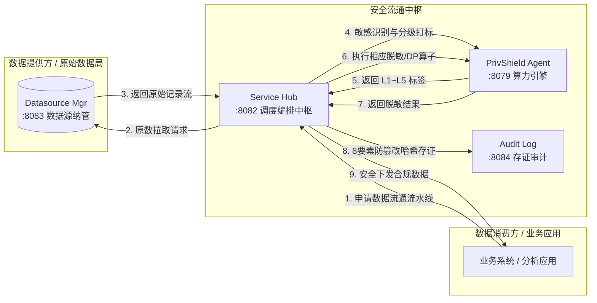

# 企业级数据流通中台微服务群 (Enterprise Services)

数联天下 · 数盾 (`PrivShield`) 不仅提供轻量级的 Python 隐私 Sidecar 节点，还构建了一整套高性能的 **企业级数据流通与安全治理中台微服务群**（基于 Go 语言）。

---

## 1. 业务架构与流通模型

在数据要素市场化与政务云跨域数据流通中，数据流通的核心挑战在于**「如何在数据不出域/可用不可见的前提下，完成跨部门安全调度、自动化敏感分级与全流程存证」**。

数盾微服务群实现了《数据要素流通安全与隐私治理技术白皮书》定义的核心枢纽拓扑：



---

## 2. 微服务职责与特性

### 2.1 Service Hub 数据服务调度中枢 (`:8082`)
* **6 阶段自动化调度**：
  1. `Ingest`：解析外部调用方数据请求与参数；
  2. `Fetch`：安全连接指定数据源拉取数据；
  3. `Classify`：请求 PrivShield 核心 Agent 执行三层漏斗分类分级；
  4. `Desensitize`：根据判定等级（L1~L5）自动选择并执行最佳脱敏算子（明文/掩码/K-匿名/差分隐私）；
  5. `Return`：封装脱敏后的安全数据流并返回调用方；
  6. `Audit`：异步向 Audit Log 微服务写入完整存证。
* **高可用与弹性保护**：内置并发信号量控制、请求队列熔断与重试机制；
* **崩溃恢复与自动重试**：启动时自动回收孤立任务（running 标记失败、pending 保留队列），周期性后台重试失败任务（指数退避 + RetryCount）；
* **完整性校验与备份**：启动时 `PRAGMA integrity_check` 阻断损坏数据库，统一备份脚本支持全量/增量/验证模式；
* **HTTP/gRPC 双协议 mTLS**：共享 `pkg/tlsutil` 工具库，TLS 1.3 + 公钥固定；
* 📖 学习与设计文档：[学习指南](services/service-hub/docs/learning-guide.md) · [详细设计](services/service-hub/docs/design.md) · [可靠性能力](services/service-hub/docs/reliability.md)

### 2.2 Datasource Manager 模拟数据源微服务 (`:8083`)
* **模拟数据源接口**：提供医保 `yibao`、康养 `kangyang` 及 2 个预留通用接口，内置 CSV 样本与数据抽样；
* **双协议暴露**：同时支持 HTTPS REST（TLS 1.3 + 客户端证书固定）与 gRPC mTLS 双向认证；
* **零重依赖**：作为服务编排测试与演示用途的 Mock 数据源，不依赖外部 MySQL/PostgreSQL/ClickHouse；
* **生命周期管控**：提供数据源资产目录、连通性心跳探测与多维访问审计；
* 📖 学习与设计文档：[学习指南](services/datasource-mgr/docs/learning-guide.md) · [详细设计](services/datasource-mgr/docs/design.md) · [可靠性能力](services/datasource-mgr/docs/reliability.md)

### 2.3 Audit Log 脱敏审计与存证微服务 (`:8084`)
* **8 要素防篡改存证**：采用 SHA-256 对 `logID`、`timestamp`、`algorithm`、`inputHash`、`outputHash`、`user`、`securityLevel`、`params` 进行防篡改签名；
* **在线核验**：提供不可篡改性校验接口，实时识别任何底层数据变动；
* **合规报告**：基于 SQLite 引擎秒级生成合规评估与多维统计图表；
* **完整性校验**：启动时 `PRAGMA integrity_check` 阻断损坏数据库，统一备份脚本支持全量/增量备份；
* **独立校验脚本**：`scripts/prod/verify_audit.py` 独立验证审计数据完整性，支持 CI/CD 集成；
* 📖 学习与设计文档：[学习指南](services/audit-log/docs/learning-guide.md) · [详细设计](services/audit-log/docs/design.md) · [可靠性能力](services/audit-log/docs/reliability.md)

---

## 3. 运行与运维命令

```bash
# 启动微服务集群 (需 Agent 先在 :8079 启动)
bash ./scripts/dev/dev-start-new-modules.sh

# 停止微服务集群
bash ./scripts/dev/dev-stop-new-modules.sh

# 运行微服务单元测试
make test-services

# 运行真实端到端 E2E 调度测试
PRIVSHIELD_E2E=1 go test -v -run TestRealE2E ./services/service-hub/internal/handlers/
```
