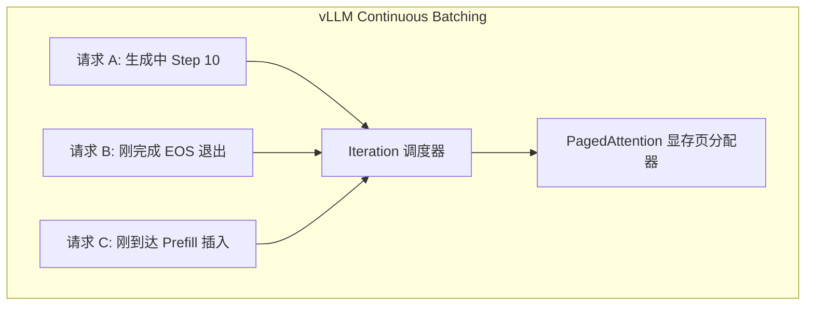

# LLM 训练与推理数据 Batching 机制、数学原理与工程实践全景指南

> 本文档为 `llmlora` 项目的核心技术指南，全面深挖大语言模型（LLM）在**训练（SFT Training）**与**推理（Inference）**阶段的数据批处理（Batching）物理本质、GPU 显存/算力Roofline模型、张量对齐、Mask 掩码数学推导、KV Cache 内存管理以及生产级代码实现。

---

## 1. LLM 计算特质与 Batching 的物理本质

### 1.1 GPU 硬件 Roofline 模型与 Memory-Bound 瓶颈

在 GPU 上运行大语言模型（Causal LM）时，计算任务主要分为两类模式：**显存带宽限制型（Memory-Bound）**与**计算密集型（Compute-Bound）**。

#### 单样本推理的内存瓶颈
当 Batch Size = 1 时，每预测一个 Token，GPU 都必须将整套模型权重参数（如 Qwen3.5-0.8B 约 1.6GB）从 **VRAM（显存）** 读取并加载到 **SRAM（片上高速缓存）** 中进行一次矩阵向量乘法（GEMV）。
- **显存带宽利用率（Memory Bandwidth）**：> 90%
- **CUDA / Tensor Core 计算单元利用率**：< 5%
此时，GPU 的成千上万个计算核心绝大多数时间处于**空转等待显存数据传输**的状态。

#### Batching 的数学提升
通过将 $N$ 个样本的输入 Prompt 张量在 Batch 维度拼接为二维矩阵 $X \in \mathbb{R}^{B \times L \times D}$，矩阵乘法从 GEMV 转化为 GEMM（矩阵乘矩阵）：

$$\text{FLOPs per Weight Byte} = \frac{2 \times B \times L \times D_{\text{in}} \times D_{\text{out}}}{2 \times D_{\text{in}} \times D_{\text{out}}} = B \times L$$

随着 **Batch Size ($B$)** 的增大，**每字节显存传输所能支撑的浮点计算次数（算力强度）呈线性增加**。GPU 正式从 Memory-Bound 跨入 Compute-Bound 状态，实现了 5x ~ 10x 的吞吐量（Tokens/s）飞跃。

---

## 2. 训练阶段 Batching 机制、数据对齐与 Loss Masking

### 2.1 训练 Batching 原理与图解

在 SFT（监督微调）训练阶段，模型接收完整序列（Prompt + Response），采用 **Right Padding（右侧填充）** 进行张量长度对齐。

```text
原始样本 1: [SOS, "今天", "天气", "真好", EOS]                       (长度 5)
原始样本 2: [SOS, "请", "分析", "患者", "病历", "记录", "信息", EOS]  (长度 8)

Right Padding 对齐后 (Batch Size = 2, Max Length = 8):
样本 1: [SOS, "今天", "天气", "真好", EOS,  <pad>, <pad>, <pad>]
样本 2: [SOS, "请",   "分析", "患者", "病历", "记录", "信息", EOS  ]
```

### 2.2 Labels Masking (`-100`) 数学与工程原理

在 SFT 训练中，损失函数为自回归交叉熵损失（Cross-Entropy Loss）：

$$\mathcal{L} = -\frac{1}{\sum M_i} \sum_{t \in \text{Target}} \log P(y_t \mid y_{<t}, X)$$

我们需要确保：
1. **User 输入 / System Prompt 不计入 Loss**：避免模型背诵提问词，只学习回答概率。
2. **Right Padding `<pad>` 位置不计入 Loss**：避免模型将填充字符当成真实文本拟合。

#### PyTorch `ignore_index = -100` 实现机制
PyTorch 的 `torch.nn.CrossEntropyLoss` 默认将 `ignore_index` 设为 `-100`。在 GPU CUDA Kernel 层面，凡是 `target == -100` 的位置：
- 损失值被直接设为 `0.0`；
- 对应的梯度反向传播被直接跳过（Gradient = `0.0`）。

```text
input_ids: [SOS,  "问:",  "发烧", "答:", "用", "阿司匹林", EOS, <pad>]
labels:    [-100, -100,  -100,  -100,  "用", "阿司匹林", EOS, -100]
                                       ↑       ↑        ↑
                                    仅此 3 个 Token 产生梯度
```

---

### 2.3 动态 Batching 与 Data Collator 显存优化

传统静态 Batching 会把所有 Batch 补齐到全局固定最大长度（如 `max_length = 1024`），导致短文本存在海量无用 `<pad>` 填充，极易引发显存爆 OOM。

`llmlora` 项目采用了 **动态 Data Collator**，每次仅将当前 Batch 内部补齐到**该 Batch 内部的最长样本长度**（或补齐到 8 的整数倍，适配 Tensor Core 硬件对齐）：

```python
# llmlora/src/dataset/collator.py 生产级 Collator 实现

import torch
from dataclasses import dataclass
from typing import Dict, List, Any

@dataclass
class DataCollatorForSFT:
    tokenizer: Any
    pad_to_multiple_of: int = 8

    def __call__(self, features: List[Dict[str, Any]]) -> Dict[str, torch.Tensor]:
        # 1. 动态探查当前 Batch 内部的最大长度
        batch_max_len = max(len(f["input_ids"]) for f in features)
        
        # 2. 硬件对齐：对齐到 pad_to_multiple_of（如 8）以触发 Tensor Core 硬件加速
        if self.pad_to_multiple_of > 0:
            batch_max_len = (
                (batch_max_len + self.pad_to_multiple_of - 1) // self.pad_to_multiple_of
            ) * self.pad_to_multiple_of

        batch_input_ids, batch_attention_mask, batch_labels = [], [], []

        for f in features:
            input_ids = f["input_ids"]
            labels = f["labels"]
            pad_len = batch_max_len - len(input_ids)

            # 3. 执行 Right Padding 右侧填充
            padded_input_ids = input_ids + [self.tokenizer.pad_token_id] * pad_len
            padded_attn_mask = [1] * len(input_ids) + [0] * pad_len
            padded_labels = labels + [-100] * pad_len

            batch_input_ids.append(padded_input_ids)
            batch_attention_mask.append(padded_attn_mask)
            batch_labels.append(padded_labels)

        return {
            "input_ids": torch.tensor(batch_input_ids, dtype=torch.long),
            "attention_mask": torch.tensor(batch_attention_mask, dtype=torch.long),
            "labels": torch.tensor(batch_labels, dtype=torch.long),
        }
```

---

### 2.4 梯度累积 (Gradient Accumulation) 数学推导

当显存限制无法将 `per_device_train_batch_size` 设得很大时，使用梯度累积可以精确等效大 Batch 训练：

```python
# 梯度累积伪代码逻辑
optimizer.zero_grad()
for i, batch in enumerate(dataloader):
    loss = model(batch) / grad_accum_steps  # 缩放 Loss
    loss.backward()                         # 累加梯度
    
    if (i + 1) % grad_accum_steps == 0:
        optimizer.step()                     # 更新权重
        optimizer.zero_grad()
```

此时的**等效 Batch Size (Effective Batch Size)** 计算公式为：

$$B_{\text{effective}} = B_{\text{per\_device}} \times N_{\text{grad\_accum}} \times N_{\text{gpus}}$$

例如在 `llmlora/.env` 配置中：
`LLMLORA_BATCH_SIZE=16`，`LLMLORA_GRAD_ACCUM_STEPS=2` $\Rightarrow$ **单卡等效 Batch Size = 32**。

---

## 3. 推理阶段 Batching 机制、Left Padding 与 KV Cache 管理

### 3.1 为什么推理阶段绝对不能使用 Right Padding？

在自回归生成（Causal Generation）过程中，模型必须基于上一个 Step 的末尾 Token 来预测下一个 Token。

如果推理使用了 **Right Padding（右侧填充）**，短样本的矩阵尾部包含 `<pad>` Token：

```text
错误示范 (Right Padding 推理):
Row 1: [ "诊", "断", "结果", <pad>, <pad> ]
Row 2: [ "患", "者", "发烧", "头痛", "咳嗽" ]
```
在计算第 1 行生成时，PyTorch 的 `generate()` 接口会将最右侧的位置（即 `<pad>`）当作上一个生成的上下文，导致：
1. **生成结果乱码**：模型开始基于 `<pad>` 进行推理；
2. **提前误触发终止**：模型的 logits 预测出 `<eos>`，导致短样本提前异常结束；
3. **位置编码（RoPE）错位**：旋转位置编码计算的相对位置偏差。

因此，**推理阶段必须统一采用 Left Padding（左侧填充）**！

```text
正确示范 (Left Padding 推理):
Row 1: [ <pad>, <pad>, "诊", "断", "结果" ]  --> 末尾是真正上下文，生成紧随其后！
Row 2: [ "患",  "者",  "发烧", "头痛", "咳嗽" ]
```

---

### 3.2 Attention Mask 掩码矩阵与 Softmax 屏蔽数学推导

Transformer 的 Scaled Dot-Product Attention 数学公式为：

$$\text{Attention}(Q, K, V) = \text{softmax}\left(\frac{Q K^T}{\sqrt{d_k}} + M\right) V$$

其中掩码矩阵 $M$ 的取值规则如下：
- 当 $M_{i,j} = 0$（真实 Token）时，加上 0 不影响原点积数值；
- 当 $M_{i,j} = -\infty$（Padding Token）时，点积数值变为 $-\infty$。

在 Softmax 计算时：

$$\text{softmax}(z_i) = \frac{e^{z_i}}{\sum e^{z_j}}$$

因为 $e^{-\infty} \to 0$，所有左侧 Padding 位置的注意力权重自动归零，**使得 Padding 字符在注意力计算中完全不产生任何影响**。

---

### 3.3 KV Cache 内存结构与 Batch 维度广播

推理开启 `use_cache = True` 时，模型会将历史层中的 Key 和 Value 向量缓存起来，避免重算。

KV Cache 的张量维度为：

$$\text{K/V Shape} = \left(\text{Batch Size}, \text{Num Heads}, \text{Sequence Length}, \text{Head Dim}\right)$$

采用 Left Padding 时，由于 Padding Token 在序列左侧：
- 动态追加新 Token 时，新 Token 始终追加在 `Sequence Length` 的最右侧末尾；
- KV Cache 可以保持连续的右侧扩展追加，无需重新整理内存。

---

### 3.4 静态 Batching vs 动态连续批处理 (Continuous Batching & PagedAttention)

| 特性 / 维度 | 静态 Batching (PyTorch Native) | 连续批处理 Continuous Batching (vLLM) |
|---|---|---|
| **内存分配** | 预先分配矩形 2D Tensor | 动态分页分配 (PagedAttention) |
| **Padding 开销** | 存在 Left Padding 显存开销 | **0% Padding 浪费** (块页映射) |
| **请求调度** | 同进同出 (最慢样本拖累全队) | 迭代级动态插拔 (Iteration-Level) |
| **吞吐量** | 中等 (适合低并发/Sidecar) | **极高 (5x - 10x 高并发高吞吐)** |



---

### 3.5 vLLM 加载 Qwen3.5-0.8B 的关键工程修复 (vLLM Integration Fixes)

在实际工程落地中，将合并模型嵌入 vLLM 引擎时，需完成以下 4 项关键修复：

1. **Config 路由修补**：将基座完整 `config.json`（包含 `vision_config` 与 `text_config` 嵌套）复制到导出目录，满足 vLLM `Qwen3_5ForConditionalGeneration` 类型的架构探查。
2. **视觉权重提取与补全**：提取基座 safetensors 中的 `visual.*` 权重并打上 `model.visual.` 前缀保存至合并模型文件（共 153 个张量），补齐多模态结构定义。
3. **KV Cache 空间控制**：设置 `max_model_len = 4096`（防止 `max_position_embeddings=262144` 预分配过大显存空间导致 OOM）。
4. **JIT 编译依赖注入**：安装 `ninja` 并将虚拟环境 bin 路径加入 `PATH`，确保 FlashInfer 热编译成功。

## 4. `llmlora` 项目生产级工程实践代码深度解剖

### 4.1 训练流水线代码链条

在 `llmlora` 中，训练 Batching 经由以下代码链条流动：

```text
llmlora/.env (配置 LLMLORA_BATCH_SIZE=16, LLMLORA_GRAD_ACCUM_STEPS=2)
  └── llmlora/src/utils/config.py (Config dataclass)
        └── llmlora/src/dataset/loader.py (SFTDataset 预处理与 Tokenize)
              └── llmlora/src/dataset/collator.py (DataCollatorForSFT 动态 Right Padding)
                    └── llmlora/src/models/trainer.py (LoRATrainingRunner + HuggingFace Trainer)
```

### 4.2 推理性能对比测试代码链条

推理测试代码库在 `llmlora/test/` 下实现了高效的子进程隔离测试：

- **`llmlora/test/benchmark_pytorch.py`**：
  使用 `AutoTokenizer(..., padding_side="left")`，在 `batch_sizes=[1, 4]` 下实测 Batch 推理。
- **`llmlora/test/run_benchmark_comparison.py`**：
  采用 Python `subprocess` 隔离运行 PyTorch 和 vLLM，完全消除了 CUDA 句柄残留与显存泄漏问题，自动导出 Markdown Benchmark 报告至 `llmlora/test/benchmark_report.md`。

---

## 5. 训练与推理 Batching 综合调参表

| 场景 | 推荐 Batch Size 配置 | 推荐 Grad Accum | 推荐 Padding 方向 | 关键配置项 |
|---|---|---|---|---|
| **RTX 5060 (8GB/12GB) 训练** | `per_device_batch_size = 16` | `grad_accum_steps = 2` | **Right Padding** | `pad_to_multiple_of = 8` |
| **显存受限 (4GB/6GB) 训练** | `per_device_batch_size = 4` | `grad_accum_steps = 8` | **Right Padding** | `gradient_checkpointing = true` |
| **Sidecar 边侧单条同步推理** | `batch_size = 1` | N/A | **Left Padding** | `max_new_tokens = 64` |
| **Sidecar 批处理高吞吐推理** | `batch_size = 4` | N/A | **Left Padding** | `padding_side = "left"` |

---

> 📖 **延伸阅读与关联文档**：
> - [架构设计与工作流设计文档](file:///home/charles/code/sfwork/privacy-local-agent/llmlora/docs/design_and_workflow.md)
> - [推理性能 Benchmark 实测报告](file:///home/charles/code/sfwork/privacy-local-agent/llmlora/test/benchmark_report.md)
> - [单次推理性能优化方案](file:///home/charles/code/sfwork/privacy-local-agent/llmlora/docs/inference_optimization.md)
> - [训练数据集生成规约](file:///home/charles/code/sfwork/privacy-local-agent/docs/medical_pipeline/医疗健康数据分类分级与隐私脱敏算法标准规范.md)
