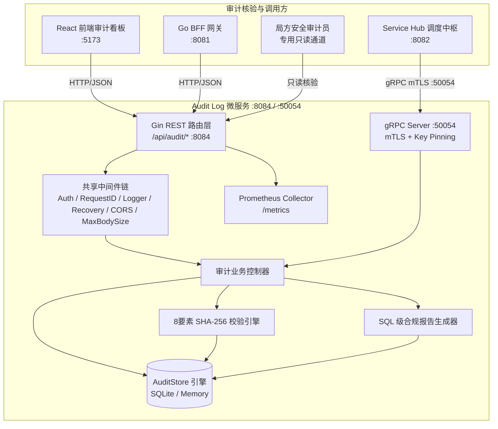
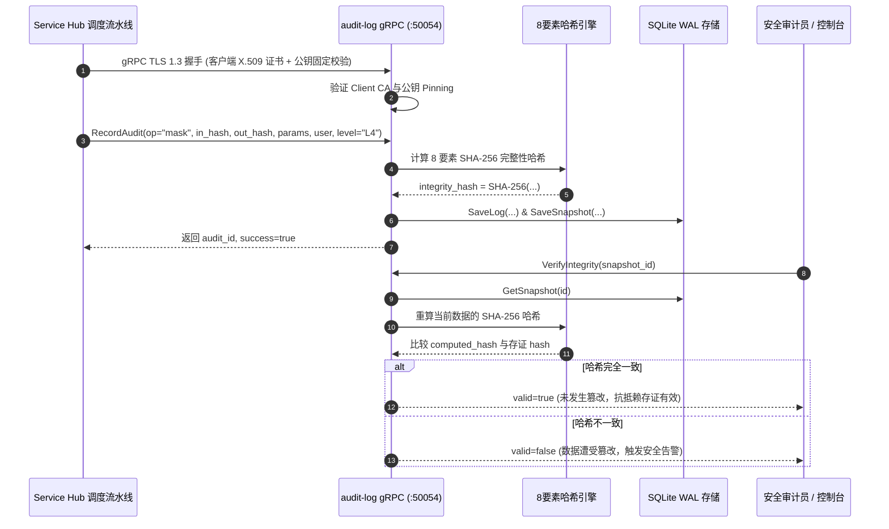

# 脱敏审计日志与存证 (Audit Log) — 详细设计文档

> 本文档定义 **数联天下 · 数盾 (`PrivShield`)** 脱敏审计日志模块（`services/audit-log`）的系统架构、双协议服务模型（REST + gRPC）、mTLS 双向认证与公钥固定、8 要素增强完整性校验、不可篡改存证与高可用持久化设计。

---

## 1. 背景与业务定位

在国家数据安全法与等保合规要求下，数据流通全链路必须具备**「可追溯、防篡改、抗抵赖」**的审计存证能力。**脱敏审计日志与存证服务 (Audit Log)** 作为独立的安全审计节点，承担着以下核心职责：

1. **双协议接入（REST + gRPC）**：对外提供标准 HTTP REST API 供前端控制台访问，同时对内提供高性能 gRPC 接口（端口 `:50054`）供 `service-hub` 调度中枢与微服务集群直接写入审计存证；
2. **零信任 mTLS 与公钥固定**：gRPC 通道支持 TLS 1.3 双向证书认证（mTLS），并内置客户端公钥固定（Public Key Pinning）机制，彻底防范中间人篡改；
3. **8 要素增强防篡改哈希存证**：采用 SHA-256 密码学哈希对审计事件全字段签名，自动生成存证快照；
4. **在线完整性校验与对账**：提供存证真实性核验端点，实时检测并告警任何底层数据篡改；
5. **SQL 级多维统计与合规报告**：基于 SQLite SQL 聚合引擎提供毫秒级操作概览（`GetStats`）与合规报告（`GenerateReport`），彻底杜绝内存加载溢出风险；
6. **企业级持久化与安全防护**：基于纯 Go SQLite 实现 WAL 读写分离持久化，配备 API Key 鉴权、常量时间比对防时序攻击与 Prometheus 监控。

---

## 2. 总体架构拓扑



---

## 3. mTLS 与防篡改存证流程



---

## 4. 8 要素增强完整性哈希算法

新版实现将所有关键治理要素全面纳入哈希计算：

$$\text{Data} = \text{logID} \parallel \text{timestamp (RFC3339Nano)} \parallel \text{algorithm} \parallel \text{inputHash} \parallel \text{outputHash} \parallel \text{user} \parallel \text{securityLevel} \parallel \text{parametersJSON}$$

$$\text{IntegrityHash} = \text{SHA256}(\text{Data})$$

```go
func computeIntegrityHash(logID string, timestamp time.Time, algorithm, inputHash, outputHash, user, securityLevel, paramsJSON string) string {
    data := fmt.Sprintf("%s|%s|%s|%s|%s|%s|%s|%v",
        logID, timestamp.Format(time.RFC3339Nano), algorithm,
        inputHash, outputHash, user, securityLevel, paramsJSON)
    hash := sha256.Sum256([]byte(data))
    return fmt.Sprintf("%x", hash)
}
```

任何微小篡改（甚至是配置 JSON 中的空格或敏感度等级由 L4 改为 L3）都将导致 SHA-256 产生雪崩效应，使 `VerifyIntegrity` 立即识别并报警。
