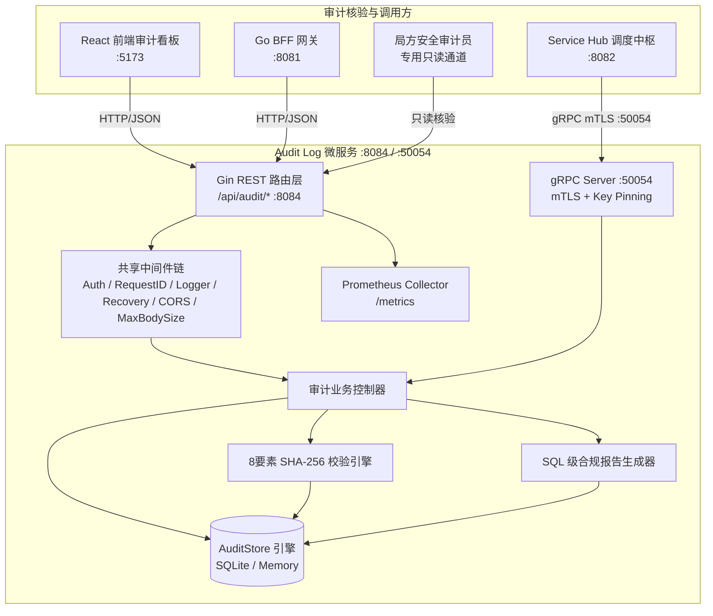
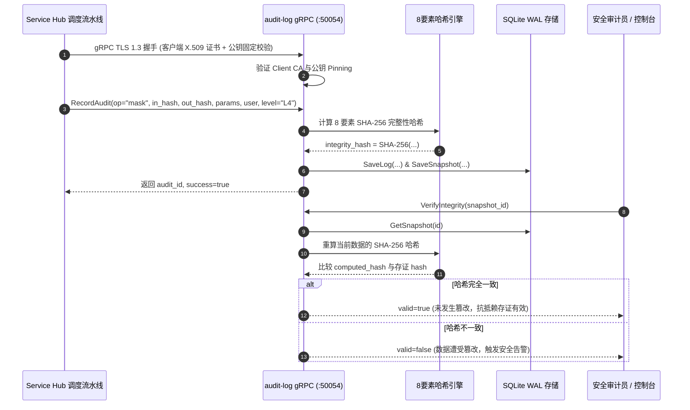

# 脱敏审计日志与存证 (Audit Log) — 详细设计文档

> 本文档定义 **数联天下 · 数盾 (`PrivShield`)** 脱敏审计日志模块（`services/audit-log`）的系统架构、双协议服务模型（REST + gRPC）、mTLS 双向认证与公钥固定、8 要素增强完整性校验、不可篡改存证与高可用持久化设计。

---

## 1. 背景与业务定位

在国家数据安全法与等保合规要求下，数据流通全链路必须具备**「可追溯、防篡改、抗抵赖」**的审计存证能力。**脱敏审计日志与存证服务 (Audit Log)** 作为独立的安全审计节点，承担着以下核心职责：

1. **双协议接入（REST + gRPC）**：对外提供标准 HTTP REST API 供前端控制台访问，同时对内提供高性能 gRPC 接口（端口 `:50054`）供 `service-hub` 调度中枢与微服务集群直接写入审计存证；
2. **零信任 mTLS 与公钥固定**：gRPC 通道支持 TLS 1.3 双向证书认证（mTLS），并内置客户端公钥固定（Public Key Pinning）机制，彻底防范中间人篡改；
3. **8 要素增强防篡改哈希存证**：采用 SHA-256 密码学哈希对审计事件全字段签名，自动生成存证快照；
4. **在线完整性校验与对账**：提供存证真实性核验端点，实时检测并告警任何底层数据篡改；
5. **SQL 级多维统计与合规报告**：基于 SQLite SQL 聚合引擎提供毫秒级操作概览（`GetStats`）与合规报告（`GenerateReport`），彻底杜绝内存加载溢出风险；
6. **企业级持久化与安全防护**：基于纯 Go SQLite 实现 WAL 读写分离持久化，配备 API Key 鉴权、常量时间比对防时序攻击与 Prometheus 监控；
7. **完整性校验与备份**：启动时 `PRAGMA integrity_check` 阻断损坏数据库，统一备份脚本支持全量/增量备份；
8. **独立校验脚本**：`scripts/prod/verify_audit.py` 独立验证审计数据完整性，支持 CI/CD 集成。

> 📖 **可靠性能力详解**：[docs/reliability.md](docs/reliability.md)

---

## 2. 总体架构拓扑



---

## 3. mTLS 与防篡改存证流程



---

## 4. 8 要素增强完整性哈希算法

新版实现将所有关键治理要素全面纳入哈希计算：

$$\text{Data} = \text{logID} \parallel \text{timestamp (RFC3339Nano)} \parallel \text{algorithm} \parallel \text{inputHash} \parallel \text{outputHash} \parallel \text{user} \parallel \text{securityLevel} \parallel \text{parametersJSON}$$

$$\text{IntegrityHash} = \text{SHA256}(\text{Data})$$

```go
func computeIntegrityHash(logID string, timestamp time.Time, algorithm, inputHash, outputHash, user, securityLevel, paramsJSON string) string {
    data := fmt.Sprintf("%s|%s|%s|%s|%s|%s|%s|%v",
        logID, timestamp.Format(time.RFC3339Nano), algorithm,
        inputHash, outputHash, user, securityLevel, paramsJSON)
    hash := sha256.Sum256([]byte(data))
    return fmt.Sprintf("%x", hash)
}
```

任何微小篡改（甚至是配置 JSON 中的空格或敏感度等级由 L4 改为 L3）都将导致 SHA-256 产生雪崩效应，使 `VerifyIntegrity` 立即识别并报警。

---

## 5. 业务合规存证与基础设施运维日志 (Loki / ELK) 的架构定位辨析

在系统总体架构与运维体系中，必须清晰区分 **「业务级数据脱敏合规存证」** 与 **「基础设施级运行日志聚合 (如 Grafana Loki / ELK)」** 两个维度的概念：

### 5.1 核心差异矩阵

| 维度 | `services/audit-log` (业务存证中台) | Grafana Loki / ELK (运维日志平台) |
|---|---|---|
| **核心定位** | **业务合规与法律证据**（解决“谁在何时对什么数据执行了何种脱敏”的法定合规溯源） | **系统运维与故障排查**（解决“服务是否健康、报错堆栈为何、请求延迟与网络抖动”的 SRE 观测） |
| **存储内容** | 8 要素存证实体、原始数据 SHA-256 哈希、脱敏结果哈希、快照哈希链 | 容器与进程标准输出 stdout / stderr 的非结构化/半结构化文本或 JSON |
| **密码学防篡改** | **必须具备**（内置 SHA-256 密码学生成与动态核验接口，防止 DBA 或黑客改库） | **不具备**（日志以分块 Chunk 或倒排索引存储，依赖存储介质本身的写保护） |
| **法律合规效力** | 满足《数据安全法》第二十七条、《个人信息保护法》第六十九条与 GDPR 第三十条之规定 | 面向运维与内部分析，通常不具备直接的抗抵赖与司法存证签名能力 |
| **存储底座** | 独立 SQLite WAL 读写分离引擎 / 专用关系型存证库（Append-Only） | 分布式对象存储（S3/MinIO）+ 索引存储（BoltDB/Cassandra/DynamoDB） |
| **查询接口** | 结构化 RESTful API (`:8084`) + 高并发 gRPC 接口 (`:50054`) | LogQL / Kibana 查询语言与 Grafana 仪表盘 |

### 5.2 与集中式日志平台 (Loki / ELK) 的协同集成方案

`services/audit-log` 自身**不依赖 Loki 作为业务存证底座**，但其作为企业级微服务，**完全原生支持接入 Grafana Loki / Promtail / ELK** 作为运维可观测底座：

```mermaid
flowchart TB
    subgraph AuditLogNode [audit-log 微服务节点]
        BusinessEngine[8要素业务存证引擎]
        SlogLogger[Go log/slog 结构化日志组件]
        
        TaskStore[(SQLite WAL 存证库<br/>Append-Only 业务账本)]
        StdOut[标准输出 stdout / stderr<br/>PRIVACY_LOG_FORMAT=json]
    end

    subgraph BusinessFlow [业务合规面]
        Auditor[安全合规审计员]
        ServiceHub[service-hub 流水线]
        WebConsole[Web 前端大屏]
    end

    subgraph ObservabilityFlow [基础设施运维面]
        Promtail[Promtail / Vector / Fluentd 日志收集 Agent]
        Loki[Grafana Loki 集中日志引擎]
        GrafanaUI[Grafana SRE 监控面板]
    end

    ServiceHub -->|1. 提交 8 要素存证| BusinessEngine
    BusinessEngine -->|2. SHA-256 签名存证落盘| TaskStore
    Auditor -->|3. 在线完整性核验 / 调取合规报告| BusinessEngine
    WebConsole -->|3. 存证列表查询| BusinessEngine

    BusinessEngine -.->|运行时记录 (RequestID/耗时/握手)| SlogLogger
    SlogLogger -->|单行 JSON 日志流| StdOut
    StdOut -->|容器日志抓取| Promtail
    Promtail -->|按标签流式推送| Loki
    Loki -->|LogQL 检索与告警| GrafanaUI
```

1. **结构化 JSON 运行日志**：
   配置 `PRIVACY_LOG_FORMAT=json` 时，微服务的所有运行事件（如 HTTP 请求接收、gRPC mTLS 握手、SQLite 落盘耗时、Slowloris 超时拦截）均由 `pkg/config/logger.go`（基于 Go `log/slog`）输出为单行标准 JSON。
2. **Promtail / Vector 自动采集**：
   在 Kubernetes 或 Docker Compose 部署环境中，宿主机日志收集 Agent 自动抓取容器日志流并追加 `app="audit-log"`, `env="prod"` 标签，投递给 Grafana Loki。
3. **职责分离的零信任原则**：
   - **业务数据存证面**：由 `services/audit-log` 独立负责，保障高防篡改等级与合规报告生成；
   - **运维可观测面**：由 Loki + Prometheus 负责，保障全集群指标与日志的统一告警与链路分析。

---

## 6. SQL 级多维统计与合规报告生成机制

为了防范大批量历史存证导致内存溢出 (OOM)，系统采用 SQL 原生聚合查询实现高性能统计：

```sql
-- 统计总操作数与平均耗时
SELECT COUNT(*), COALESCE(AVG(duration_ms), 0) FROM audit_logs;

-- 按治理算子聚合
SELECT operation, COUNT(*) FROM audit_logs GROUP BY operation;

-- 按数据敏感等级聚合 (L1~L5)
SELECT security_level, COUNT(*) FROM audit_logs GROUP BY security_level;
```

---

## 7. 存储引擎设计与 Append-Only 不可篡改约束

- **SQLite WAL 并发模式**：写操作通过写前日志 (Write-Ahead Log) 顺序追加，读操作完全无锁并发，提供高吞吐存证写入能力。
- **只增不改 (Append-Only) 架构约束**：
  - 数据层接口仅暴露 `SaveLog`、`SaveSnapshot`、`GetLog`、`ListLogs`；
  - 核心业务层不提供任何 `Update` 或 `Delete` 接口，从代码级根绝人为篡改或删除历史存证的可能。
