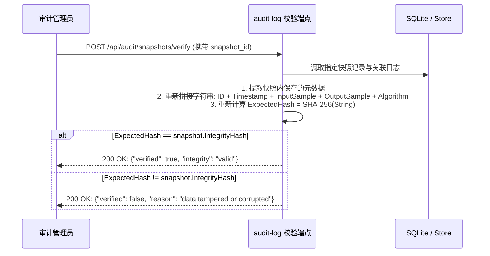
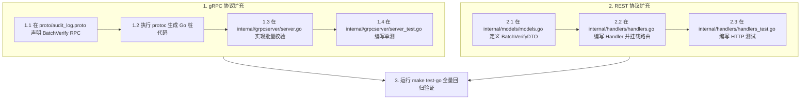

# 脱敏审计与防篡改存证服务 (audit-log) 深度学习指南

> 面向研发、合规审计师与安全架构师的完整技术指南，深入解析数联天下 · 数盾 (`PrivShield`) 脱敏审计日志、SHA-256 密码学不可篡改存证、合规报告生成与核心源码实现。

---

## 目录 / Table of Contents

- [1. 模块全景与业务定位](#1-模块全景与业务定位)
- [2. 系统架构与存证拓扑图解](#2-系统架构与存证拓扑图解)
- [3. 8 要素审计存证模型与 SHA-256 防篡改原理](#3-8-要素审计存证模型与-sha-256-防篡改原理)
  - [3.1 审计日志 8 大关键要素](#31-审计日志-8-大关键要素)
  - [3.2 密码学哈希链与快照完整性校验机制](#32-密码学哈希链与快照完整性校验机制)
- [4. 核心代码架构与目录结构](#4-核心代码架构与目录结构)
- [5. 核心源码深入解读](#5-核心源码深入解读)
  - [5.1 服务启动入口与生命周期 (cmd/server/main.go)](#51-服务启动入口与生命周期-cmdservermaingo)
  - [5.2 配置驱动与环境变量解析 (internal/config/config.go)](#52-配置驱动与环境变量解析-internalconfigconfiggo)
  - [5.3 REST 控制层与合规报告生成 (internal/handlers/handlers.go)](#53-rest-控制层与合规报告生成-internalhandlershandlersgo)
  - [5.4 存储引擎与 Append-only 存证 (pkg/store)](#54-存储引擎与-append-only-存证-pkgstore)
  - [5.5 gRPC 高性能存证写入与 mTLS 加固 (internal/grpcserver/server.go)](#55-grpc-高性能存证写入与-mtls-加固-internalgrpcserverservergo)
  - [5.6 gRPC 桩代码与服务端实现的核心关联 (audit_log_grpc.pb.go vs server.go)](#56-grpc-桩代码-audit_log_grpcpbgo-与服务端实现-servergo-的核心关联)
- [6. 合规报告与统计聚合引擎](#6-合规报告与统计聚合引擎)
- [7. 本地开发、实操与 API 演练](#7-本地开发实操与-api-演练)
- [8. 生产环境部署与监控](#8-生产环境部署与监控)
- [9. 常见问题排查 (FAQ)](#9-常见问题排查-faq)
- [10. 实战演练：如何新增一个存证通信 API（REST & gRPC 双协议全流程）](#10-实战演练如何新增一个存证通信-apirest--grpc-双协议全流程)
  - [10.1 gRPC 接口开发步骤](#101-grpc-接口开发步骤)
  - [10.2 HTTP REST 接口开发步骤](#102-http-rest-接口开发步骤)

---

## 1. 模块全景与业务定位

在《中华人民共和国数据安全法》、《个人信息保护法》(PIPL) 以及国际 GDPR 规范中，**“操作留痕、去向可追、责任可究、存证防篡改”** 是企业数据合规治理的法定红线。

**`audit-log` (脱敏审计与防篡改存证服务)** 是 `PrivShield` 体系中的不可篡改账本与合规存证中心：

```
┌───────────────────────────────────────────────────────────────────────────┐
│              数据治理协同方 (service-hub 调度中枢 / PrivShield Agent)        │
└─────────────────────────────────────┬─────────────────────────────────────┘
                                      │ HTTP REST (:8084) / gRPC (:50054)
                                      ▼
┌───────────────────────────────────────────────────────────────────────────┐
│                 audit-log 脱敏审计存证中台 (Go 1.24+ / Gin)                │
│                                                                           │
│   • 8要素存证落盘   • SHA-256 双哈希存证   • 快照防篡改校验   • 合规报告生成  │
└─────────────────────────────────────┬─────────────────────────────────────┘
                                      │
                                      ▼
┌───────────────────────────────────────────────────────────────────────────┐
│                 持久化不可篡改存储 (SQLite WAL / Append-Only)             │
│                                                                           │
│   • 日志表 (audit_logs)   • 存证快照表 (snapshots)   • 统计聚合索引        │
└───────────────────────────────────────────────────────────────────────────┘
```

### 核心职责与设计目标

1. **8 要素不可篡改存证**：每次脱敏操作均记录操作主体、时间戳、原始数据 SHA-256 哈希、脱敏数据 SHA-256 哈希、算法及参数。
2. **密码学快照与完整性校验**：结合 `SHA-256(AuditLogID + Timestamp + InputSample + OutputSample + Algorithm)` 动态验证账本完整性，杜绝数据库管理员 (DBA) 或外部黑客篡改日志。
3. **多维统计与合规报告**：自动按时间跨度（1h/24h/7d/30d）、敏感等级（L1~L5）、算子分布与成功率聚合生成标准化合规审计报告。
4. **双协议高吞吐写入**：提供 Web 端 RESTful API 与内部微服务毫秒级异步/同步写入的 gRPC 接口。
5. **零信任金融级安全**：支持 TLS 1.3 双向认证与公钥固定 (SPKI Pinning)。

---

## 2. 系统架构与存证拓扑图解

```mermaid
flowchart TB
    subgraph Producers [日志生成方]
        ServiceHub[service-hub 调度中枢<br/>:8082]
        Agent[PrivShield 核心引擎<br/>:8079]
        BFF[Go / Python BFF<br/>:8081 / :8080]
    end

    subgraph AuditLogService [audit-log 审计存证中心 (:8084 / :50054)]
        GinRouter[Gin REST Router<br/>/api/audit/*]
        GRPCSrv[gRPC Server<br/>AuditLogServiceServer]
        MW[中间件链: MaxBodySize / StructuredLogger / Auth / SecurityHeaders]
        
        Hasher[SHA-256 密码学生成器<br/>Input/Output/Integrity Hasher]
        Verifier[完整性动态校验器<br/>Snapshot Integrity Verifier]
        Reporter[合规分析与报告生成器<br/>Compliance Report Generator]
        
        AuditStore[(AuditStore 引擎<br/>Memory / SQLite WAL)]
    end

    subgraph Consumers [审计与监管调用]
        Auditor[安全合规审计员]
        WebUI[控制台审计流水与大屏]
        Prometheus[Prometheus 指标采集]
    end

    Producers -->|HTTP POST| GinRouter
    Producers -->|gRPC mTLS| GRPCSrv

    GinRouter --> MW --> Hasher
    GRPCSrv --> Hasher

    Hasher --> AuditStore
    AuditStore --> Verifier
    AuditStore --> Reporter

    Auditor -->|调取合规报告| GinRouter
    WebUI -->|查询审计日志与统计| GinRouter
    GinRouter --> Prometheus
```

---

## 3. 8 要素审计存证模型与 SHA-256 防篡改原理

### 3.1 审计日志 8 大关键要素

每条存入系统的日志实体均包含满足法律合规溯源要求的 8 大核心要素（结构定义见 `internal/models/models.go`）：

```go
type AuditLog struct {
    ID            string    `json:"id"`              // 1. 唯一存证 ID (UUIDv4)
    Timestamp     time.Time `json:"timestamp"`       // 2. 存证时间戳 (精确至毫秒)
    User          string    `json:"user"`            // 3. 操作人 / 调用服务 CN / 租户标识
    Operation     string    `json:"operation"`       // 4. 治理动作 (mask/classify/k_anon/dp/qol)
    DataSource    string    `json:"datasource"`      // 5. 目标数据源标识 (ds_yibao/ds_kangyang...)
    InputHash     string    `json:"input_hash"`      // 6. 原始数据密码学哈希 SHA-256(Input)
    OutputHash    string    `json:"output_hash"`     // 7. 脱敏后数据哈希 SHA-256(Output)
    Algorithm     string    `json:"algorithm"`       // 8. 执行算法与算子名称 (field_mask...)
    Parameters    any       `json:"parameters"`      // 算法参数字典 (如 {"fields": ["id_card"]})
    InputRows     int       `json:"input_rows"`      // 输入记录条数
    OutputRows    int       `json:"output_rows"`     // 输出记录条数
    DurationMs    int64     `json:"duration_ms"`     // 执行耗时
    Status        string    `json:"status"`          // "success" | "failed"
    SecurityLevel string    `json:"security_level"`  // 数据分类分级判定级别 (L1-L5)
}
```

> **为什么记录 `InputHash` 而不记录原始明文？**
> 审计日志本身如果包含明文敏感数据，日志库自身就会成为最大的泄密源！通过记录原始明文的 **SHA-256 哈希值**，既能实现“未来发生数据纠纷时出示原文比对哈希以自证清白”，又实现了“审计库自身零敏感数据沉淀”。

### 3.2 密码学哈希链与快照完整性校验机制

为了防止数据库被未经授权的特权账号（如 DBA 或恶意黑客）篡改或删除历史记录，系统提供了**快照完整性校验机制**：



---

## 4. 核心代码架构与目录结构

```text
services/audit-log/
├── cmd/
│   └── server/
│       └── main.go              # 服务启动主入口、HTTP/gRPC 并发启动与优雅停机
├── internal/
│   ├── config/                  # 环境变量配置加载与默认值保护
│   │   ├── config.go
│   │   └── config_test.go
│   ├── agent/                   # PrivShield Agent 连通性探测客户端
│   │   ├── client.go
│   │   └── client_test.go
│   ├── grpcserver/              # gRPC 服务端实现与 TLS/mTLS 凭证构造
│   │   ├── server.go
│   │   └── server_test.go
│   ├── handlers/                # REST 控制层 (日志写入、查询、快照校验、合规报告)
│   │   ├── handlers.go
│   │   └── handlers_test.go
│   └── models/                  # 审计实体模型、统计模型与合规报告 DTO
│       ├── models.go
│       └── models_test.go
├── proto/                       # gRPC Protobuf 契约与生成的 Go 代码
│   ├── audit_log.proto
│   ├── audit_log.pb.go
│   └── audit_log_grpc.pb.go
├── scripts/                     # 运维与部署脚本
│   └── deploy.sh                # 生产部署脚本 (已统一至 1.8.0)
├── docs/                        # SDLC 规范文档
│   ├── prd.md
│   ├── design.md
│   ├── api.md
│   ├── ops.md
│   ├── testing.md
│   └── learning-guide.md        # 本学习文档
├── Dockerfile                   # 多阶段轻量镜像构建
├── Makefile                     # 快捷命令入口
└── run.sh                       # 本地快速启动脚本
```

---

## 5. 核心源码深入解读

### 5.1 服务启动入口与生命周期 (`cmd/server/main.go`)

`cmd/server/main.go` 负责装配审计日志服务的所有核心依赖：

```go
func main() {
    // 1. 初始化配置与结构化日志
    cfg := config.Load()
    logger := pkgconfig.SetupLogger(cfg.LogFormat, cfg.LogLevel)

    // 2. 初始化存储层：支持 SQLite WAL 持久化或纯内存模式
    auditStore, err := initAuditStore(cfg.DBPath, logger)
    if err != nil {
        log.Fatalf("failed to initialize audit store: %v", err)
    }

    // 3. 初始化指标收集器与 Agent 客户端
    mc := metrics.NewCollector("audit-log")
    agentClient := agent.New(cfg)

    // 4. 初始化 Gin 路由器并注入安全中间件（含 32MB 请求体限制）
    server := handlers.New(agentClient, cfg, auditStore, logger, mc)
    router := gin.New()
    server.RegisterRoutes(router)

    // 5. 构建防 Slowloris 攻击的 HTTP Server
    httpSrv := &http.Server{
        Addr:              cfg.Address(),
        Handler:           router,
        ReadHeaderTimeout: 5 * time.Second,
        ReadTimeout:       30 * time.Second,
        WriteTimeout:      60 * time.Second,
        IdleTimeout:       120 * time.Second,
        MaxHeaderBytes:    1 << 20,
    }

    // 6. 并发启动 HTTP REST 与 gRPC (含 TLS 1.3 / mTLS)
    // ...

    // 7. 优雅关停释放连接
    // ...
}
```

### 5.2 配置驱动与环境变量解析 (`internal/config/config.go`)

| 环境变量 | 默认值 | 作用说明 |
|---|---|---|
| `AUDIT_LOG_HOST` | `0.0.0.0` | HTTP REST 服务监听地址 |
| `AUDIT_LOG_PORT` | `8084` | HTTP REST 服务监听端口 |
| `AUDIT_LOG_GRPC_HOST` | `0.0.0.0` | gRPC 服务监听地址 |
| `AUDIT_LOG_GRPC_PORT` | `50054` | gRPC 服务监听端口 |
| `AUDIT_LOG_DB_PATH` | `""` (内存) | 审计日志 SQLite 存储路径 (配置时开启 WAL 持久化) |
| `PRIVACY_AGENT_REST_HOST` | `127.0.0.1` | PrivShield Agent 连通性探针地址 |
| `PRIVACY_REST_PORT` | `8079` | PrivShield Agent 端口 |
| `PRIVACY_TLS_ENABLED` | `false` | 是否开启 gRPC TLS/mTLS 加密 |
| `PRIVACY_TLS_CLIENT_AUTH` | `none` | 客户端证书校验策略 (`none` / `verify_if_given` / `require`) |
| `PRIVACY_TLS_PINNED_PUBKEY_FILE` | `""` | 允许的客户端公钥固定白名单文件 |

### 5.3 REST 控制层与合规报告生成 (`internal/handlers/handlers.go`)

`handlers.go` 提供了完备的存证生命周期 API：

1. `CreateLog`：接收存证请求，若未显式提供哈希，自动利用 `crypto/sha256` 计算 `InputHash` 与 `OutputHash` 并写入存储。
2. `ListLogs`：支持基于 `start_time`、`end_time`、`operation`、`datasource`、`security_level` 的高效复合过滤与分页。
3. `VerifyIntegrity`：快照完整性动态校验。
4. `GenerateReport`：汇总时间窗口内的治理执行情况，输出成功率、各等级（L1~L5）分布并自动生成合规建议。

### 5.4 存储引擎与 Append-only 存证 (`pkg/store`)

`store.AuditStore` 接口定义了存证存储规范：
- 日志只允许 **追加写入 (Append-only)** 与 **按条件检索 (Read-only)**，对外不暴露 Update/Delete 接口，从代码设计层面保障存证的不可篡改性。

### 5.5 gRPC 高性能存证写入与 mTLS 加固 (`internal/grpcserver/server.go`)

`internal/grpcserver/server.go` 实现了高吞吐、低延迟的 `AuditLogServiceServer`：
- 支持 `LogAudit`、`VerifySnapshot` 与 `GetAuditStats` RPC 接口。
- 内置零信任 mTLS 与客户端公钥固定 (SPKI Pinning) 防护。

### 5.6 gRPC 桩代码 (`audit_log_grpc.pb.go`) 与服务端实现 (`server.go`) 的核心关联

在 `audit-log` 模块中，`proto/audit_log_grpc.pb.go` 与 `internal/grpcserver/server.go` 遵循标准的契约与落地架构模式：

1. **接口契约 (Server Interface)**：
   `AuditLogServiceServer` 接口定义了存证系统的 RPC 方法规范（如 `LogAudit`、`VerifySnapshot`、`GetAuditStats`）；
2. **方法分发器 (Dispatcher)**：
   `_AuditLogService_LogAudit_Handler` 等自动生成的内部调度函数接收 HTTP/2 网络流，反序列化 `*LogAuditRequest`，并转发给服务端实例；
3. **业务落地实现 (Server Implementation)**：
   `internal/grpcserver/server.go` 中的 `(*GRPCServer).LogAudit` 等方法实现了真实的存证持久化与 SHA-256 完整性哈希计算；
4. **生命周期绑定**：
   在 `cmd/server/main.go` 中通过 `pb.RegisterAuditLogServiceServer(grpcServer, serviceImpl)` 完成服务注册与监听启动。

---

## 6. 合规报告与统计聚合引擎

调用 `POST /api/audit/report` 可自动生成结构化合规审计报告：

```json
{
  "id": "report_20260315_001",
  "generated_at": "2026-03-15T10:00:00Z",
  "period": "24h",
  "total_operations": 15420,
  "success_rate": 99.98,
  "by_security_level": {
    "L1": 3200,
    "L2": 7800,
    "L3": 3900,
    "L4": 520,
    "L5": 0
  },
  "top_operations": ["mask", "k_anon", "classify"],
  "recommendations": [
    "L3/L4 敏感操作均已成功执行字段掩码与差分隐私加噪，符合《数据安全法》合规要求",
    "快照完整性校验全部通过，未检测到账本篡改事件"
  ]
}
```

---

## 7. 本地开发、实操与 API 演练

### 7.1 启动服务

```bash
cd services/audit-log
bash run.sh
```

### 7.2 核心 REST 接口演练

#### 1. 写入一条脱敏存证记录 (`POST /api/audit/logs`)
```bash
curl -s -X POST http://127.0.0.1:8084/api/audit/logs \
  -H "Content-Type: application/json" \
  -d '{
    "operation": "mask",
    "datasource": "ds_yibao",
    "algorithm": "field_mask",
    "parameters": {"fields": ["id_card", "phone"]},
    "input_rows": 10,
    "output_rows": 10,
    "duration_ms": 15,
    "user": "dr_zhang",
    "status": "success",
    "security_level": "L3"
  }' | jq .
```

#### 2. 查询审计日志分页列表
```bash
curl -s "http://127.0.0.1:8084/api/audit/logs?limit=5&offset=0&operation=mask" | jq .
```

#### 3. 获取实时审计聚合统计指标
```bash
curl -s "http://127.0.0.1:8084/api/audit/stats?period=24h" | jq .
```

#### 4. 生成合规审计报告
```bash
curl -s -X POST http://127.0.0.1:8084/api/audit/report \
  -H "Content-Type: application/json" \
  -d '{"period": "24h"}' | jq .
```

### 7.3 运行单元测试套件

```bash
go test -v ./internal/...
```

---

## 8. 生产环境部署与监控

### Docker 容器化构建与持久化挂载

```bash
# 1. 在项目根目录构建镜像
docker build -f services/audit-log/Dockerfile -t privshield-audit-log:1.8.0 .

# 2. 启动容器并挂载数据卷实现 SQLite 持久化
docker run -d \
  --name privshield-audit-log \
  -p 8084:8084 -p 50054:50054 \
  -v audit-log-data:/app/data \
  -e AUDIT_LOG_DB_PATH=/app/data/audit.db \
  privshield-audit-log:1.8.0
```

### Prometheus 监控指标

访问 `http://127.0.0.1:8084/metrics`：
- `audit_log_entries_total`：累计写入存证条数
- `audit_log_verifications_total`：快照完整性校验次数与结果
- `audit_log_http_requests_total`：HTTP 接口请求总数与延迟

---

## 9. 常见问题排查 (FAQ)

### Q1: 大批量存证写入时是否会造成请求阻塞？
- **优化机制**：`audit-log` 的 SQLite 引擎已开启 WAL (Write-Ahead Logging) 模式，支持并发读取与高速顺序写入；对于高并发生产场景，建议上游服务采用 gRPC 连接池并批量提交存证。

### Q2: 请求体过大提示 `http: request body too large`
- **安全说明**：系统在 `handlers.go` 中通过 `middleware.MaxBodySize(32 << 20)` 限制了单次最大 Payload 为 32 MiB，以防御恶意内存消耗攻击。超过 32MB 的批量数据应分批分片写入。

### Q3: 快照校验接口提示 `integrity hash mismatch`
- **排查说明**：说明该快照对应的数据库记录字段已被外部修改（例如通过直接编辑 SQLite 数据库文件篡改了 `input_sample` 或 `output_sample`）。系统成功识别并拦截了账本篡改行为。

---

## 10. 实战演练：如何新增一个存证通信 API（REST & gRPC 双协议全流程）

当需要为存证微服务扩充全新的业务接口（例如新增「批量快速核验存证列表」接口 `BatchVerifySnapshots`）时，遵循以下开发流程：



### 10.1 gRPC 接口开发步骤

1. **定义 Protobuf 契约 (`proto/audit_log.proto`)**：
   ```protobuf
   // 在 service AuditLogService 中声明
   rpc BatchVerifySnapshots (BatchVerifyRequest) returns (BatchVerifyResponse);

   message BatchVerifyRequest {
       repeated string snapshot_ids = 1;
   }

   message BatchVerifyResponse {
       int32 total = 1;
       int32 passed = 2;
       repeated string failed_ids = 3;
   }
   ```
2. **编译生成桩文件**：
   ```bash
   protoc -I proto --go_out=proto --go_opt=paths=source_relative \
       --go-grpc_out=proto --go-grpc_opt=paths=source_relative \
       proto/audit_log.proto
   ```
3. **实现服务端方法 (`internal/grpcserver/server.go`)**：
   ```go
   func (s *GRPCServer) BatchVerifySnapshots(ctx context.Context, req *pb.BatchVerifyRequest) (*pb.BatchVerifyResponse, error) {
       var failed []string
       passed := 0
       for _, id := range req.SnapshotIds {
           snap, err := s.store.GetSnapshot(id)
           if err != nil || !s.verifyHash(snap) {
               failed = append(failed, id)
           } else {
               passed++
           }
       }
       return &pb.BatchVerifyResponse{
           Total:     int32(len(req.SnapshotIds)),
           Passed:    int32(passed),
           FailedIds: failed,
       }, nil
   }
   ```
4. **单测编写与覆盖 (`internal/grpcserver/server_test.go`)**。

---

### 10.2 HTTP REST 接口开发步骤

1. **在 `internal/handlers/handlers.go` 中实现 Handler 并绑定路由**：
   ```go
   func (s *Server) BatchVerify(c *gin.Context) {
       var req struct {
           SnapshotIDs []string `json:"snapshot_ids" binding:"required"`
       }
       if err := c.ShouldBindJSON(&req); err != nil {
           c.JSON(http.StatusBadRequest, gin.H{"error": err.Error()})
           return
       }
       // 批量核验逻辑
       c.JSON(http.StatusOK, gin.H{
           "total":  len(req.SnapshotIDs),
           "status": "completed",
       })
   }

   func (s *Server) RegisterRoutes(r *gin.Engine) {
       // ...
       r.POST("/api/audit/snapshots/batch-verify", s.BatchVerify)
   }
   ```
2. **在 `internal/handlers/handlers_test.go` 验证 HTTP 状态码与响应**。

