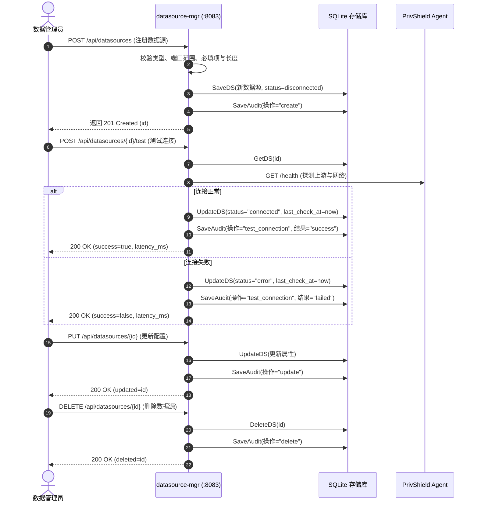

# 数据源管理 (Datasource Manager) — 详细设计文档

> 本文档定义 **数联天下 · 数盾 (`PrivShield`)** 数据源管理模块（`services/datasource-mgr`）的系统架构、数据源接入生命周期、元数据智能分类、访问审计追踪与持久化设计。

---

## 1. 背景与业务定位

在政务云多源异构数据治理体系中，**柳树数据局原始数据库 D (Datasource Manager)** 位于物理或逻辑隔离的局方高密环境，负责对卫健、医保、人社等政务部门的原始数据源进行纳管。

`datasource-mgr` 模块作为数据源管控的后端微服务，提供：

1. **多源异构数据源接入**：统一纳管关系型数据库（MySQL、PostgreSQL、Oracle）、API 服务与离线文件型数据源；
2. **完整生命周期管理**：提供注册（Create）、查看（Get/List）、更新（Update）、删除（Delete）及连通性探测（Test Connection）的完整 CRUD 能力；
3. **元数据智能打标与分类**：自动化拉取表结构与字段元数据，联动 Agent 分类分级引擎自动识别敏感字段与标记安全等级（L1~L5）；
4. **全量访问审计与存证**：对所有针对数据源的创建、查询、测试、删除与更新操作进行细粒度审计入库，支持 SQL 级分页检索；
5. **企业级持久化与高可用**：基于 SQLite 纯 Go 驱动实现 WAL 模式持久化，无 CGO 依赖，支持安全中间件链与 Prometheus 监控。

---

## 2. 总体架构设计

```mermaid
graph TD
    subgraph Frontend [管控前端]
        WebUI[React 控制台 UI<br/>:5173]
        GoGateway[Go BFF 网关<br/>:8081]
    end

    subgraph DatasourceMgr [Datasource Manager :8083]
        HTTPRouter[Gin HTTP 路由层<br/>/api/datasources/*]
        Middleware[共享中间件<br/>Auth / CORS / RequestID / Logger / Recovery]
        PromMetrics[Prometheus Collector<br/>/metrics]

        DSController[数据源业务控制器]
        AuditRecorder[访问审计记录器]
        
        DSStore[(DataSourceStore<br/>SQLite / Memory)]
    end

    subgraph ExternalSources [底层多源异构数据源]
        MySQL[(MySQL 业务库)]
        PG[(PostgreSQL 库)]
        APIEndpoint[政务接口 API]
        FileStorage[文件/对象存储]
    end

    subgraph UpstreamAgent [PrivShield 核心 Agent :8079]
        AgentHealth[/health 探活]
        AgentClassify[/v1/dynclassification/classify]
    end

    WebUI -->|HTTP REST| HTTPRouter
    GoGateway -->|HTTP REST| HTTPRouter
    HTTPRouter --> Middleware
    Middleware --> DSController
    HTTPRouter --> PromMetrics

    DSController --> DSStore
    DSController --> AuditRecorder
    AuditRecorder --> DSStore

    DSController -.->|连通性探测 / 代理| UpstreamAgent
    DSController -.->|元数据采集| ExternalSources
```

---

## 3. 核心功能与业务流程

### 3.1 数据源全生命周期管理 (CRUD)



### 3.2 元数据自动分类与字段打标

调用 `GET /api/datasources/:id/metadata` 时，模块执行表结构与字段安全打标：

- **字段级敏感属性识别**：识别姓名、身份证号、诊断信息、医保卡号等 PII / PHI 敏感字段；
- **安全等级自动关联**：
  - 公开属性（如 ID、自增序号）→ **L1**（非敏感）
  - 基础人员信息（如姓名、就诊科室）→ **L3**（PII / 敏感）
  - 高密关键信息（如身份证号码、重大疾病诊断）→ **L4**（高敏 / 机密）

### 3.3 数据源访问审计追踪

每次管理操作（创建、修改、删除、连通性探测、元数据查看）均产生不可抵赖的审计记录，包含：
- 操作类型 (`operation`)
- 操作主体 (`user_name`)
- 时间戳 (`timestamp`)
- 关联数据源 ID 与名称 (`datasource_id`, `datasource_name`)
- 涉及数据条数与操作状态 (`records_count`, `status`)

---

## 4. 数据持久化设计 (`pkg/store/sqlite`)

### 4.1 表结构 DDL

```sql
-- 数据源表
CREATE TABLE IF NOT EXISTS datasources (
    id TEXT PRIMARY KEY,
    name TEXT NOT NULL,
    type TEXT,
    host TEXT,
    port INTEGER,
    database_name TEXT,
    security_level TEXT,
    status TEXT NOT NULL DEFAULT 'disconnected',
    created_at DATETIME NOT NULL,
    last_check_at DATETIME,
    tags_json TEXT
);

-- 访问审计记录表
CREATE TABLE IF NOT EXISTS access_audit (
    id TEXT PRIMARY KEY,
    datasource_id TEXT,
    datasource_name TEXT,
    operation TEXT,
    user_name TEXT,
    timestamp DATETIME NOT NULL,
    records_count INTEGER DEFAULT 0,
    status TEXT
);
CREATE INDEX IF NOT EXISTS idx_access_audit_ds ON access_audit(datasource_id);
```

### 4.2 高效 SQL 分页

采用 SQL 层的 `LIMIT ? OFFSET ?` 与 `COUNT(*)` 双重优化，彻底消除将全量数据加载至内存切片的性能与内存隐患。

---

## 5. API 接口规范

| 方法 | 路径 | 描述 | 请求参数 / 体 | 响应状态 |
|---|---|---|---|---|
| `GET` | `/health` | 服务健康检查 | — | `200 OK` |
| `GET` | `/api/health` | API 内部健康检查 | — | `200 OK` |
| `GET` | `/api/datasources` | 获取数据源列表（分页） | `limit`, `offset` | `200 OK` |
| `POST` | `/api/datasources` | 注册新数据源 | `name, type, host, port, database, security_level, tags` | `201 Created` |
| `GET` | `/api/datasources/:id` | 获取单个数据源详情 | URL 路径参数 `:id` | `200 OK` / `404` |
| `PUT` | `/api/datasources/:id` | 更新数据源配置 | `name, type, host, port, database, security_level, tags, status` | `200 OK` / `404` |
| `DELETE` | `/api/datasources/:id` | 删除指定数据源 | URL 路径参数 `:id` | `200 OK` / `404` |
| `POST` | `/api/datasources/:id/test` | 测试数据源网络连通性 | URL 路径参数 `:id` | `200 OK` |
| `GET` | `/api/datasources/:id/metadata` | 获取表结构与分类分级元数据 | URL 路径参数 `:id` | `200 OK` |
| `GET` | `/api/datasources/:id/audit` | 获取数据源的访问审计日志（分页） | `limit`, `offset` | `200 OK` |
| `GET` | `/metrics` | Prometheus 监控指标 | — | `200 OK` |
