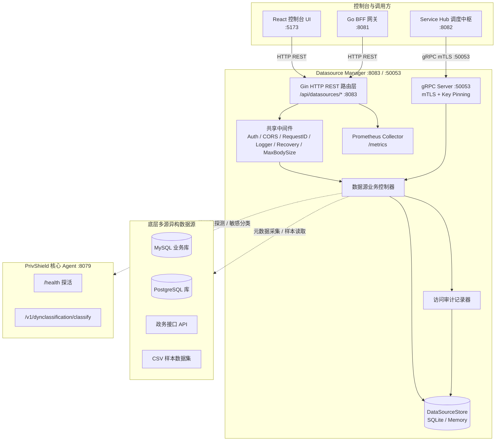
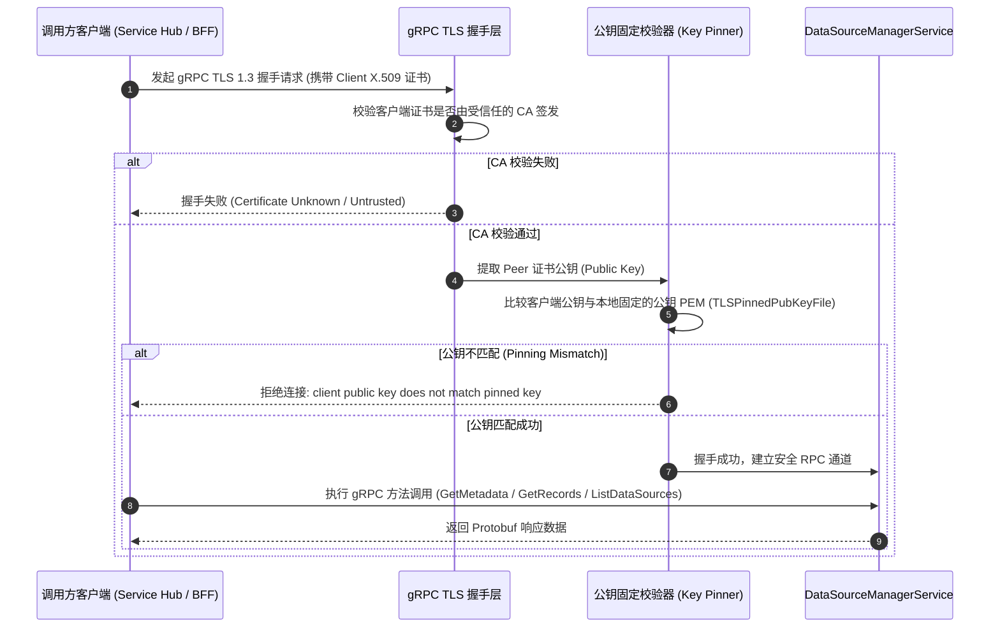

# 数据源管理 (Datasource Manager) — 详细设计文档

> 本文档定义 **数联天下 · 数盾 (`PrivShield`)** 数据源管理模块（`services/datasource-mgr`）的系统架构、双协议服务模型（REST + gRPC）、mTLS 双向认证与公钥固定、数据源接入生命周期、元数据智能分类、访问审计追踪与持久化设计。

---

## 1. 背景与业务定位

在政务云多源异构数据治理体系中，**数据源管理中枢 (Datasource Manager)** 位于物理或逻辑隔离的局方高密环境，负责对卫健、医保、人社等政务部门的原始数据源进行统一纳管与特征探查。

`datasource-mgr` 模块作为核心中台微服务，具备以下核心能力：

1. **双协议接入（REST + gRPC）**：对外提供标准 HTTP REST API 供前端控制台访问，同时对内提供高性能 gRPC 接口（端口 `:50053`）供 `service-hub` 调度中枢与微服务集群直接调用；
2. **零信任 mTLS 与公钥固定**：gRPC 通道支持 TLS 1.3 双向证书认证（mTLS），并内置客户端公钥固定（Public Key Pinning）机制，彻底防范中间人攻击（MITM）与伪造证书风险；
3. **多源异构数据源接入**：统一纳管关系型数据库（MySQL、PostgreSQL、Oracle）、API 服务与离线文件型数据源；
4. **完整生命周期管理**：提供注册（Create）、查看（Get/List）、更新（Update）、删除（Delete）及连通性探测（Test Connection）的完整 CRUD 能力；
5. **元数据智能打标与分类**：自动化拉取表结构与字段元数据，联动 Agent 分类分级引擎自动识别敏感字段与标记安全等级（L1~L5）；
6. **全量访问审计与存证**：对所有针对数据源的创建、查询、测试、删除与更新操作进行细粒度审计入库，支持 SQL 级分页检索；
7. **企业级持久化与高可用**：基于 SQLite 纯 Go 驱动实现 WAL 模式持久化，无 CGO 依赖，支持安全中间件链与 Prometheus 监控。

---

## 2. 总体架构设计

---

## 3. mTLS 与公钥固定安全架构

为了满足政务高密数据环境对于微服务间 RPC 通信的零信任安全要求，`datasource-mgr` 在 gRPC 协议层实现了纵深防御认证体系：

---

## 4. 核心功能与业务流程

### 4.1 数据源全生命周期管理 (CRUD)

1. **注册（Create）**：校验字段必填性、数据源类型白名单（`database|api|file`）、端口合法范围（1-65535）以及安全等级（`high|medium|low`）。
2. **探测（Test Connection）**：对于 `file` 类型，检验样本文件在白名单目录中的物理存在与可读性；对于外部服务，探测网络可达性与响应延迟 `latency_ms`。
3. **元数据自动探查（GetMetadata）**：读取数据源表结构字段，对样例数据调用上游 Agent 执行分类，返回 L1-L5 安全标签。
4. **明细数据采样（GetDataSourceRecords）**：内置路径穿越防护（防 LFI）与 50,000 行安全读取上限，提供可靠的分页采样输出。
5. **审计追踪（GetAccessAudit）**：记录所有数据源的访问、导出与脱敏调用历史。

---

## 5. 存储设计

数据源存储抽象为 `store.DataSourceStore` 接口：
- **内存实现 (`pkg/store/memory`)**：适用于开发调试与单元测试；
- **SQLite 实现 (`pkg/store/sqlite`)**：基于纯 Go SQLite 驱动，支持 WAL 模式并发写入与表结构自动迁移。
