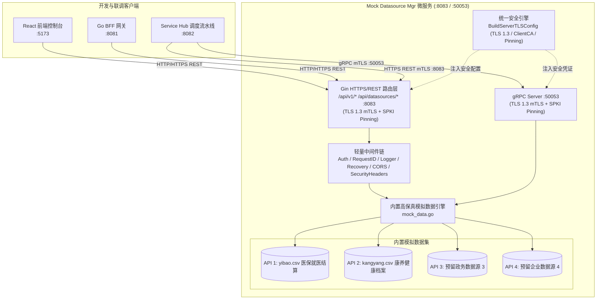

# 模拟数据源服务 (Mock Datasource Manager) — 详细设计文档

> 本文档定义 **数联天下 · 数盾 (`PrivShield`)** 模拟数据源模块（`services/datasource-mgr`）的系统架构、固定模拟数据库、API 1~4 接口设计、双协议支持（REST + gRPC）与 mTLS 双向认证。

---

## 1. 定位与设计原则

### 1.1 业务定位
`datasource-mgr` 专为 **开发、联调与测试** 设计，作为轻量级的模拟数据提供者。
- **开发/联调期**：提供标准数据结构与高保真模拟样本数据（医保 `yibao.csv`、康养 `kangyang.csv` 及预留接口 3/4）；
- **生产运行期**：调度中枢及业务服务将直接对接局方真实物理数据库或外部业务接口，无需在生产环境中部署多源异构管理与自动探查等重型中间件。

### 1.2 核心特性保留
1. **双协议通信与全链路安全**：对外提供 HTTP/HTTPS REST (`:8083`) 与高性能 gRPC (`:50053`)；
2. **全链路 mTLS 双向认证与公钥固定**：HTTP/HTTPS 与 gRPC 统一采用 TLS 1.3 客户端证书校验与客户端公钥固定（SPKI Pinning）；
3. **固定模拟数据库**：内置医保就医结算数据与康养健康档案数据；
4. **4 个独立模拟接口**：API 1（医保）、API 2（康养）、API 3（预留扩展 3）、API 4（预留扩展 4）。

---

## 2. 总体架构拓扑

---

## 3. 接口架构映射 (API 1 ~ 4)

| 接口 | 目标数据源 | REST 端点 | gRPC RPC 方法 | 数据特征 |
|---|---|---|---|---|
| **API 1** | 医保数据源 | `GET /api/v1/yibao` | `GetYibaoData` | 包含身份证号、姓名、就医诊断、费用金额等敏感字段 |
| **API 2** | 康养数据源 | `GET /api/v1/kangyang` | `GetKangyangData` | 包含老人编号、慢病史、体检血压、生活自理评估等 |
| **API 3** | 预留数据源 3 | `GET /api/v1/mock3` | `GetMockData3` | 政务跨部门流通与审批流水模拟 |
| **API 4** | 预留数据源 4 | `GET /api/v1/mock4` | `GetMockData4` | 财务税收与企业统计报表模拟 |
