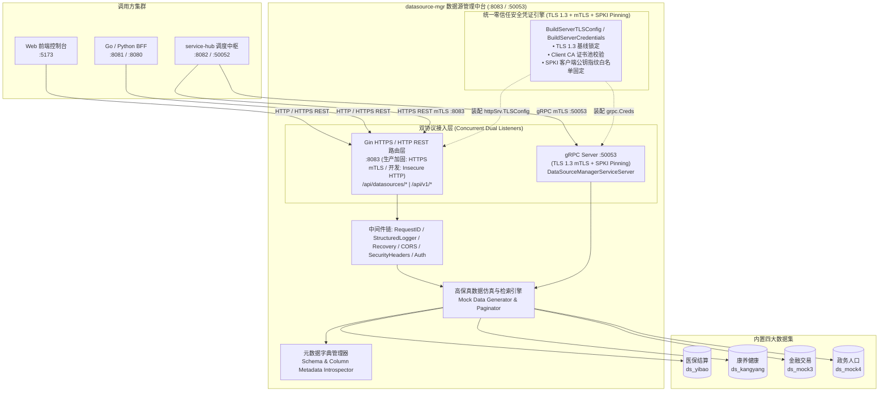
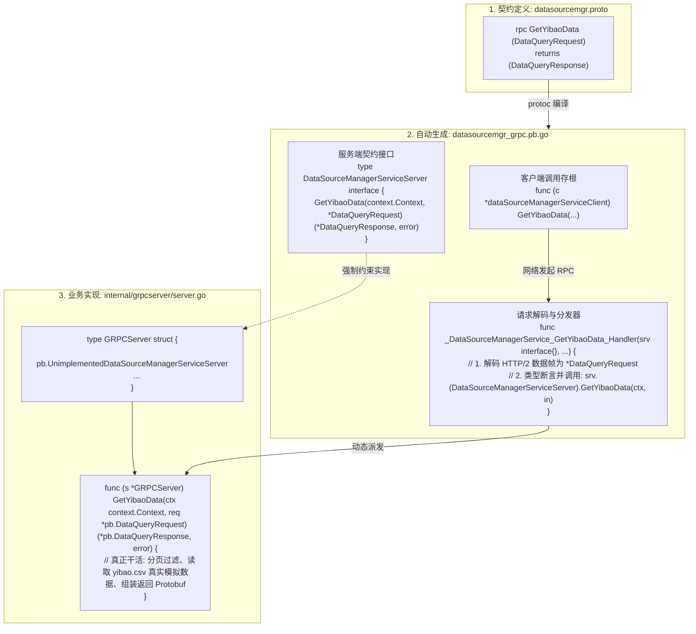
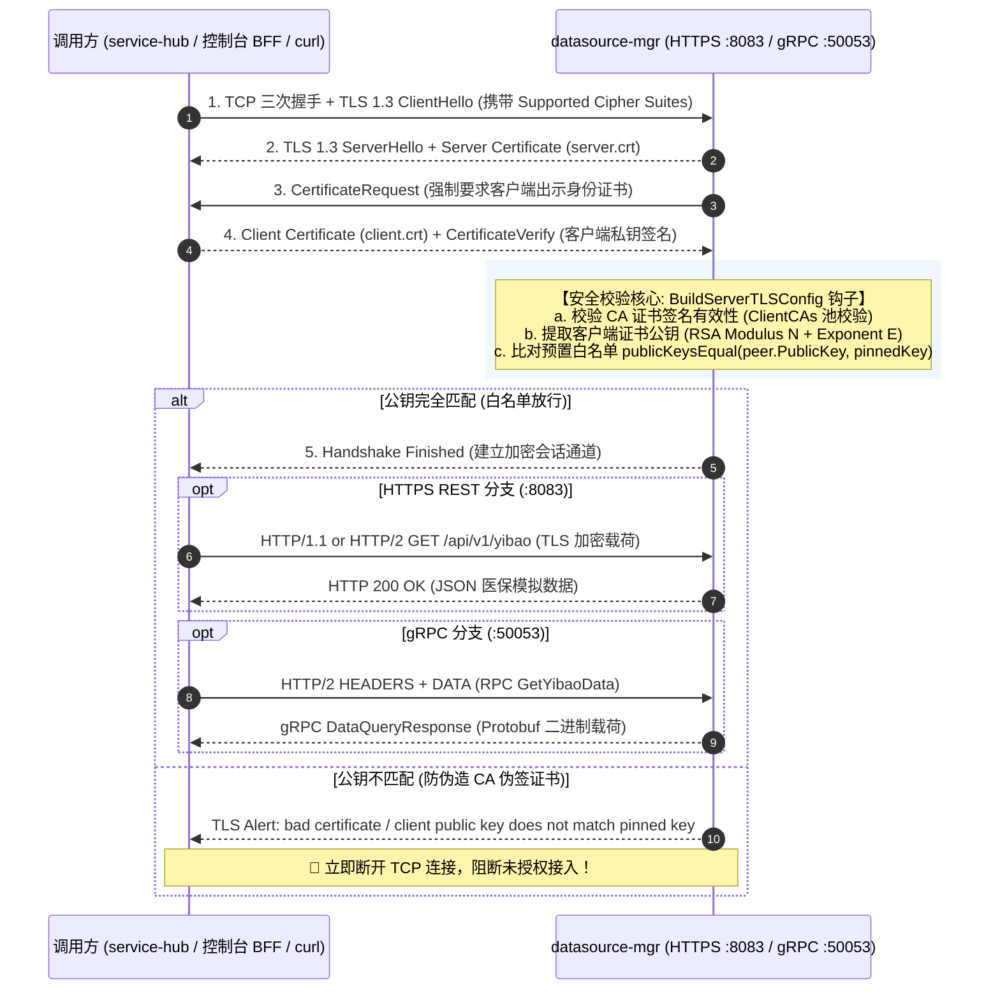
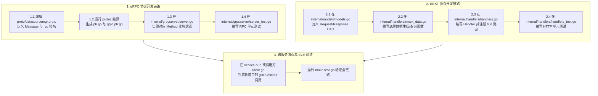

# 数据源管理服务 (datasource-mgr) 深度学习指南

> 面向研发、测试与数据治理工程师的完整技术指南，全面解析数联天下 · 数盾 (`PrivShield`) 数据源管理与高保真仿真探查模块的系统架构、数据字典、双协议暴露、零信任安全与核心源码实现。

---

## 目录 / Table of Contents

- [1. 模块全景与业务定位](#1-模块全景与业务定位)
- [2. 系统架构与交互拓扑](#2-系统架构与交互拓扑)
- [3. 预置高保真数据源与敏感特征字典](#3-预置高保真数据源与敏感特征字典)
  - [3.1 医保就医与结算数据集 (ds_yibao)](#31-医保就医与结算数据集-ds_yibao)
  - [3.2 康养旅居与健康档案数据集 (ds_kangyang)](#32-康养旅居与健康档案数据集-ds_kangyang)
  - [3.3 金融账户与交易流水数据集 (ds_mock3)](#33-金融账户与交易流水数据集-ds_mock3)
  - [3.4 政务人口与户籍档案数据集 (ds_mock4)](#34-政务人口与户籍档案数据集-ds_mock4)
- [4. 核心代码架构与目录结构](#4-核心代码架构与目录结构)
- [5. 核心源码深入解读](#5-核心源码深入解读)
  - [5.1 服务启动入口与双协议并发 (cmd/server/main.go)](#51-服务启动入口与双协议并发-cmdservermaingo)
  - [5.2 配置驱动与环境变量解析 (internal/config/config.go)](#52-配置驱动与环境变量解析-internalconfigconfiggo)
  - [5.3 REST 路由与数据检索控制 (internal/handlers/handlers.go)](#53-rest-路由与数据检索控制-internalhandlershandlersgo)
  - [5.4 模拟数据生成器与分页探针 (internal/handlers/mock_data.go)](#54-模拟数据生成器与分页探针-internalhandlersmock_datago)
  - [5.5 gRPC 高性能服务实现与 mTLS 加固 (internal/grpcserver/server.go)](#55-grpc-高性能服务实现与-mtls-加固-internalgrpcserverservergo)
  - [5.6 gRPC 桩代码与业务实现的核心关联 (datasourcemgr_grpc.pb.go vs server.go)](#56-grpc-桩代码-datasourcemgr_grpcpbgo-与业务实现-servergo-的核心关联)
- [6. 零信任传输与公钥固定安全机制](#6-零信任传输与公钥固定安全机制)
- [7. 本地开发、实操与 API 演练](#7-本地开发实操与-api-演练)
- [8. 生产环境部署与容器化](#8-生产环境部署与容器化)
- [9. 常见问题排查 (FAQ)](#9-常见问题排查-faq)
- [10. 实战演练：如何新增一个通信 API（REST & gRPC 双协议全流程）](#10-实战演练如何新增一个通信-apirest--grpc-双协议全流程)
  - [10.1 gRPC 通信接口开发四步法](#101-grpc-通信接口开发四步法)
  - [10.2 HTTP REST 接口开发四步法](#102-http-rest-接口开发四步法)
  - [10.3 上游消费端 (以 service-hub 为例) 跨微服务对接](#103-上游消费端-以-service-hub-为例-跨微服务对接)

---

## 1. 模块全景与业务定位

在数据要素流通与隐私保护的开发、联调与生产运行过程中，直接使用真实生产库存在巨大的合规风险与泄密隐患。

**`datasource-mgr` (数据源管理与敏感特征自动探查服务)** 是 `PrivShield` 体系中的数据源资产枢纽与高保真数据提供者：

```
┌───────────────────────────────────────────────────────────────────────────┐
│                      数据源调度调用方 (service-hub / 控制台 BFF)             │
└─────────────────────────────────────┬─────────────────────────────────────┘
                                      │ HTTP/HTTPS REST (:8083) / gRPC (:50053) [双协议 mTLS]
                                      ▼
┌───────────────────────────────────────────────────────────────────────────┐
│                  datasource-mgr 数据源管理中台 (Go 1.24+)                  │
│                                                                           │
│   • 数据源注册与纳管   • 连通性健康探测   • 元数据特征探查   • 高保真数据抽取  │
│   • TLS 1.3 双向认证  • SPKI 公钥固定    • 防 Slowloris 攻击 • 双协议安全暴露  │
└───────────┬─────────────────────────┬──────────────────────────┬──────────┘
            │                         │                          │
            ▼                         ▼                          ▼
┌───────────────────────┐ ┌───────────────────────┐ ┌───────────────────────┐
│  医保结算源 ds_yibao   │ │  康养健康源 ds_kangyang│ │ 金融/政务源 mock3/mock4 │
│ 姓名/身份证/诊断/金额 │ │ 年龄/慢病等级/紧急联系人│ │ 银行卡/流水/户籍/住址   │
└───────────────────────┘ └───────────────────────┘ └───────────────────────┘
```

### 核心职责与设计目标

1. **统一数据源资产纳管**：统一抽象异构数据源（MySQL、PostgreSQL、文件源、高保真 Mock 数据源）元数据。
2. **敏感特征自动探查与抽样**：为调度中枢提供字段名、数据类型、行数统计与敏感特征抽样数据。
3. **多协议高效安全暴露**：提供 Web 端易用的 HTTP/HTTPS RESTful API (:8083) 与微服务间高性能二进制 gRPC API (:50053)。
4. **金融级零信任传输**：全链路集成 TLS 1.3 mTLS 双向证书校验与公钥哈希白名单固定 (SPKI Pinning)，覆盖 HTTPS REST 与 gRPC 双通道。
5. **开箱即用与零外部依赖**：内置完整的高保真医疗、康养、金融、政务仿真数据生成器，零依赖快速启动。

---

## 2. 系统架构与交互拓扑



---

## 3. 预置高保真数据源与敏感特征字典

为了全面检验隐私保护引擎的脱敏、差分隐私、K-匿名与动态分类分级能力，`datasource-mgr` 内置了 4 大典型行业场景数据集：

### 3.1 医保就医与结算数据集 (`ds_yibao`)

- **业务场景**：医院门诊/住院结算、医保基金报销与核查。
- **数据规模**：默认 100+ 条高保真模拟记录（支持无限动态扩展与分页）。
- **字段字典**：

| 字段名 | 含义说明 | 敏感级别建议 | 包含敏感特征 | 典型示例 |
|---|---|---|---|---|
| `patient_id` | 患者唯一就诊号 | L2 (内部标识) | 业务唯一编码 | `YB-2026-0001` |
| `name` | 患者真实姓名 | L3 (敏感个人信息) | 中文姓名 (PII) | `张建国` |
| `id_card` | 居民身份证号 | L4 (极敏感 PII) | 18 位中国身份证 | `110101198506041234` |
| `hospital` | 就诊医院名称 | L1 (公开机构) | 机构名称 | `成都市第一人民医院` |
| `department` | 就诊科室 | L2 (就诊信息) | 医疗科室 | `心血管内科` |
| `diagnosis` | 疾病诊断结论 | L3 (健康生理信息) | 敏感病情 | `原发性高血压 II 级` |
| `treatment_date`| 就诊日期时间 | L2 (行为轨迹) | 日期时间 | `2026-03-15` |
| `total_fee` | 医疗总费用 (元) | L2 (财务明细) | 浮点数值 (用于 DP 加噪) | `3280.50` |
| `fund_pay` | 医保统筹基金支付 | L2 (财务明细) | 浮点数值 | `2460.00` |
| `self_pay` | 个人自费金额 | L2 (财务明细) | 浮点数值 | `820.50` |
| `phone` | 患者联系电话 | L3 (敏感通信信息) | 11 位手机号 | `13800138001` |

### 3.2 康养旅居与健康档案数据集 (`ds_kangyang`)

- **业务场景**：社区康养中心、慢性病跟踪与旅居养老管理。
- **字段字典**：

| 字段名 | 含义说明 | 包含敏感特征 | 隐私治理典型算子 |
|---|---|---|---|
| `resident_id` | 康养入住人编号 | 机构编码 | 明文 / Hash 伪名化 |
| `name` | 老人姓名 | 中文姓名 | 字符掩码 (`张*国`) |
| `gender` | 性别 | 准标识符 (QI) | K-匿名化分组 |
| `age` | 年龄 | 准标识符 (QI) | 区间泛化 (`[70, 80)`) / 差分隐私均值 |
| `blood_pressure`| 血压值 (收缩压/舒张压) | 生理健康指标 | 差分隐私 Laplace 加噪 |
| `chronic_disease`| 慢性病管理分级 | 敏感病史 | 泛化分类 |
| `emergency_phone`| 紧急联系人电话 | 通信联系方式 | 手机掩码 (`139****1234`) |
| `room_number` | 居住房间号 | 物理位置准标识 | 楼层泛化 |

### 3.3 金融账户与交易流水数据集 (`ds_mock3`)

- **业务场景**：银行账户风控、反洗钱与资金流水审计。
- **包含字段**：`account_id`、`card_number` (16~19 位银行卡号)、`holder_name`、`transaction_amount` (交易金额)、`merchant`、`client_ip`。

### 3.4 政务人口与户籍档案数据集 (`ds_mock4`)

- **业务场景**：政务人口普查、社会保障与精准帮扶。
- **包含字段**：`citizen_id`、`household_head`、`family_address` (详细家庭住址)、`education` (学历)、`income_level`。

---

## 4. 核心代码架构与目录结构

```text
services/datasource-mgr/
├── cmd/
│   └── server/
│       └── main.go              # 程序主入口、并发服务启动与优雅关停
├── internal/
│   ├── config/                  # 环境变量配置解析与校验
│   │   ├── config.go
│   │   └── config_test.go
│   ├── grpcserver/              # gRPC 服务端实现与 TLS/mTLS 凭证构造
│   │   ├── server.go
│   │   └── server_test.go       # 单元与 mTLS 证书校验测试 (4/4 PASS)
│   ├── handlers/                # HTTP REST 接口实现与高保真数据生成器
│   │   ├── handlers.go          # REST 路由注册与请求派发
│   │   ├── handlers_test.go     # REST 单元测试与分页测试
│   │   └── mock_data.go         # 医保/康养/金融/政务数据集生成与过滤逻辑
│   └── models/                  # 数据模型、元数据定义与响应 DTO
│       ├── models.go
│       └── models_test.go
├── proto/                       # gRPC 契约与 Protobuf 生成代码
│   ├── datasource_mgr.proto
│   ├── datasource_mgr.pb.go
│   └── datasource_mgr_grpc.pb.go
├── scripts/                     # 运维与部署脚本
│   └── deploy.sh                # 生产/独立容器部署脚本 (版本已统一至 1.8.0)
├── docs/                        # SDLC 文档
│   ├── prd.md
│   ├── design.md
│   ├── api.md
│   ├── ops.md
│   ├── testing.md
│   └── learning-guide.md        # 本学习文档
├── Dockerfile                   # 多阶段轻量容器镜像构建
├── Makefile                     # 快捷构建与测试指令
└── run.sh                       # 本地快速开发启动脚本
```

---

## 5. 核心源码深入解读

### 5.1 服务启动入口与双协议并发 (`cmd/server/main.go`)

`cmd/server/main.go` 采用了高标准的工程化并发设计，生命周期清晰明确：

```go
func main() {
    // 1. 加载配置与初始化结构化日志
    cfg := config.Load()
    logger := pkgconfig.SetupLogger(cfg.LogFormat, cfg.LogLevel)

    // 2. 初始化 Gin REST 路由器与中间件链
    server := handlers.New(cfg, logger)
    router := gin.New()
    server.RegisterRoutes(router)

    // 3. 构建防御 Slowloris 慢连接拒绝服务并支持 HTTPS mTLS 的 HTTP Server
    httpSrv := &http.Server{
        Addr:              cfg.Address(),
        Handler:           router,
        ReadHeaderTimeout: 5 * time.Second,  // 严格限制请求头传输时间
        ReadTimeout:       30 * time.Second,
        WriteTimeout:      60 * time.Second,
        IdleTimeout:       120 * time.Second,
        MaxHeaderBytes:    1 << 20,          // 1 MiB 限制
    }

    if cfg.TLSEnabled {
        httpTLSConfig, err := grpcserver.BuildServerTLSConfig(cfg)
        if err != nil {
            log.Fatalf("failed to build TLS config for HTTP/HTTPS server: %v", err)
        }
        httpSrv.TLSConfig = httpTLSConfig
    }

    // 4. 协程 A：启动 HTTP/HTTPS REST 监听（生产环境自动启用 mTLS）
    go func() {
        if cfg.TLSEnabled {
            if err := httpSrv.ListenAndServeTLS("", ""); err != nil && err != http.ErrServerClosed {
                logger.Error("HTTPS server failed", "err", err)
            }
        } else {
            if err := httpSrv.ListenAndServe(); err != nil && err != http.ErrServerClosed {
                logger.Error("HTTP server failed", "err", err)
            }
        }
    }()

    // 5. 协程 B：启动 gRPC 服务（支持 Insecure 或金融级 mTLS 双向认证）
    var grpcServer *grpc.Server
    if cfg.TLSEnabled {
        creds, err := grpcserver.BuildServerCredentials(cfg)
        if err != nil {
            log.Fatalf("failed to build TLS credentials: %v", err)
        }
        grpcServer = grpc.NewServer(grpc.Creds(creds))
    } else {
        grpcServer = grpc.NewServer()
    }
    // 注册 gRPC 服务实现
    pb.RegisterDataSourceManagerServiceServer(grpcServer, grpcserver.New(cfg, logger))
    go func() {
        grpcListener, err := net.Listen("tcp", cfg.GRPCAddress())
        if err != nil {
            logger.Error("gRPC listen failed", "err", err)
            os.Exit(1)
        }
        grpcServer.Serve(grpcListener)
    }()

    // 6. 监听系统中断信号，5 秒超时优雅关闭
    quit := make(chan os.Signal, 1)
    signal.Notify(quit, syscall.SIGINT, syscall.SIGTERM)
    <-quit

    ctx, cancel := context.WithTimeout(context.Background(), 5*time.Second)
    defer cancel()
    httpSrv.Shutdown(ctx)
    grpcServer.GracefulStop()
}
```

### 5.2 配置驱动与环境变量解析 (`internal/config/config.go`)

`config.go` 负责统一解析所有系统环境变量，开箱即用，具备完善的边界防护：

```go
type Config struct {
    Host             string   // DATASOURCE_MGR_HOST (默认 0.0.0.0)
    Port             string   // DATASOURCE_MGR_PORT (默认 8083)
    GRPCHost         string   // DATASOURCE_MGR_GRPC_HOST (默认 0.0.0.0)
    GRPCPort         string   // DATASOURCE_MGR_GRPC_PORT (默认 50053)
    CORSOrigins      []string // CORS_ORIGINS
    APIKey           string   // PRIVACY_API_KEY
    TLSEnabled       bool     // PRIVACY_TLS_ENABLED
    TLSCertFile      string   // PRIVACY_TLS_CERT_FILE
    TLSKeyFile       string   // PRIVACY_TLS_KEY_FILE
    TLSCAFile        string   // PRIVACY_TLS_CA_FILE
    TLSClientAuth    string   // PRIVACY_TLS_CLIENT_AUTH (none/verify_if_given/require)
    TLSPinnedPubKeys string   // PRIVACY_TLS_PINNED_PUBKEY_FILE
    LogLevel         string   // PRIVACY_LOG_LEVEL
    LogFormat        string   // PRIVACY_LOG_FORMAT
}
```

### 5.3 REST 路由与数据检索控制 (`internal/handlers/handlers.go`)

`handlers.go` 注册了清晰规范的 RESTful 接口体系：

```go
func (s *Server) RegisterRoutes(r *gin.Engine) {
    // 注入统一中间件
    r.Use(middleware.RequestID())
    r.Use(middleware.StructuredLogger(s.logger, "datasource-mgr"))
    r.Use(middleware.Recovery(s.logger, "datasource-mgr"))
    r.Use(middleware.SecurityHeaders())
    r.Use(middleware.CORS(s.cfg.CORSOrigins))
    r.Use(middleware.Auth(s.cfg.APIKey))

    // 1. 专属数据集直查端点
    r.GET("/api/v1/yibao", s.GetYibaoData)
    r.GET("/api/v1/kangyang", s.GetKangyangData)
    r.GET("/api/v1/mock3", s.GetMock3Data)
    r.GET("/api/v1/mock4", s.GetMock4Data)

    // 2. 通用数据源资产与元数据端点
    r.GET("/api/datasources", s.ListDataSources)
    r.GET("/api/datasources/:id", s.GetDataSource)
    r.GET("/api/datasources/:id/records", s.GetDataSourceRecords)
    r.POST("/api/datasources/:id/test", s.TestConnection)
    r.GET("/api/datasources/:id/metadata", s.GetMetadata)
}
```

### 5.4 模拟数据生成器与分页探针 (`internal/handlers/mock_data.go`)

内置高保真数据生成函数：
- `GetYibaoRecords(limit, offset)`：支持任意偏移量与分页限制切片，自动生成带校验位的 18 位身份证号码与真实中文姓名。
- `GetKangyangRecords(limit, offset)`：支持动态生成收缩压/舒张压波动区间与慢性病评估指标。
- `GetMetadataBySourceID(sourceID)`：返回目标数据源的表名、列名、数据类型字典，用于 Agent 进行特征探测与策略匹配。

### 5.5 gRPC 与 HTTPS 传输层安全凭证实现与 mTLS 加固 (`internal/grpcserver/server.go`)

`internal/grpcserver/server.go` 既实现了完整的 `DatasourceMgrServiceServer` 业务接口，也承担了整个服务的 **底层 TLS 1.3 / mTLS 凭证构造中枢**：

- `BuildServerTLSConfig(cfg)`：**统一构造标准 Go `*tls.Config`**，同时服务于 `http.Server`（HTTPS REST）与 `grpc.Server`：
  1. 锁定 `MinVersion: tls.VersionTLS13`，防止针对 TLS 1.0/1.1/1.2 的协议降级攻击；
  2. 加载服务端证书与私钥（`TLSCertFile`, `TLSKeyFile`）；
  3. 配置客户端 CA 证书池（`ClientCAs`）与认证模式（`RequireAndVerifyClientCert`）；
  4. 注入 `VerifyPeerCertificate` 回调，提取对端证书中的公钥数学参数（RSA 模数 N 与指数 E），比对固定的公钥白名单（SPKI Pinning）。
- `BuildServerCredentials(cfg)`：将 `BuildServerTLSConfig` 生成的 `*tls.Config` 包装为 gRPC 的 `credentials.TransportCredentials`。
- `GetYibaoData(ctx, req)`：高速流式或分页批处理返回 Protobuf 序列化的医保记录。
- `GetDataBySource(ctx, req)`：多态数据源通用拉取接口。
- `TestConnection(ctx, req)`：毫秒级连通性探测。

---

### 5.6 gRPC 桩代码 (`datasourcemgr_grpc.pb.go`) 与业务实现 (`server.go`) 的核心关联

许多初学者常常对 `proto/datasourcemgr_grpc.pb.go` 中的 `GetYibaoData` 与 `internal/grpcserver/server.go` 中的 `GetYibaoData` 感到困惑。二者是典型的 **「契约接口与分发器（Generated Stub & Dispatcher）」** 与 **「具体业务实现（Concrete Implementation）」** 关系：



#### 核心职责矩阵

| 组成部分 | 所在文件位置 | 角色与作用 | 核心代码逻辑 |
|---|---|---|---|
| **客户端存根** | `proto/datasourcemgr_grpc.pb.go` | **Client Stub** | `(*dataSourceManagerServiceClient).GetYibaoData`：供外部调用方使用，将参数打包并通过 HTTP/2 发送网络请求。 |
| **服务端契约接口** | `proto/datasourcemgr_grpc.pb.go` | **Server Interface** | `DataSourceManagerServiceServer` 接口：规范服务端必须实现的方法签名。 |
| **方法路由分发器** | `proto/datasourcemgr_grpc.pb.go` | **Dispatcher Handler** | `_DataSourceManagerService_GetYibaoData_Handler`：收到网络请求后解码请求体，并调用传入的 `srv.(DataSourceManagerServiceServer).GetYibaoData`。 |
| **业务落地实现** | `internal/grpcserver/server.go` | **Concrete Impl** | `(*GRPCServer).GetYibaoData`：**真正执行业务的代码**，读取模拟数据源、组装 `DataQueryResponse`。 |

#### 一次完整 RPC 请求的执行全流程

1. **连接建立 (TCP Accept & TLS)**：
   `cmd/server/main.go` 中的 `grpcServer.Serve(grpcLis)` 监听新 TCP 连接。若开启 mTLS，执行 TLS 1.3 握手与 SPKI 公钥指纹白名单比对；
2. **多路复用与请求接收**：
   TCP 连接升级为 HTTP/2 传输层。上游（如 `service-hub`）调用 `client.GetYibaoData(ctx, req)` 发送 HTTP/2 HEADERS 帧（携带 `:path: /datasourcemgr.DataSourceManagerService/GetYibaoData`）；
3. **分发器动态派发**：
   gRPC 运行时根据 `:path` 在 `DataSourceManagerService_ServiceDesc` 描述表中找到 `_DataSourceManagerService_GetYibaoData_Handler`，为其派发一个独立的 Worker Goroutine 并反序列化参数；
4. **业务落地执行**：
   分发器调用 `main.go` 中注册的 `(*GRPCServer).GetYibaoData`，执行参数校验与数据读取，最后通过 HTTP/2 DATA 帧将结果序列化回传给客户端。

> 💡 **架构通用性提示**：`service-hub` 与 `audit-log` 模块中的 gRPC 服务（`service_hub_grpc.pb.go` ↔ `grpcserver/server.go`、`audit_log_grpc.pb.go` ↔ `grpcserver/server.go`）均遵循完全相同的契约接口与具体实现分离的设计范式。

---

## 6. 零信任传输与公钥固定安全机制

在分布式零信任网络中，仅依赖 CA 根证书签名可能存在风险（如企业内部自建 CA 私钥意外泄露导致攻击者伪造合法证书）。

`datasource-mgr` 在 **HTTPS REST (:8083) 与 gRPC (:50053)** 双协议上全面落地了 **SPKI (Subject Public Key Info) 公钥指纹白名单固定机制**：



---

## 7. 本地开发、实操与 API 演练

### 7.1 启动服务

```bash
# 进入 datasource-mgr 目录
cd services/datasource-mgr

# 1. 启动轻量开发模式（免 TLS，默认监听 :8083 HTTP 与 :50053 gRPC）
bash scripts/dev-run.sh
# 或
make dev

# 2. 启动生产加固模式（双协议 TLS 1.3 + mTLS + 公钥固定）
bash scripts/prod-run.sh
# 或
make prod
```

### 7.2 核心接口调用演练

#### 1. 开发模式（纯明文 HTTP）
```bash
# 查看数据源资产清单
curl -s http://127.0.0.1:8083/api/datasources | jq .

# 分页调取医保就医模拟数据集（取前 3 条）
curl -s "http://127.0.0.1:8083/api/v1/yibao?limit=3&offset=0" | jq .

# 探查康养数据源元数据字典
curl -s http://127.0.0.1:8083/api/datasources/ds_kangyang/metadata | jq .
```

#### 2. 生产加固模式（HTTPS REST 双向认证 mTLS）
```bash
# 挂载测试 CA 根证书与已固定公钥的客户端证书访问 HTTPS REST 接口
curl -s --cacert certs/ca.crt \
  --cert certs/client.crt \
  --key certs/client.key \
  https://127.0.0.1:8083/api/v1/yibao?limit=3 | jq .

# 测试未携带客户端证书时，验证被 mTLS 阻断
curl -s --cacert certs/ca.crt https://127.0.0.1:8083/api/v1/yibao
# 预期输出: curl: (35) error:0A000412:SSL routines::ssl/tls alert bad certificate
```

### 7.3 运行单元测试套件

```bash
# 运行全部单元测试与脚本集成测试（含 HTTPS mTLS 与 gRPC mTLS 握手校验）
go test -v ./...
```

---

## 8. 生产环境部署与容器化

### 8.1 独立 Docker 容器构建与运行

```bash
# 1. 在项目根目录构建镜像
docker build -f services/datasource-mgr/Dockerfile -t privshield-datasource-mgr:1.8.0 .

# 2. 启动容器
docker run -d \
  --name privshield-datasource-mgr \
  -p 8083:8083 -p 50053:50053 \
  -e DATASOURCE_MGR_HOST=0.0.0.0 \
  -e DATASOURCE_MGR_PORT=8083 \
  privshield-datasource-mgr:1.8.0
```

### 8.2 Docker Compose 编排

在 `deploy/docker-compose/docker-compose.yml` 中已默认编排为 `datasource-mgr` 服务，开箱即用。

---

## 9. 常见问题排查 (FAQ)

### Q1: 调取数据时返回 `limit` 超出预期？
- **机制说明**：为了防止单次拉取过多数据导致内存激增，系统在 `parsePagination` 中内置了 `maxLimit = 500` 的安全上限。若请求参数 `limit=2000`，实际将按 `500` 截断返回。

### Q2: 单元测试 `TestBuildServerCredentials` 报错？
- **排查步骤**：测试会自动在内存中动态生成 X.509 测试证书。若因运行环境缺少 crypto 随机源或权限问题报错，确认环境运行在标准 Linux/macOS 环境下且 Go 版本 $\ge$ 1.22。

### Q3: 如何向系统新增一种全新的模拟数据源？
- **扩展指引**：
  1. 在 `internal/models/models.go` 的 `MockDataSource` 中添加新数据源 ID 与元数据。
  2. 在 `internal/handlers/mock_data.go` 中编写对应数据集的生成函数与字段元数据映射。
  3. 在 `internal/handlers/handlers.go` 注册对应的 `/api/v1/<name>` 路由与通用分发逻辑。

---

## 10. 实战演练：如何新增一个通信 API（REST & gRPC 双协议全流程）

当业务需要新增一个数据源接口（例如新增一个「社保缴纳与公积金模拟数据」接口 `ShebaoData`）时，需按以下标准化流程进行双协议同步开发：



### 10.1 gRPC 通信接口开发四步法

#### 步骤 1：在 `proto/datasourcemgr.proto` 中定义契约
在 `proto/datasourcemgr.proto` 的 `service DataSourceManagerService` 块中追加 RPC 声明并定义消息体：

```protobuf
// 在 service DataSourceManagerService 中追加：
rpc GetShebaoData (DataQueryRequest) returns (DataQueryResponse);

// 若需要专属请求参数，可新增 Message：
message ShebaoExtraRequest {
    string city_code = 1;
    int32 limit = 2;
    int32 offset = 3;
}
```

#### 步骤 2：编译生成 Protobuf 与 gRPC 桩代码
在 `services/datasource-mgr` 目录下运行 protoc 编译：

```bash
# 生成 Go 数据结构与 gRPC 客户端/服务端桩代码
protoc -I proto --go_out=proto --go_opt=paths=source_relative \
    --go-grpc_out=proto --go-grpc_opt=paths=source_relative \
    proto/datasourcemgr.proto
```
> 执行后将自动更新 `proto/datasourcemgr.pb.go` 和 `proto/datasourcemgr_grpc.pb.go`，并在 `DataSourceManagerServiceServer` 接口中自动追加 `GetShebaoData` 签名约束。

#### 步骤 3：在 `internal/grpcserver/server.go` 中实现业务接口
在 `server.go` 中为 `*GRPCServer` 实现该方法（利用已生成的类型）：

```go
// GetShebaoData 实现社保数据源 gRPC 接口
func (s *GRPCServer) GetShebaoData(ctx context.Context, req *pb.DataQueryRequest) (*pb.DataQueryResponse, error) {
    limit := int(req.Limit)
    if limit <= 0 {
        limit = 20
    }
    offset := int(req.Offset)
    if offset < 0 {
        offset = 0
    }

    // 调用底层数据生成层
    rows, total, err := handlers.GetShebaoRecords(limit, offset)
    if err != nil {
        return nil, status.Errorf(codes.Internal, "failed to get shebao records: %v", err)
    }

    return toDataQueryResponse("ds_shebao", "社保与公积金模拟数据库", total, limit, offset, rows), nil
}
```

#### 步骤 4：在 `internal/grpcserver/server_test.go` 中编写单测
```go
func TestGRPCGetShebaoData(t *testing.T) {
    srv, conn, cleanup := setupTestGRPCServer(t)
    defer cleanup()
    client := pb.NewDataSourceManagerServiceClient(conn)

    resp, err := client.GetShebaoData(context.Background(), &pb.DataQueryRequest{Limit: 5})
    if err != nil {
        t.Fatalf("unexpected error: %v", err)
    }
    if resp.SourceId != "ds_shebao" {
        t.Errorf("expected source ds_shebao, got %s", resp.SourceId)
    }
}
```

---

### 10.2 HTTP REST 接口开发四步法

#### 步骤 1：在 `internal/models/models.go` 中定义 DTO
```go
type ShebaoRecord struct {
    CitizenID    string  `json:"citizen_id"`
    Name         string  `json:"name"`
    Company      string  `json:"company"`
    MonthlyPay   float64 `json:"monthly_pay"`
    Balance      float64 `json:"balance"`
}
```

#### 步骤 2：在 `internal/handlers/mock_data.go` 中编写数据抽取逻辑
```go
func GetShebaoRecords(limit, offset int) ([]map[string]any, int, error) {
    // 构造模拟记录或读取真实文件
    var records []map[string]any
    // ... 分页切片后返回
    return records, len(records), nil
}
```

#### 步骤 3：在 `internal/handlers/handlers.go` 中编写 Handler 并注册路由
```go
// 1. 实现 Handler
func (s *Server) GetShebaoData(c *gin.Context) {
    limit, offset := parsePagination(c)
    rows, total, err := GetShebaoRecords(limit, offset)
    if err != nil {
        c.JSON(http.StatusInternalServerError, gin.H{"error": err.Error()})
        return
    }
    c.JSON(http.StatusOK, gin.H{
        "source_id": "ds_shebao",
        "total":     total,
        "records":   rows,
    })
}

// 2. 在 RegisterRoutes 中注册
func (s *Server) RegisterRoutes(r *gin.Engine) {
    // ...
    r.GET("/api/v1/shebao", s.GetShebaoData)
}
```

#### 步骤 4：在 `internal/handlers/handlers_test.go` 中测试 REST 端点
```go
func TestAPIShebaoData(t *testing.T) {
    router := setupTestRouter()
    w := httptest.NewRecorder()
    req, _ := http.NewRequest(http.MethodGet, "/api/v1/shebao?limit=5", nil)
    router.ServeHTTP(w, req)

    if w.Code != http.StatusOK {
        t.Errorf("expected 200 OK, got %d", w.Code)
    }
}
```

---

### 10.3 上游消费端 (以 `service-hub` 为例) 跨微服务对接

当 `datasource-mgr` 增加了新接口后，上游微服务 `service-hub` 只需在 `internal/datasource/client.go` 中暴露封装好的客户端方法。由于 `datasource-mgr` 支持 **全链路双向认证 (HTTPS mTLS + gRPC mTLS)**，`service-hub` 客户端构造器已内嵌自适应凭证装配机制：

```go
// services/service-hub/internal/datasource/client.go

// 1. 客户端构造器：自适应注入 TLS 1.3 客户端证书与根 CA
func New(cfg *config.Config) *Client {
    httpClient := &http.Client{Timeout: 10 * time.Second}

    if cfg.TLSEnabled && cfg.TLSCertFile != "" && cfg.TLSKeyFile != "" {
        tlsConfig := &tls.Config{MinVersion: tls.VersionTLS13}
        if cert, err := tls.LoadX509KeyPair(cfg.TLSCertFile, cfg.TLSKeyFile); err == nil {
            tlsConfig.Certificates = []tls.Certificate{cert}
        }
        if cfg.TLSCAFile != "" {
            if caPEM, err := os.ReadFile(cfg.TLSCAFile); err == nil {
                caPool := x509.NewCertPool()
                if caPool.AppendCertsFromPEM(caPEM) {
                    tlsConfig.RootCAs = caPool
                }
            }
        }
        httpClient.Transport = &http.Transport{TLSClientConfig: tlsConfig}
    }

    return &Client{
        cfg:        cfg,
        baseURL:    strings.TrimRight(cfg.DatasourceBaseURL(), "/"),
        grpcAddr:   cfg.DatasourceGRPCAddress(),
        httpClient: httpClient,
    }
}

// 2. 业务调用方法：优先走 gRPC 二进制流，降级走 HTTPS REST
func (c *Client) FetchShebaoData(ctx context.Context, limit, offset int) (*DataQueryResult, error) {
    if c.grpcClient != nil {
        // 优先使用高性能 gRPC mTLS 通道
        resp, err := c.grpcClient.GetShebaoData(ctx, &pb.DataQueryRequest{
            Limit:  int32(limit),
            Offset: int32(offset),
        })
        if err != nil {
            return nil, err
        }
        return protoToQueryResult(resp), nil
    }
    // 降级使用 HTTPS REST 通道（自动携带 Client 证书与 CA 根链）
    return c.fetchREST(ctx, fmt.Sprintf("/api/v1/shebao?limit=%d&offset=%d", limit, offset))
}
```

最后执行 `make test-go`，即可确保整个中台微服务群在类型安全、协议编译、双向安全握手与业务逻辑上 100% 协同就绪。

