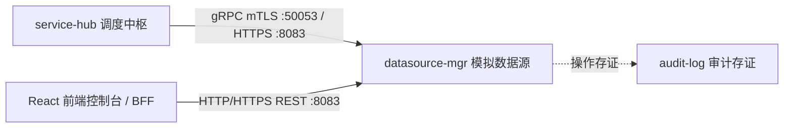

# 模拟数据源服务 (Mock Datasource Manager) — 产品需求文档 (PRD)

## 1. 产品概述

**模拟数据源服务**（`datasource-mgr`）是 PrivShield 平台的轻量级模拟数据源服务，专为开发、联调、测试与合规治理演练阶段提供真实业务数据仿真与跨服务安全通信验证。

| 属性 | 值 |
|---|---|
| 模块名称 | `datasource-mgr` |
| 默认端口 | HTTP/HTTPS REST: `8083` / gRPC: `50053` |
| 开发语言与框架 | Go 1.24+ / Gin / gRPC (Protobuf v3) |
| 安全协议 | TLS 1.3 mTLS 双向认证 + SPKI 客户端公钥指纹固定 |

---

## 2. 核心业务需求

### 2.1 模拟数据源资产生命周期
```
数据源注册/加载 → 连通性探测 → 元数据特征探查 → 高保真模拟数据抽取 → 操作审计
```

### 2.2 4 个专用高保真模拟数据源与接口
1. **API 1 医保就医与结算源 (`ds_yibao`)**：包含身份证号、姓名、就医诊断、费用金额等高密字段，用于仿真医保合规流通场景；
2. **API 2 康养体检与慢病源 (`ds_kangyang`)**：包含老人编号、慢病分级、收缩压/舒张压、自理评估等字段，用于仿真健康康养场景；
3. **API 3 预留政务数据源 (`ds_mock3`)**：政务多部门审批流水仿真；
4. **API 4 预留企业数据源 (`ds_mock4`)**：企业税务与财务经营数据仿真。

---

## 3. 功能需求

### 3.1 双协议通信与接口矩阵

| 方法/RPC | 路径/方法名 | 协议 | 说明 |
|---|---|---|---|
| GET / rpc | `/api/health` / `Health` | HTTP/gRPC | 健康检查与模块标识探针 |
| GET / rpc | `/api/v1/yibao` / `GetYibaoData` | HTTP/gRPC | **API 1** 医保就医与结算模拟数据抽取 |
| GET / rpc | `/api/v1/kangyang` / `GetKangyangData` | HTTP/gRPC | **API 2** 康养体检与慢病模拟数据抽取 |
| GET / rpc | `/api/v1/mock3` / `GetMockData3` | HTTP/gRPC | **API 3** 预留政务模拟数据源 3 抽取 |
| GET / rpc | `/api/v1/mock4` / `GetMockData4` | HTTP/gRPC | **API 4** 预留企业模拟数据源 4 抽取 |
| GET / rpc | `/api/datasources/:id/records` / `GetDataBySource` | HTTP/gRPC | 通用数据源按 ID 动态路由抽取 |
| GET / rpc | `/api/datasources` / `ListMockSources` | HTTP/gRPC | 数据源资产目录元数据列表 |
| GET / rpc | `/api/datasources/:id` / `GetDataSource` | HTTP/gRPC | 单个数据源详情元数据 |
| POST / rpc | `/api/datasources/:id/test` / `TestConnection` | HTTP/gRPC | 数据源物理连通性测试 |
| GET | `/api/datasources/:id/metadata` | HTTP | 字段名与敏感特征元数据探查 |
| GET | `/api/datasources/:id/audit` | HTTP | 数据源访问与探查审计日志 |

### 3.2 运行配置项

| 环境变量 | 默认值 | 说明 |
|---|---|---|
| `DATASOURCE_MGR_HOST` | `127.0.0.1` | HTTP/HTTPS REST 监听地址 |
| `DATASOURCE_MGR_PORT` | `8083` | HTTP/HTTPS REST 监听端口 |
| `DATASOURCE_MGR_GRPC_HOST` | `127.0.0.1` | gRPC 监听地址 |
| `DATASOURCE_MGR_GRPC_PORT` | `50053` | gRPC 监听端口 |
| `DATASOURCE_MGR_TLS_ENABLED` | `false` | 是否开启双协议 TLS 1.3 mTLS 双向认证 |
| `DATASOURCE_MGR_TLS_CERT_FILE` | (空) | 服务端 X.509 证书 PEM 路径 |
| `DATASOURCE_MGR_TLS_KEY_FILE` | (空) | 服务端私钥 PEM 路径 |
| `DATASOURCE_MGR_TLS_CA_FILE` | (空) | 客户端身份验证根 CA 证书路径 |
| `DATASOURCE_MGR_TLS_CLIENT_AUTH` | (空) | 客户端证书模式 (`require` / `verify`) |
| `DATASOURCE_MGR_TLS_PINNED_PUBKEY_FILE`| (空) | 固定的客户端公钥文件路径 (SPKI Pinning) |
| `DATASOURCE_MGR_LOG_FORMAT` | `json` | 日志格式 (`json` / `text`) |
| `DATASOURCE_MGR_LOG_LEVEL` | `info` | 日志级别 (`debug` / `info` / `warn` / `error`) |

---

## 4. 安全与非功能需求

1. **金融级零信任传输安全**：
   - 强制 TLS 1.3 最低加密基线；
   - 支持 mTLS 客户端证书强校验与 SPKI 客户端公钥指纹白名单固定，阻断伪造 CA 证书攻击；
2. **高并发与低延迟**：
   - 数据抽样响应延迟 < 5ms；
   - HTTP Server 显式配置超时（ReadHeaderTimeout 5s, ReadTimeout 30s, IdleTimeout 120s），防御 Slowloris 拒绝服务攻击；
3. **高内聚低耦合**：
   - 纯 Go 标准库与轻量依赖，内置完整数据生成器，零外部数据库依赖，开箱即用。

---

## 5. 系统集成关系


