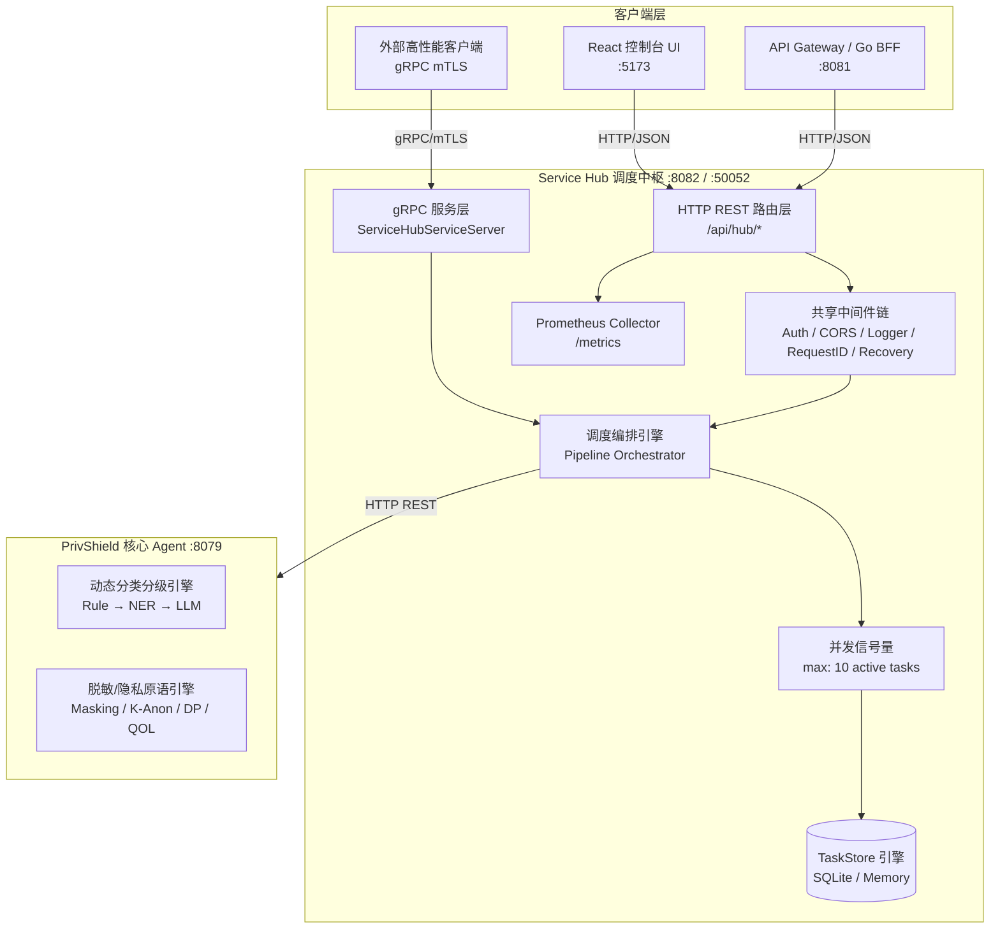
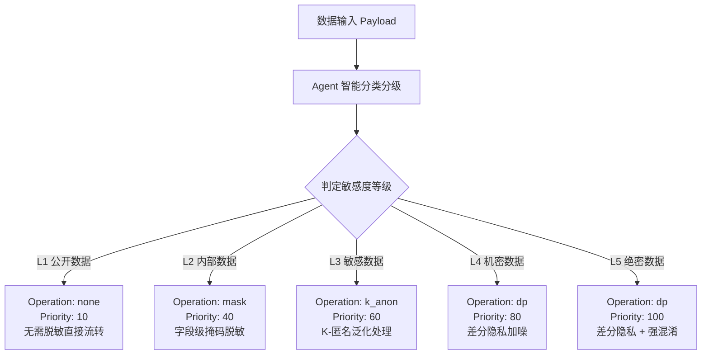
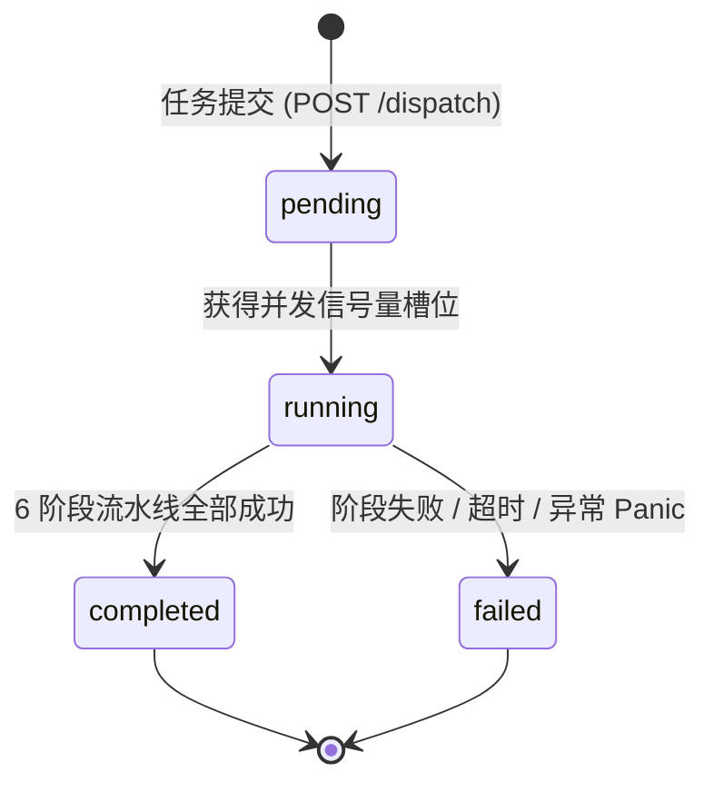

# 数据服务调度中枢 (Service Hub) — 详细设计文档

> 本文档定义 **数联天下 · 数盾 (`PrivShield`)** 数据服务调度中枢模块（`services/service-hub`）的系统架构、流水线调度、多协议接口、数据持久化与高可用设计。

---

## 1. 背景与业务定位

在《数据要素流通安全与隐私治理技术白皮书》描述的政务云数据安全架构中，**数联数据服务 S (Service Hub)** 是数据流通链路的核心枢纽与调度中枢，负责：

1. **统一接入与协商**：统一接收来自各调用方的数据申请请求与协商凭证；
2. **流水线编排调度**：自动化调度「请求接入 → 申请原数 → 分类分级 → 下发脱敏 → 返回结果 → 存证写日志」6 大阶段；
3. **分类分级智能联动**：接入 Layer-1~3 分类分级漏斗，根据动态评估得出的数据敏感度（L1~L5）自动决策并下发最适隐私原语（明文/字段脱敏/K-匿名/差分隐私/查询混淆）；
4. **双协议服务暴露**：同时提供面向 Web 前端与管控端的 HTTP REST API，以及面向高性能微服务互通的双向 mTLS / 公钥固定 gRPC 服务；
5. **生产级任务持久化**：支持 SQLite 任务生命周期持久化与状态机流转，支持服务优雅关停与高并发协程控制。

---

## 2. 总体架构拓扑



---

## 3. 核心机制与架构设计

### 3.1 六阶段调度流水线 (6-Stage Pipeline)

调度中枢将每一个数据治理请求抽象为 6 个有序阶段：

```text
① ingest (接入) ──▶ ② fetch (取数) ──▶ ③ classify (分类) ──▶ ④ desensitize (脱敏) ──▶ ⑤ return (返回) ──▶ ⑥ audit (存证) ──▶ done
```

| 阶段 | 标识 | 执行动作 | 异常与降级策略 |
|---|---|---|---|
| **1. 接入** | `ingest` | 验证请求合法性、解析参数、生成唯一 `task_id`、写入 `pending` 状态 | 参数不合法立即返回 400 |
| **2. 取数** | `fetch` | 从指定源数据节点（或请求 Payload）提取需要治理的数据记录 | 取数异常标记任务 `failed` |
| **3. 分类** | `classify` | 若需动态分类，调用 Agent `/v1/dynclassification/classify` 评估敏感度 | 上游不可达时降级至默认规则判定 |
| **4. 脱敏** | `desensitize` | 根据敏感级别或显式操作参数，调用 Agent 执行字段脱敏、K-匿名或差分隐私 | 脱敏失败任务置为 `failed` 并记录原因 |
| **5. 返回** | `return` | 组装处理结果，记录最终处理耗时与状态 | 校验返回格式完整性 |
| **6. 存证** | `audit` | 触发审计存证记录写盘，完成流水线流转 | 记录审计流水 |

### 3.2 敏感度等级与脱敏策略自动映射

在 `POST /api/hub/classify` 接口中，调度中枢实现了安全与合规的自动化决策：

$$\text{Level} \xrightarrow{\quad\text{Policy Mapping}\quad} \text{Operation \& Priority}$$



### 3.3 gRPC 双向认证 (mTLS) 与公钥固定 (Public Key Pinning)

为了满足政务云网间传输的金融级零信任安全，`service-hub` 内置了完整的 gRPC TLS / mTLS 凭证构建器：

1. **传输层加密**：加载 `TLSCertFile` 与 `TLSKeyFile`，强制要求 TLS 1.2+。
2. **双向客户端认证** (`RequireAndVerifyClientCert`)：加载专有根 CA 证书，严格校验证书信任链。
3. **公钥指纹固定** (`TLSPinnedPubKeyFile`)：在 TLS 握手回调中提取客户端证书公钥（支持 RSA、ECDSA、Ed25519），与预设公钥 PEM 进行恒定比对，杜绝 CA 私钥泄露或伪造证书攻击。

---

## 4. 数据模型与 SQLite 持久化

通过共享包 `pkg/store/sqlite` 实现纯 Go SQLite 持久化（零 CGO 依赖）：

### 4.1 表结构定义 (`tasks`)

```sql
CREATE TABLE IF NOT EXISTS tasks (
    id TEXT PRIMARY KEY,
    status TEXT NOT NULL DEFAULT 'pending',
    stage TEXT NOT NULL DEFAULT 'queued',
    source TEXT,
    operation TEXT,
    priority INTEGER DEFAULT 0,
    created_at DATETIME NOT NULL,
    started_at DATETIME,
    completed_at DATETIME,
    duration_ms INTEGER DEFAULT 0,
    error TEXT,
    payload_json TEXT
);
CREATE INDEX IF NOT EXISTS idx_tasks_status ON tasks(status);
CREATE INDEX IF NOT EXISTS idx_tasks_created ON tasks(created_at);
```

### 4.2 任务状态机



---

## 5. 高可用与并发治理

1. **Goroutine 信号量限流**：使用 `taskSem := make(chan struct{}, 10)` 限制同一时刻最多处理 10 个流水线任务，防止突发流量耗尽内存。
2. **Panic 自愈与隔离**：流水线 Goroutine 内置 `defer recover()`，发生不可预期异常时自动捕获，将对应任务标记为 `failed` 并记录详细堆栈，保护主进程稳定。
3. **优雅关停 (Graceful Shutdown)**：
   - 捕获系统 `SIGINT` / `SIGTERM` 信号；
   - 优先通过 `cancel()` 通知所有运行中的 `processTask` Goroutine 退出；
   - 通过 `sync.WaitGroup` 等待活跃任务完成退出清理；
   - 随后优雅关闭 gRPC 与 HTTP 监听器。

---

## 6. API 接口规范

### 6.1 HTTP REST 端点清单

| 方法 | 路径 | 描述 | 鉴权要求 |
|---|---|---|---|
| `GET` | `/health` | 服务自身与上游 Agent 连通性探测 | 豁免 |
| `GET` | `/api/health` | 内部健康检查端点 | 豁免 |
| `GET` | `/api/hub/status` | 调度中枢运行状态与任务汇总指标 | 需 Bearer Token |
| `GET` | `/api/hub/tasks` | 分页查询任务列表（支持 `status` 过滤） | 需 Bearer Token |
| `GET` | `/api/hub/tasks/:id` | 根据 `task_id` 查询单个任务详情 | 需 Bearer Token |
| `POST` | `/api/hub/dispatch` | 手动提交流水线调度任务 | 需 Bearer Token |
| `GET` | `/api/hub/pipeline` | 获取流水线各阶段的实时运行状态 | 需 Bearer Token |
| `POST` | `/api/hub/classify` | 智能分类分级并自动调度脱敏任务 | 需 Bearer Token |
| `GET` | `/metrics` | Prometheus 监控抓取端点 | 豁免 |

### 6.2 gRPC 服务定义 (`proto/servicehub.proto`)

```protobuf
syntax = "proto3";
package servicehub;
option go_package = "github.com/fengzhizi319/PrivShield/console/service-hub/proto;servicehub";

service ServiceHubService {
  rpc Health(HealthRequest) returns (HealthResponse);
  rpc HubStatus(HubStatusRequest) returns (HubStatusResponse);
  rpc Dispatch(DispatchRequest) returns (DispatchResponse);
  rpc ClassifyAndDispatch(ClassifyAndDispatchRequest) returns (ClassifyAndDispatchResponse);
  rpc GetTask(GetTaskRequest) returns (TaskProto);
  rpc ListTasks(ListTasksRequest) returns (ListTasksResponse);
  rpc PipelineStatus(PipelineStatusRequest) returns (PipelineStatusResponse);
}
```

---

## 7. 监控指标与可观测性设计

`service-hub` 深度集成了基于 Prometheus 与 Grafana 的可观测性体系：

### 7.1 Prometheus 核心指标
* `http_requests_total{module="service-hub",method,path,status}`: 调度端点 HTTP 请求量与状态码分布；
* `http_request_duration_seconds{module="service-hub",method,path}`: 端到端调度延迟直方图（用于计算 P95 / P99 响应延迟）；
* `agent_requests_total{module="service-hub",endpoint,status}`: 调度中枢发往上游 Agent 的算力调用次数与成功率；
* `agent_request_duration_seconds{module="service-hub",endpoint}`: 上游 Agent 算力调用延迟直方图。

### 7.2 专属 Grafana 看板
* 预置仪表盘: `deploy/grafana/service-hub-dashboard.json` (UID: `privshield-service-hub`)；
* 具备 QPS 监控、P95 延迟分解、Agent 算力耗时分析与协同微服务吞吐看板。

### 7.3 自动化告警规则
* 规则定义位于 `deploy/prometheus/alerts.yml` 的 `PrivShield.services` 告警组；
* 覆盖调度 P95 超时（>2s）、5xx 错误率飙升（>5%）与上游 Agent 调用失败预警。

