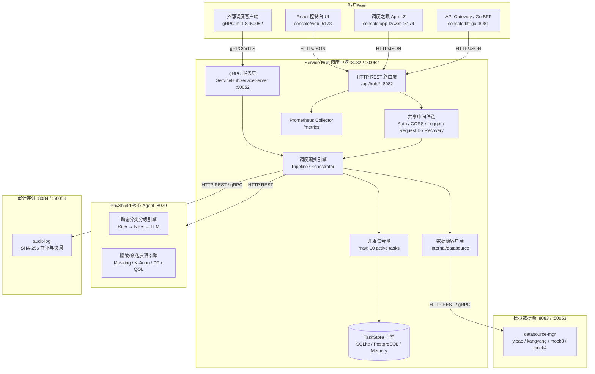

# 数据服务调度中枢 (Service Hub) — 详细设计文档

> 本文档定义 **数联天下 · 数盾 (`PrivShield`)** 数据服务调度中枢模块（`services/service-hub`）的系统架构、流水线调度、模拟数据源联动对接、多协议接口、数据持久化与高可用设计。

---

## 1. 背景与业务定位

在《数据要素流通安全与隐私治理技术白皮书》描述的政务云数据安全架构中，**数联数据服务 (Service Hub)** 是数据流通链路的核心枢纽与调度中枢，负责：

1. **统一接入与协商**：统一接收来自各调用方的数据申请请求与协商凭证；
2. **模拟数据源跨服务联动**：对接 `services/datasource-mgr`，按需调取医保（`yibao.csv`）、康养（`kangyang.csv`）及预留数据源进行高保真仿真调度；
3. **流水线编排调度**：自动化调度「请求接入 → 申请原数 (fetch) → 分类+脱敏 (classify) → 脱敏治理 (desensitize) → 返回结果 (return) → 存证写日志 (audit)」6 大阶段，其中阶段 ③ 调用 engine `/v1/medical/process` 医疗流水线一体化完成分类分级与脱敏治理，阶段 ④ 快速通过；
4. **分类分级智能联动**：接入 Layer-1~3 分类分级漏斗，根据动态评估得出的数据敏感度（L1~L5）自动决策并下发最适隐私原语（明文/字段脱敏/K-匿名/差分隐私/查询混淆）；
5. **双协议服务暴露**：同时提供面向 Web 前端与管控端的 HTTP REST API，以及面向高性能微服务互通的双向 mTLS / 公钥固定 gRPC 服务；
6. **生产级任务持久化**：支持 SQLite 任务生命周期持久化与状态机流转，支持服务优雅关停与高并发协程控制；
7. **崩溃恢复与自动重试**：启动时自动回收孤立任务（running 标记失败、pending 保留队列），周期性后台重试失败任务（指数退避 + RetryCount）；
8. **完整性校验与备份**：启动时 `PRAGMA integrity_check` 阻断损坏数据库，统一备份脚本支持全量/增量/验证模式；
9. **HTTP/gRPC 双协议 mTLS**：共享 `pkg/tlsutil` 工具库，TLS 1.3 + 公钥固定。

> 📖 **可靠性能力详解**：[docs/reliability.md](docs/reliability.md)

---

## 2. 总体架构拓扑



---

## 3. 六阶段调度流水线与数据源联动

调度中枢将每一个数据治理请求抽象为 6 个有序阶段：

```text
① ingest (接入) ──▶ ② fetch (取数) ──▶ ③ classify (分类) ──▶ ④ desensitize (脱敏) ──▶ ⑤ return (返回) ──▶ ⑥ audit (存证) ──▶ done
```

| 阶段 | 标识 | 执行动作 | 协同模块与机制 |
|---|---|---|---|
| **1. 接入** | `ingest` | 验证请求合法性、解析参数、生成唯一 `task_id`、写入 `pending` 状态 | 参数不合法立即返回 400 |
| **2. 取数** | `fetch` | 若请求未显式携带 Payload，自动调用 `datasource-mgr` 根据数据源标识（如 `ds_yibao`）抓取模拟样本 | `internal/datasource/client.go` |
| **3. 分类+脱敏** | `classify` | 一次调用 engine `/v1/medical/process` 医疗流水线，一体化完成 3-Layer 分类分级 + L4/L5 高敏文本剥离 + PII 强掩码 + ICD-10 编码脱敏 + 诊断残留清除 | engine 医疗流水线（替代原先 classify + desensitize 两步分离调用，减少一次网络往返） |
| **4. 脱敏治理** | `desensitize` | 已由阶段 ③ 医疗流水线合并完成，快速通过（保留阶段状态追踪） | 状态机快速流转 |
| **5. 返回** | `return` | 组装处理结果，记录最终处理耗时与状态 | 格式校验 |
| **6. 存证** | `audit` | 触发审计存证记录写盘，完成流水线流转 | `services/audit-log` |

---

## 4. 敏感度等级与脱敏策略自动映射

```mermaid
graph LR
    Input[原始数据] --> Funnel[Agent 三层分类漏斗]
    Funnel -->|L1 公开| OpNone[无脱敏直接流通 (none)]
    Funnel -->|L2 内部| OpMask[字段级动态打码 (mask)]
    Funnel -->|L3 敏感| OpKAnon[K-匿名化泛化 (k_anon)]
    Funnel -->|L4 机密| OpDP[差分隐私加噪 (dp)]
    Funnel -->|L5 绝密| OpQOL[查询混淆与全阻断 (qol)]
```
